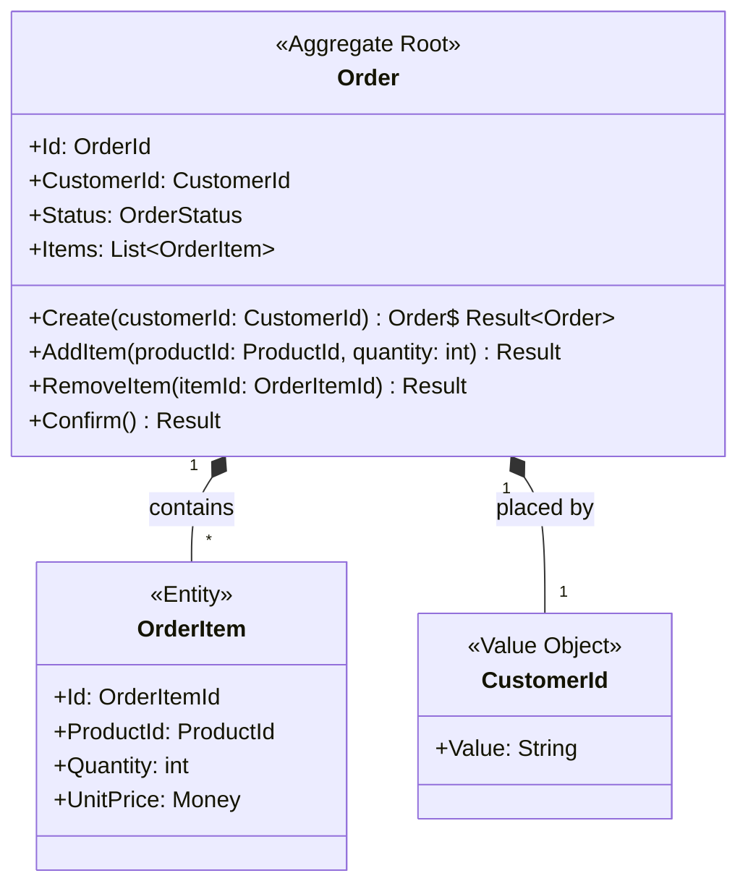

```mermaid
classDiagram
    %% Order Aggregate
    class Order {
        <<Aggregate Root>>
        +Id: OrderId
        +CustomerId: CustomerId
        +Status: OrderStatus
        +Items: List~OrderItem~
        +Create(customerId: CustomerId) Order$ Result~Order~
        +AddItem(productId: ProductId, quantity: int) Result
        +RemoveItem(itemId: OrderItemId) Result
        +Confirm() Result
    }
    class OrderItem {
        <<Entity>>
        +Id: OrderItemId
        +ProductId: ProductId
        +Quantity: int
        +UnitPrice: Money
    }
    class CustomerId {
        <<Value Object>>
        +Value: String
    }

    Order "1" *-- "*" OrderItem : contains
    Order "1" *-- "1" CustomerId : placed by
```