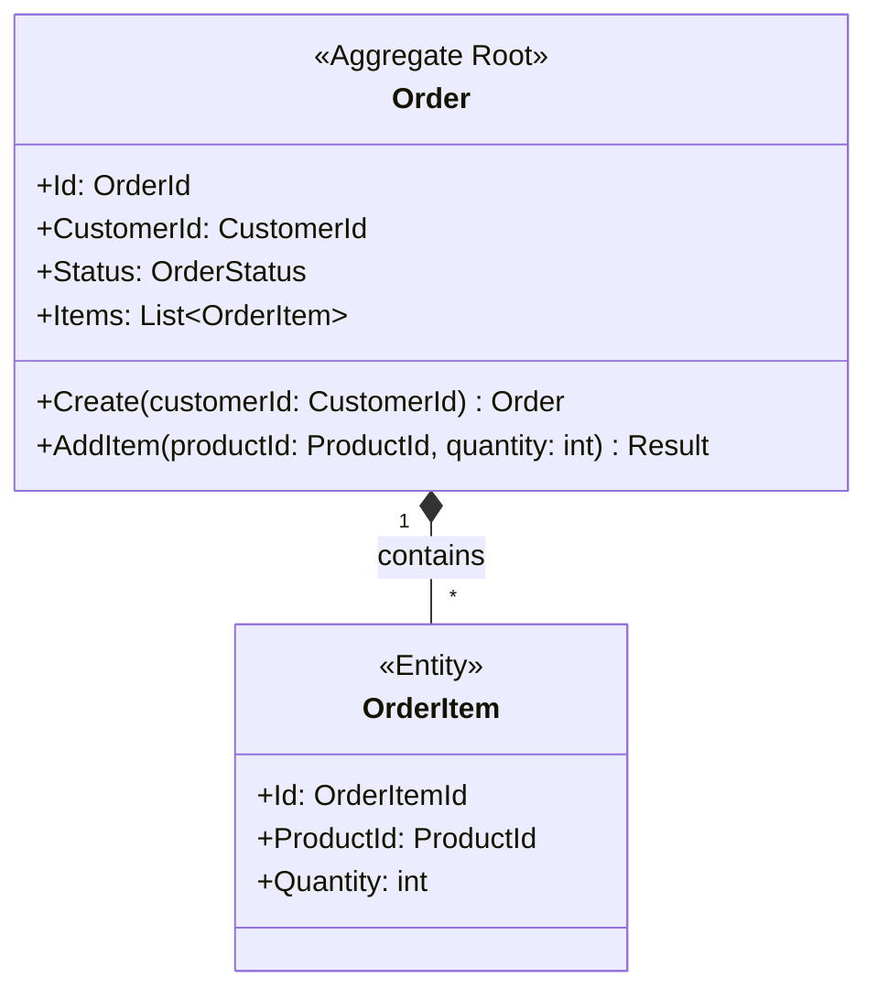

# CLAUDE.md

This file provides guidance to Claude Code (claude.ai/code) when working with code in this repository.

## Project Overview

This is a **DDD Specification Marketplace** - a Claude Code plugin for creating domain design documents using tactical Domain-Driven Design patterns. The plugin provides skills that guide users through creating structured `DOMAIN.md` documents that serve as blueprints for implementing domain models.

**Target Audience:** The domain.md documents are primarily for coding agents that will generate code from these specifications. Reviewers are professional software developers familiar with DDD, so explanations should not cover basic DDD concepts.

## Plugin Architecture

This is a **Claude Code Plugin** that extends Claude's capabilities with domain-driven design expertise. The plugin is registered as a local marketplace and contains a single skill.

### Directory Structure

```
ddd-spec/
├── .claude-plugin/
│   └── marketplace.json          # Plugin marketplace manifest
├── plugins/
│   └── ddd/                      # DDD Plugin
│       ├── .claude-plugin/
│       │   └── plugin.json       # Plugin manifest
│       └── skills/
│           └── ddd-domain-design/
│               ├── SKILL.md       # Main skill definition
│               ├── guides/        # Comprehensive DDD pattern guides
│               │   ├── INDEX.md   # Guide index
│               │   ├── value-objects.md
│               │   ├── entities.md
│               │   ├── aggregates.md
│               │   ├── domain-events.md
│               │   ├── domain-services.md
│               │   ├── repositories.md
│               │   ├── ports.md
│               │   ├── factories.md
│               │   └── specifications.md
│               └── examples/      # Example domain designs
│                   ├── order-domain-example.md
│                   ├── ddd-patterns-guide.md
│                   └── invariants-examples.md
└── .claude/
    └── settings.local.json       # Local Claude settings
```

## Core Skills

### `ddd-domain-design` Skill

**When to use:** Invoke when users request:
- "Create a domain.md" or "design a domain model"
- "Create a DOMAIN.md document"
- References to tactical DDD patterns (aggregates, entities, value objects, invariants, ubiquitous language)

**What it does:** Creates structured domain design documents following tactical DDD principles with:
- Ubiquitous Language glossary
- Mermaid class diagrams with proper DDD stereotypes
- Type descriptions (aggregates, entities, value objects)
- Design explanations
- Business invariants documentation
- Future considerations section

**Key principle:** Always invoke this skill via the Skill tool when users request domain design work - do not attempt to create domain documents without it.

## Document Structure (DOMAIN.md)

Every domain design must follow this exact structure:

```markdown
# [Domain Name] Domain Design

[Introduction - 1-4 sentences]

## Ubiquitous Language

| Term | Definition |
|------|------------|
| [Term 1] | [Clear, concise definition] |
| [Term 2] | [Clear, concise definition] |

## Class Diagrams

[Mermaid class diagram]

## Types

### [AggregateRoot]
[Purpose and responsibilities]

### [SomeEntity]
[Purpose and responsibilities]

## Design Explanations

### [Design choice header]
[Explanation of non-obvious design decisions]

## Invariants

### [Aggregate name] Invariants

| ID | Invariant | Notes |
|----|-----------|-------|
| XX-1 | [invariant description] | [Optional clarification] |

## Future Considerations

[Ideas not yet incorporated]
```

## Key DDD Principles

### Aggregate Design (Four Rules)

1. **Model True Invariants** - Group objects requiring immediate consistency
2. **Design Small Aggregates** - Root + few value objects (avoid mega-aggregates)
3. **Reference by Identity Only** - Hold IDs of other aggregates, not object references
4. **Use Eventual Consistency Outside** - Cross-aggregate updates via domain events

### Value Objects

- Immutable (never change after creation)
- Structural equality (same values = same object)
- No identity (defined by attributes, not ID)
- Always valid (validation in constructor/factory)
- Prevents primitive obsession (e.g., `Money`, `Address`, `EmailAddress`)

### Entities

- Identity-based (same ID = same entity)
- Mutable (state changes over lifecycle)
- Behavioral encapsulation (methods, not public setters)
- Private setters (state changes via business methods)

### Domain Events

- Naming: Past tense (e.g., `OrderPlaced`, `PaymentAuthorized`)
- Content: Minimal data required (aggregate ID + changed fields)
- Publishing: Use Transactional Outbox pattern for atomicity
- Consumers: Must be idempotent (handle duplicate messages)

## Mermaid Diagram Guidelines

### Stereotypes (Required)
- `<<Aggregate Root>>` - Root of consistency boundary
- `<<Entity>>` - Object with identity, mutable
- `<<Value Object>>` - Immutable, defined by attributes
- `<<Enumeration>>` - Fixed set of values
- `<<Domain Service>>` - Stateless operation spanning aggregates

### Relationships
- `*--` Composition (aggregate owns child)
- `-->` Association (reference by ID to other aggregate)

### Cardinality
- `"1"` - Exactly one
- `"*"` - Many (zero or more)
- `"0..1"` - Zero or one
- `"1..*"` - One or more

### Example Pattern


## Writing Style

**For domain.md documents:**
- Succinct, technical prose (assume DDD expertise)
- No code snippets (abstraction level above code)
- No basic DDD concept explanations
- Focus on design rationale and trade-offs

**For class diagrams:**
- Use verb phrases for methods (e.g., `confirm()`, not `confirmOrder()`)
- Show return types (e.g., `Result`, `Order`)
- Use types, not primitives (e.g., `Money`, not `decimal`)

## Local Development

### Plugin Registration

This plugin is registered in `.claude/settings.local.json` as a local marketplace:

```json
{
  "extraKnownMarketplaces": {
    "ddd-marketplace": {
      "source": {
        "source": "directory",
        "path": "./"
      }
    }
  }
}
```

### Plugin Manifests

- **Marketplace manifest:** `.claude-plugin/marketplace.json`
- **Plugin manifest:** `plugins/ddd/.claude-plugin/plugin.json`

### Local Settings

Permissions for skill development and Mermaid diagrams are configured in `.claude/settings.local.json`.

## Comprehensive DDD Pattern Guides

The `guides/` directory contains extensive documentation for each tactical DDD pattern. These guides provide:

- **Detailed rules and principles** for each pattern
- **Mermaid diagrams** showing structure and relationships
- **Common anti-patterns** to avoid
- **When to use** decision frameworks
- **Design examples** and comparisons

### Available Guides

| Pattern | Guide | Focus |
|---------|-------|-------|
| Value Objects | `value-objects.md` | Immutability, structural equality, Result pattern for creation |
| Entities | `entities.md` | Identity strategies, lifecycle, behavioral encapsulation |
| Aggregates | `aggregates.md` | Four rules of design, consistency boundaries, small aggregates |
| Domain Services | `domain-services.md` | Cross-aggregate logic, stateless operations, port pattern |
| Domain Events | `domain-events.md` | Eventual consistency, minimal data, transactional outbox |
| Repositories | `repositories.md` | Domain interfaces, specification pattern, Result returns |
| Driven Ports | `ports.md` | External dependencies, hexagonal architecture, adapters |
| Factories | `factories.md` | Complex creation, factory methods vs classes |
| Specifications | `specifications.md` | Business queries, composability, reusable rules |

### Progressive Disclosure Approach

When working with users on domain design:

1. **Quick decisions:** Use the quick reference tables in SKILL.md
2. **Designing specific patterns:** Read the full guide for that pattern
3. **Understanding relationships:** Read multiple related guides (e.g., Aggregates + Domain Events)
4. **Troubleshooting:** Consult anti-patterns sections in guides

### Domain Layer Focus

The guides focus exclusively on **domain layer concerns**:
- Domain model design (entities, value objects, aggregates)
- Domain logic (domain services, behavioral encapsulation)
- Domain interfaces (repository interfaces, driven ports)
- Business invariants and domain events

**Excluded** (infrastructure/application concerns):
- Repository implementations (SQL, NoSQL)
- Adapter implementations (email, payment gateways)
- Application services
- File organization and deployment

## Important Design Constraints

### Result Pattern Integration

The skill emphasizes the **Result pattern** for type-safe error handling without exceptions:

- Value Object `Create` methods return `Result<ValueObject>` for validation
- Entity creation returns `Result<Entity>` for validation failures
- Aggregate behavior methods return `Result` for invariant violations
- Repository `GetById` returns `Result<T>` for not-found cases
- Port/Service operations return `Result<T>` for external failures

This pattern is integrated throughout all DDD patterns documented in the guides.

### Critical Design Rules

1. **No primitive types in diagrams** - Wrap primitives in value objects (use `Money`, not `decimal`)
2. **Small aggregates only** - Aggregate root + 1-2 entities max, prefer just root + value objects
3. **Cross-aggregate references by ID** - Never hold direct object references to other aggregates
4. **Business methods, not setters** - Entities expose behavior (`order.confirm()`), not state manipulation
5. **Invariants in the aggregate** - Business rules enforced by aggregate root, not external services
6. **Anemic domain anti-pattern** - Avoid entities that are mere data containers with all logic in services
