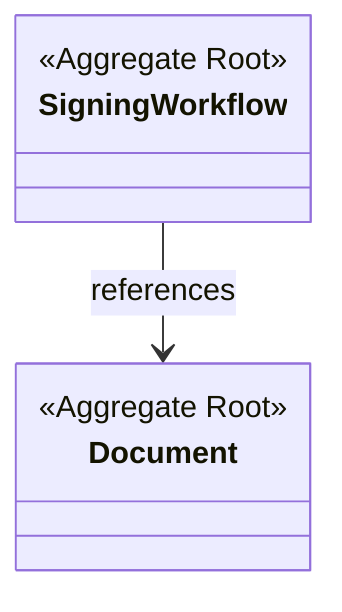
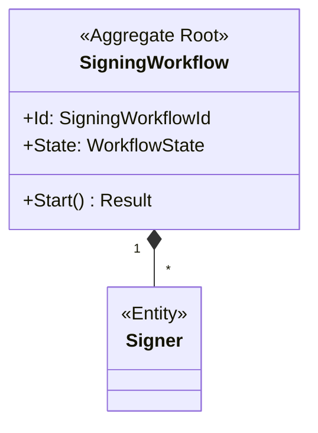
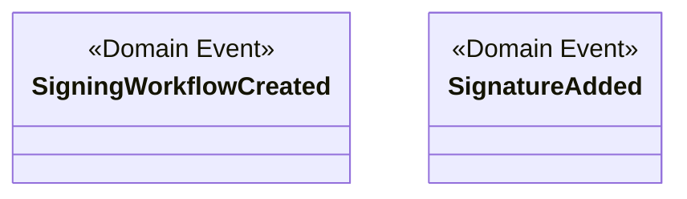
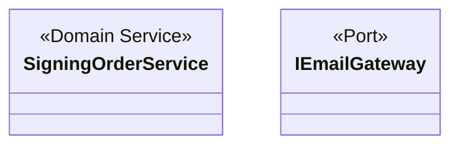
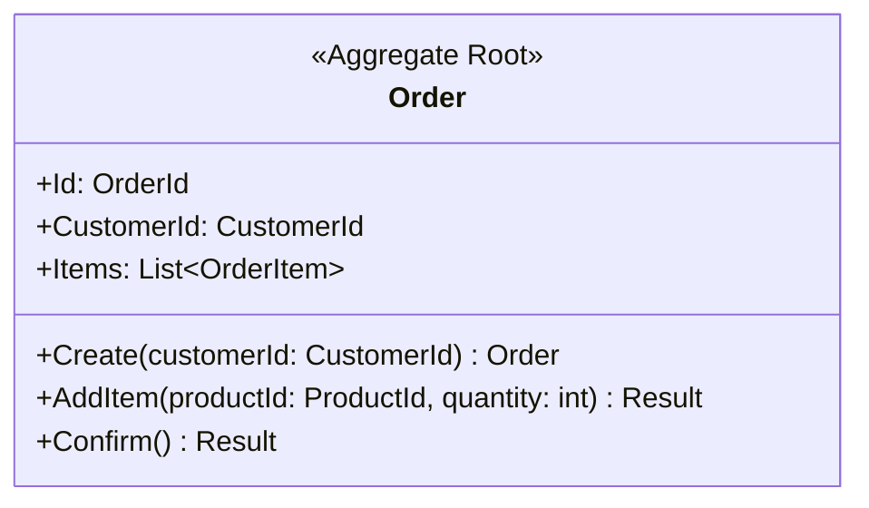
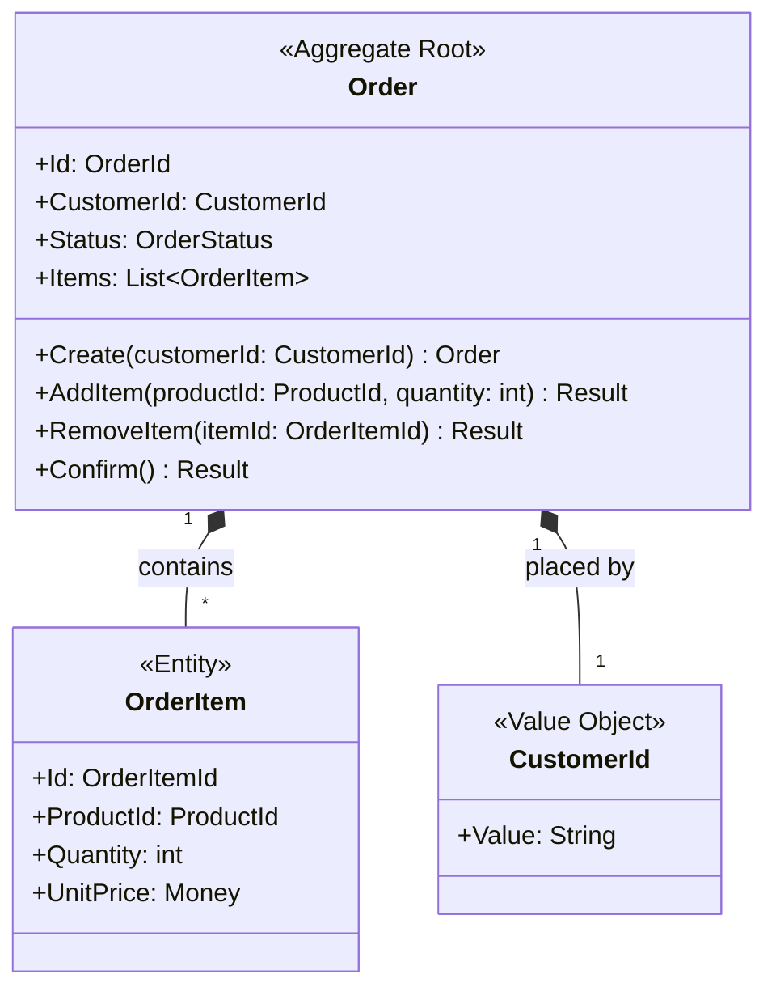

# Domain Design (Tactical DDD)

This skill guides the creation and modification of `DOMAIN.md` documents using tactical Domain-Driven Design patterns. The document serves as a blueprint for coding agents to implement domain models correctly, targeting professional developers familiar with DDD concepts.

## Document Structure

Every `DOMAIN.md` must follow this structure:

1. **Title and Introduction** - Domain name and purpose (1-4 sentences)
2. **Ubiquitous Language** - Glossary of domain terms in **business language only** (no DDD technical terms)
3. **Class Diagrams** - Multiple Mermaid class diagrams organized by concern
4. **Types** - Descriptions of types with non-obvious business logic or design decisions (omit simple value objects like Email, PersonName, Address, Money, Quantity, ID types)
5. **Design Details** - Supplemental information NOT captured by class diagrams (state machines, transition tables, complex business rules, cross-context integration)
6. **Invariants** - Business rules that must always hold true
7. **Future Considerations** - Ideas not yet incorporated

## Ubiquitous Language Guidelines

**Critical Principle:** The Ubiquitous Language table must be readable and understandable by **business stakeholders** (domain experts, product managers, business analysts). This table defines the shared language between technical and business teams.

### What to Include

- Domain concepts from the business domain
- Terms that have specific meaning in this context
- Phrases used in conversations with domain experts

### Writing Style

**DO:**
- Define what the concept **is** in business terms
- Use language from actual business conversations
- Focus on the business problem it solves
- Keep definitions concise (1-2 sentences)

**DON'T:**
- Use DDD technical terms (aggregate root, entity, value object, repository, domain service, domain event)
- Describe technical implementation details
- Use programming jargon (class, instance, reference, ID)
- Mix technical and business concerns

### Examples

**Good (Business-focused):**
```
| Term | Definition |
|------|------------|
| Signing Workflow | A document signing process that coordinates multiple signers, tracks their signatures, and manages the signing sequence |
| Signer | A person who needs to sign a document, identified by their email address and name |
| Expiration Time | The deadline after which the signing workflow is automatically cancelled |
```

**Bad (Technical terms mixed in):**
```
| Term | Definition |
|------|------------|
| Signing Workflow | The aggregate root that orchestrates the signing process |  ❌ Uses "aggregate root"
| Signer | An entity that represents a participant in the workflow |  ❌ Uses "entity"
| Expiration Time | A value object that stores the deadline timestamp |  ❌ Uses "value object"
```

### When to Split Tables

If the domain has many subdomains or bounded contexts, consider grouping terms into multiple tables:
- **Core Domain Terms** - The primary business concepts
- **Supporting Concepts** - Secondary terms and configurations
- **Integration Terms** - Concepts related to external systems

## Document Template

```markdown
# [Domain Name] Domain Design

[1-4 sentence description of what this domain model represents and its purpose]

## Ubiquitous Language

| Term | Definition |
|------|------------|
| [Term 1] | [Clear, concise definition in business terms only - no DDD technical jargon] |
| [Term 2] | [Clear, concise definition in business terms only - no DDD technical jargon] |

## Class Diagrams

### Aggregate Overview

[High-level diagram showing all aggregates and their relationships]

### [Aggregate Name] Aggregate

[Detailed diagram of aggregate structure with internal entities and value objects]

## Domain Events

[Diagram showing all domain events and their relationships to aggregates]

## Domain Services and Ports

[Diagram showing domain services and their dependencies on ports/external services]

## Types

**Include only types with non-obvious business logic or design decisions.**

**OMIT from Types section:**
- Simple value objects (Email, PersonName, Address, Money, Quantity, ID types, DateRange, etc.)
- Types where the class diagram is self-explanatory
- Types with only basic CRUD operations

**Focus on:**
- Aggregates with complex lifecycle management
- Entities with non-obvious business behavior
- Domain services that coordinate across aggregates
- Types with complex invariant enforcement

**Writing style:**
- NO DDD technical terms (avoid "aggregate root", "entity", "value object", "repository")
- Describe business purpose and behavior, not DDD pattern classification
- Focus on what problems the type solves, not its pattern role

### [AggregateRoot]

[Business-focused description: What lifecycle does it manage? What business problems does it solve? What key decisions does it encapsulate?]

### [ComplexEntity]

[Business-focused description: What business behavior does it encapsulate beyond simple data storage?]

### [DomainService]

[Business-focused description: What domain operation does it coordinate? Why does this logic span multiple aggregates?]

## Design Details

**This section contains information NOT visible in class diagrams.**

**Include:**
- State diagrams for state machines
- State transition tables with triggers and guard conditions
- Sequence diagrams for complex interactions
- Cross-context integration points
- Complex business rules not obvious from diagrams
- Data flow diagrams for multi-step processes

**DO NOT include:**
- DDD concept explanations (no "this demonstrates proper aggregate boundary respect")
- Explanations of simple/obvious design patterns
- Teaching-style content about DDD principles

### [Design Aspect]

[Supplemental diagram or table explaining complex behavior, state transitions, or integration points]

## Invariants

### [Aggregate name] Invariants

| ID | Invariant | Notes |
|----|-----------|-------|
| XX-1 | [invariant description] | [Optional clarification] |
| XX-2 | [invariant description] | [Optional clarification] |

### [Entity name] Invariants

| ID | Invariant | Notes |
|----|-----------|-------|
| YY-1 | [invariant description] | [Optional clarification] |

## Future Considerations

[Free-form content of ideas that have been not yet incorporated to the design]
```

## Mermaid Class Diagram Guidelines

### Diagram Organization Strategy

**Split diagrams when:**
- A single diagram exceeds 20 classes
- Multiple aggregates exist in the domain
- The domain has more than 5 domain events
- Value objects clutter the main aggregate structures

**Recommended diagram structure:**

1. **Aggregate Overview** (always create)
   - Shows all aggregate roots and their relationships
   - Includes cross-aggregate associations (by ID)
   - Uses simple notation, minimal internal details

2. **Per-Agregate Details** (create one per aggregate)
   - Shows the aggregate root with its entities and value objects
   - Includes all behavioral methods
   - Shows composition relationships within the aggregate
   - Names: "[Aggregate Name] Aggregate"

3. **Domain Events** (create if 3+ events)
   - Shows all domain events and their fields
   - Indicates which aggregates raise each event
   - Shows event relationships if any exist

4. **Domain Services and Ports** (create if 2+ services)
   - Shows domain services and their operations
   - Includes ports/interfaces for external dependencies
   - Shows service dependencies on aggregates or other services

**Example structure:**
```markdown
## Class Diagrams

### Aggregate Overview



### SigningWorkflow Aggregate



## Domain Events



## Domain Services and Ports



### Diagram Requirements

Use Mermaid class diagrams exclusively. Follow these syntax rules:

**Define classes with stereotypes:**


**Relationship types:**
- `*--` Composition (aggregate owns child, child cannot exist without parent)
- `-->` Association (reference by ID to other aggregate)
- `o--` Aggregation (looser ownership, rarely used in tactical DDD)

**Cardinality notation:**
- `"1"` - Exactly one
- `"*"` - Many (zero or more)
- `"0..1"` - Zero or one
- `"1..*"` - One or more

### DDD Stereotypes

Always annotate classes with appropriate DDD stereotypes:
- `<<Aggregate Root>>` - Root of a consistency boundary
- `<<Entity>>` - Object with identity, mutable
- `<<Value Object>>` - Immutable, defined by attributes
- `<<Enumeration>>` - Fixed set of values
- `<<Domain Service>>` - Stateless operation spanning aggregates

### Proper Aggregate Design

**DO:**
- Keep aggregates small (root + few value objects)
- Reference other aggregates by ID only
- Show behavioral methods, not just data
- Use composition (`*--`) for entities within aggregate
- Use association (`-->`) with IDs for cross-aggregate references

**DON'T:**
- Create mega-aggregates with many entities
- Hold direct object references to other aggregates
- Expose public setters on entities
- Show primitive fields directly (wrap in value objects)

### Example: Proper Aggregate



**Ubiquitous Language for this example:**
| Term | Definition |
|------|------------|
| Order | A customer's request to purchase products |
| Order Item | A single product line in an order with quantity and price |
| Customer | The person placing the order |
| Order Status | The current state of an order (Pending, Confirmed, Shipped, etc.) |

❌ **Avoid:** "Order: The aggregate root that manages items" (uses DDD technical term)

## Tactical DDD Pattern Guides

> **Progressive Disclosure:** Each tactical DDD pattern has a comprehensive guide with detailed rules, examples, and diagrams. Refer to these guides when designing specific aspects of your domain model.

### Core Patterns

#### Result Pattern

**Quick Reference:**
- Encapsulates operation success/failure without exceptions
- Type-safe error handling
- Enables functional error propagation
- Create methods return `Result<T>` for validation

**Use when:**
- Creating Value Objects (validation failures)
- Creating Entities (validation failures)
- State transitions (invalid transitions)
- Any operation that can fail with business rule violations

**Examples:**
- `EmailAddress.Create("invalid")` → `Result<EmailAddress>.Error("Invalid email format")`
- `Order.Confirm()` → `Result.Success` or `Result.Error("Order has no items")`

---

#### Value Objects

**Quick Reference:**
- Immutable (never change after creation)
- Structural equality (same values = same object)
- No identity (defined by attributes, not ID)
- Always valid (Create method returns `Result<T>`)

**📖 Full Guide:** `guides/value-objects.md`

**Use when:**
- Measuring, quantifying, or describing something
- Combining related primitive fields (e.g., `Address`, `Money`)
- Ensuring type safety instead of primitive obsession

**Examples:** `Money`, `EmailAddress`, `Address`, `DateRange`, `Quantity`

**Creation pattern:** Value Objects use static `Create` methods that return `Result<ValueObject>` to handle validation failures gracefully.

---

#### Entities

**Quick Reference:**
- Identity-based (same ID = same entity, even if attributes change)
- Mutable (state changes over lifecycle)
- Behavioral encapsulation (methods, not just data)
- Private setters (state changes via business methods)
- Creation returns `Result<T>` for validation

**📖 Full Guide:** `guides/entities.md`

**Use when:**
- Tracking objects over time
- Lifecycle matters (creation, state changes, deletion)
- Distinguishing between instances is critical

**Creation pattern:** Entities use static `Create` factory methods that return `Result<Entity>` to handle validation failures. Behavior methods return `Result` for operations that can fail.

---

#### Aggregates

**Quick Reference:**
- Four Rules of Aggregate Design:
  1. Model True Invariants - Group objects that must be consistent immediately
  2. Design Small Aggregates - Root + few value objects (avoid mega-aggregates)
  3. Reference by Identity Only - Hold IDs of other aggregates, not object references
  4. Use Eventual Consistency Outside - Cross-aggregate updates use domain events

**📖 Full Guide:** `guides/aggregates.md`

**Implications:**
- One repository per aggregate root
- Transaction boundary = aggregate boundary
- Global consistency = eventual (via events)
- Behavior methods return `Result` for invariant violations

---

#### Domain Services

**Quick Reference:**
- Domain logic that doesn't naturally fit within a single Entity or Value Object
- Stateless operations that carry domain knowledge
- Part of the Ubiquitous Language (use domain terminology in names)
- Coordinate interactions between multiple aggregates
- Return `Result<T>` for operations that can fail

**📖 Full Guide:** `guides/domain-services.md`

**Use when:**
- An operation involves multiple aggregates of different types
- Placing logic on an entity would introduce inappropriate coupling
- Domain logic requires coordination across consistency boundaries
- The operation is a fundamental domain concept but not a natural responsibility of any single entity

**Examples:**
- `FundsTransferService.transfer(from: Account, to: Account, amount: Money)` - coordinates withdrawal and deposit across two Account aggregates
- `ExchangeRateService.convert(amount: Money, from: Currency, to: Currency)` - domain logic for currency conversion
- `OrderPricingService.calculateDiscount(order: Order, customer: Customer)` - spans Order and Customer aggregates

**Key distinctions:**
- Domain Service ≠ Application Service: Domain services contain business logic; application services orchestrate workflows
- Domain Service operation should be named as a verb phrase from the ubiquitous language (e.g., `transfer`, `convert`, `calculate`)

---

#### Domain Events

**Quick Reference:**
- Naming: Past tense (e.g., `OrderPlaced`, `PaymentAuthorized`)
- Content: Minimal data required (aggregate ID + changed fields)
- Immutability: Events are facts that cannot be changed
- Publishing: Use Transactional Outbox pattern for atomicity

**📖 Full Guide:** `guides/domain-events.md`

**Use when:**
- Side effects need decoupling (e.g., sending emails)
- Cross-aggregate updates required
- Audit trail or integration needed

---

#### Repositories (Domain Interfaces)

**Quick Reference:**
- One repository interface per Aggregate Root
- Repository interface in Domain layer (implementation is infrastructure concern)
- Collection-like semantics (Add, Update, Remove, GetById, Find)
- Use Specification pattern for complex queries (see Specifications below)
- GetById returns `Result<T>` for not-found cases

**📖 Full Guide:** `guides/repositories.md`

**Key principles:**
- Repository interfaces are domain concerns
- Repository implementations are infrastructure concerns
- Domain layer defines contract, infrastructure provides implementation

---

#### Driven Ports (Domain Interfaces)

**Quick Reference:**
- Ports are interfaces defined in Domain layer for external dependencies
- Ports represent contracts the domain needs from the outside world
- Adapters implement ports (adapters are infrastructure concerns)
- Ports return `Result<T>` for operations that can fail
- Examples: `IEmailGateway`, `IPaymentGateway`, `IExchangeRateService`

**📖 Full Guide:** `guides/ports.md`

**Key principles:**
- Domain defines the interface (port) it needs
- Infrastructure provides the implementation (adapter)
- Domain depends on abstraction (port), not concretion (adapter)
- Domain Services use ports when they need external services

**Use when:**
- Domain logic requires external service calls (email, SMS, payment gateway)
- Domain needs data from other bounded contexts
- Domain must interact with infrastructure concerns

**Examples:**
- `IEmailGateway.send(message)` - domain contracts for email
- `IPaymentGateway.charge(amount)` - payment processing contract
- `IExchangeRateService.convert(from, to)` - external rate provider

---

### Supporting Concepts

#### Factories

**Quick Reference:**
- Encapsulate complex object creation
- Ensure aggregates are born in valid state
- Separate creation from representation
- Static factory methods for simple cases
- Factory classes for complex creation

**Use when:**
- Creation logic is complex
- Aggregate requires data from external services
- Multiple ways to create the same object
- Creation involves domain logic

**Examples:**
- `Order.Create(customerId)` - Static factory on root
- `OrderFactory` - Separate class for complex creation
- Factory methods that return `Result<T>` for validation failures

---

#### Specifications

**Quick Reference:**
- Encapsulate business queries as named concepts
- Use ubiquitous language for names (e.g., `ActiveCustomerSpecification`)
- Composable with AND, OR, NOT operators
- Reusable across queries and validations
- Pure predicates (no side effects)

**📖 Full Guide:** `guides/specifications.md`

**Use when:**
- Complex business queries with multiple conditions
- Rules are reused across multiple use cases
- Query logic needs documentation as domain concept
- Validation depends on querying domain state

**Examples:**
- `ActiveCustomerSpecification` - Customers who ordered in last 12 months
- `OverdueOrderSpecification` - Orders past due date that aren't paid/cancelled
- `EligibleForDiscountSpecification` - `ActiveCustomer AND (PremiumCustomer OR VipCustomer)`

---

#### Policies

**Quick Reference:**
- Encapsulate algorithms and business rules that can vary
- Use ubiquitous language names (e.g., `OverbookingPolicy`, `PricingPolicy`)
- Policies are injected as parameters to domain objects
- Distinguish from Specifications: Policies execute algorithms (how), Specifications evaluate predicates (is satisfied)
- Can be Value Objects (immutable configuration) or Domain Services (stateless algorithms)

**📖 Full Guide:** `guides/policies.md`

**Use when:**
- Multiple algorithms exist for the same operation (e.g., Standard/Discount/VIP pricing)
- Complex conditional logic obscures an entity's primary responsibility
- Business rules change independently of the objects they apply to
- EventStorming: Policy listens to Domain Event and decides which Command to execute

**Examples:**
- `OverbookingPolicy` - "Allow 10% overbooking on voyages for cancellations"
- `PricingPolicy` - Standard, Discount, or VIP pricing strategies (interchangeable)
- `RoutingPolicy` - Fastest route vs cheapest route vs avoid restricted areas
- `BusinessPriorityCalculator` - Encapsulates priority formula: `Value / (Cost + Risk)`

**Policy vs Specification:**
- Specifications return Boolean (Is this satisfied?)
- Policies return values or execute algorithms (How should this work?)

---

#### Invariants

**Definition:** Business rules that must always hold true.

**Documenting Invariants:**
- Group by aggregate or entity
- Use structured ID format (e.g., `ORDER-1`, `CUSTOMER-2`)
- Include brief clarification if needed

**📖 Examples:** `examples/invariants-examples.md`

**Examples:**
- Order total must equal sum of item quantities × unit prices
- Customer email must be unique
- Order cannot be confirmed without payment

---

#### Avoiding Anemic Domain Models

**Quick Reference:**
- Design entities with behavioral methods (not just getters/setters)
- Privatize setters to force state changes through business methods
- Encapsulate collections with Add/Remove methods that enforce invariants
- Extract Value Objects to combine related primitives
- Business logic belongs in entities/aggregates, not services

**The Anti-Pattern:**
Anemic domain models occur when entities are mere data containers with public setters and all business logic resides in service layers. This violates DDD principles by separating behavior from state.

**How to Avoid:**
- Entities expose behavior through methods like `order.confirm()`, not `order.setStatus("CONFIRMED")`
- Collections are encapsulated with `order.addItem(item)` that validates invariants
- State transitions return `Result` for validation failures
- Domain Services contain only domain logic that spans multiple aggregates

**Examples:**
- ✅ `order.addItem(item)` - validates invariants, returns Result
- ❌ `order.getItems().add(item)` - bypasses validation

---

#### Ubiquitous Language

**Purpose:** Shared language between technical teams and domain experts, captured in the domain document.

**In Domain Documents:**
- Capture domain terminology in the Ubiquitous Language table
- Define terms clearly and concisely
- Challenge ambiguous or technical jargon
- Refine language as understanding grows

## Writing Style

**For the domain.md document:**
- Succinct, technical prose (assume DDD expertise)
- No code snippets (abstraction level above code)
- No basic DDD concept explanations (audience knows DDD)
- No teaching-style content (avoid "this demonstrates proper X pattern")
- Focus on design rationale and trade-offs
- Target audience: coding agents and professional DDD developers

**For class diagrams:**
- Use verb phrases for methods (e.g., `confirm()`, not `confirmOrder()`)
- Show return types (e.g., `Result`, `Result<Order>`)
- Behavior methods return `Result` for operations that can fail
- Create methods return `Result<T>` for validation
- Group related attributes together
- Use types, not primitives (e.g., `Money`, not `decimal`)

## Additional Resources

### Example Files

Working examples in `examples/`:
- **`order-domain-example.md`** - Complete domain design document following the template
- **`ddd-patterns-guide.md`** - DDD pattern examples (value objects, entities, aggregates, cross-aggregate references)
- **`invariants-examples.md`** - Comprehensive invariant documentation examples

### Pattern Guides

Comprehensive guides for each tactical DDD pattern are linked in the pattern sections above (see `guides/` directory).
