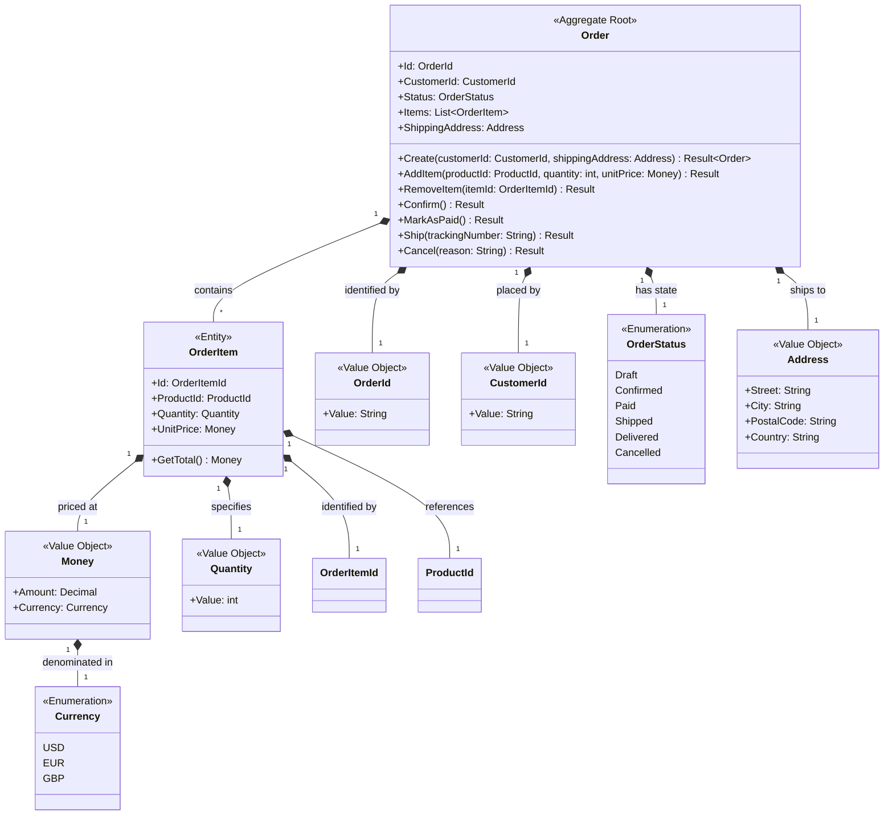

# Order Management Domain Design

This domain handles the lifecycle of customer orders from creation through fulfillment. It manages order state, items, pricing, and order status transitions.

## Ubiquitous Language

| Term | Definition |
|------|------------|
| Order | A customer's request to purchase products |
| OrderItem | A single line item within an order containing product, quantity, and price |
| OrderStatus | The current state of an order (Draft, Confirmed, Paid, Shipped, Delivered, Cancelled) |
| Confirmation | The act of finalizing a draft order for processing |
| Fulfillment | The process of preparing and delivering an order to the customer |

## Class Diagrams

## Types

### Order

Root of the Order aggregate. Manages the complete lifecycle of an order from draft through delivery. Handles business rules for state transitions, ensures order integrity, and publishes domain events for state changes.

### OrderItem

Entity within the Order aggregate representing a single line item. Tracks product identity, quantity, and locked-in price at order time. Cannot exist independently of its parent Order.

### Address

Value object encapsulating shipping location information. Immutable and validated upon creation. Ensures consistent address format across the system.

### Money

Value object representing monetary amounts with currency. Encapsulates arithmetic operations and rounding rules specific to financial calculations.

### Quantity

Value object wrapping integer quantities with validation rules (must be positive, within reasonable bounds). Prevents primitive obsession for numeric quantities.

## Design Explanations

### Customer Reference by ID

The Order aggregate references Customer by CustomerId (value object), not by direct object reference. This maintains aggregate boundary integrity, prevents mega-aggregate formation, and enables distribution across services if needed.

### Price Locking in OrderItem

UnitPrice is captured within OrderItem at order creation time. This preserves the price the customer agreed to, independent of subsequent product price changes. The price becomes an immutable historical fact.

### Shipping as Value Object

ShippingAddress is modeled as a value object within Order rather than an entity. Orders don't track address lifecycle—only current shipping destination. If address changes, a new Address instance replaces the old one.

### Small Aggregate Design

The Order aggregate contains only its root and child OrderItems. References to Product, Customer, and other concepts are by ID only. This keeps the aggregate small for performance and supports clear transaction boundaries.

## Invariants

### Order Aggregate Invariants

| ID | Invariant | Notes |
|----|-----------|-------|
| ORDER-1 | Order must have at least one item to be confirmed | Empty orders cannot be processed |
| ORDER-2 | Order total must equal sum of all item totals | Calculated, not stored |
| ORDER-3 | Order cannot be confirmed without a valid shipping address | Address validation occurs on creation |
| ORDER-4 | Order status transitions must follow valid state machine | Draft→Confirmed→Paid→Shipped→Delivered (any state→Cancelled) |
| ORDER-5 | Paid orders cannot have items added or removed | Item modification only allowed in Draft state |

### OrderItem Invariants

| ID | Invariant | Notes |
|----|-----------|-------|
| ITEM-1 | Quantity must be greater than zero | Enforced by Quantity value object |
| ITEM-2 | Unit price must be positive | Enforced by Money value object |
| ITEM-3 | ProductId cannot be null or empty | Required for fulfillment |

## Future Considerations

- Add OrderDiscount value object to handle promotional discounts
- Consider splitting into Order and Shipment aggregates for complex fulfillment workflows
- Add version field for optimistic concurrency control
- Consider event sourcing for order history audit trail
