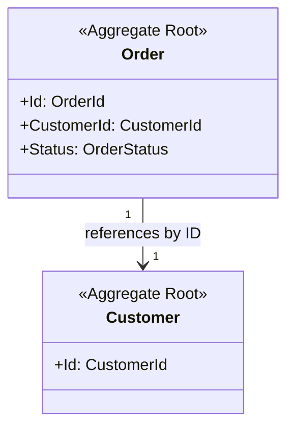
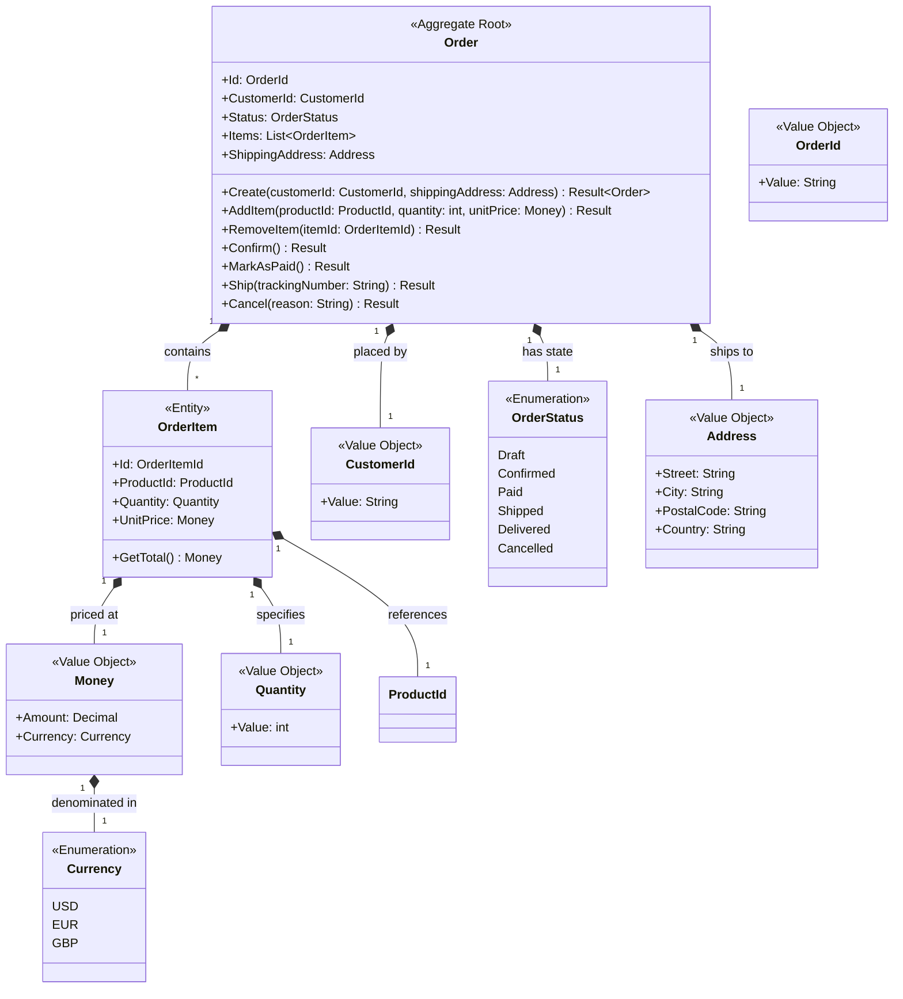
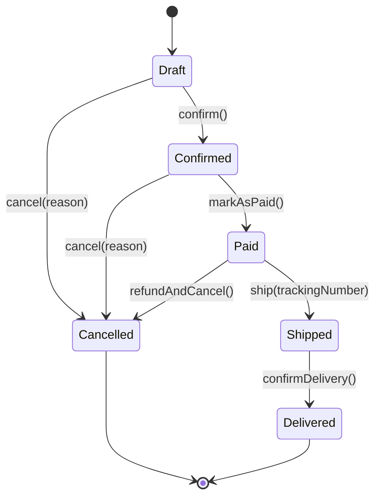

# Order Management Domain Design

This domain handles the lifecycle of customer orders from creation through fulfillment. It manages order state, items, pricing, and order status transitions.

## Ubiquitous Language

| Term | Definition |
|------|------------|
| Order | A customer's request to purchase products |
| OrderItem | A single line item within an order containing product, quantity, and price |
| OrderStatus | The current state of an order (Draft, Confirmed, Paid, Shipped, Delivered, Cancelled) |
| Confirmation | The act of finalizing a draft order for processing |
| Fulfillment | The process of preparing and delivering an order to the customer |

## Class Diagrams

### Aggregate Overview

### Order Aggregate

## Types

### Order

Manages order lifecycle from draft creation through delivery confirmation. Enforces business rules for state transitions, validates order completeness before processing, and coordinates item modifications within the order consistency boundary.

### OrderItem

Represents a single line item with locked-in price at order time. Captures product identity, quantity, and unit price as an immutable historical record. Cannot exist independently of its parent order.

## Design Details

### Order Status State Machine

### State Transition Triggers

| From | To | Trigger | Guard Condition |
|------|----|---------|-----------------|
| Draft | Confirmed | Order confirmed | Has items, has shipping address |
| Confirmed | Paid | Payment received | Payment valid |
| Paid | Shipped | Items shipped | Tracking number assigned |
| Shipped | Delivered | Delivery confirmed | Customer/signature confirmation |
| Draft/Confirmed/Paid | Cancelled | Cancel requested | Refund processed if paid |

### Price Locking Strategy

UnitPrice is captured within OrderItem at order creation time, preserving the price the customer agreed to independent of subsequent product price changes.

## Invariants

### Order Aggregate Invariants

| ID | Invariant | Notes |
|----|-----------|-------|
| ORDER-1 | Order must have at least one item to be confirmed | Empty orders cannot be processed |
| ORDER-2 | Order total must equal sum of all item totals | Calculated, not stored |
| ORDER-3 | Order cannot be confirmed without a valid shipping address | Address validation occurs on creation |
| ORDER-4 | Order status transitions must follow valid state machine | Draft→Confirmed→Paid→Shipped→Delivered (any state→Cancelled) |
| ORDER-5 | Paid orders cannot have items added or removed | Item modification only allowed in Draft state |

### OrderItem Invariants

| ID | Invariant | Notes |
|----|-----------|-------|
| ITEM-1 | Quantity must be greater than zero | Enforced by Quantity value object |
| ITEM-2 | Unit price must be positive | Enforced by Money value object |
| ITEM-3 | ProductId cannot be null or empty | Required for fulfillment |

## Future Considerations

- Add OrderDiscount value object to handle promotional discounts
- Consider splitting into Order and Shipment aggregates for complex fulfillment workflows
- Add version field for optimistic concurrency control
- Consider event sourcing for order history audit trail
