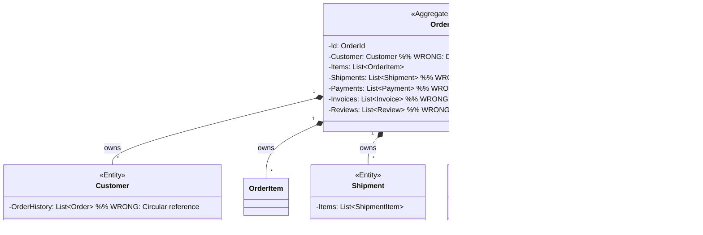

# Aggregates

## Overview

An Aggregate is a cluster of associated objects (Entities and Value Objects) treated as a unit for data changes. It is the primary pattern for enforcing consistency boundaries in tactical DDD.

**Core components:**
- **Aggregate Root** - The single entry point and gatekeeper
- **Boundary** - Defines what is inside the consistency unit
- **Invariants** - Business rules that must always hold true

## The Four Rules of Aggregate Design

Vaughn Vernon's canonical rules from *Implementing Domain-Driven Design*:

### Rule 1: Model True Invariants in Consistency Boundaries

**Rule:** Group objects that must be consistent with each other immediately after a transaction.

**Examples:**

| Objects | Same Aggregate? | Rationale |
|---------|-----------------|-----------|
| Order + OrderItems | Yes | Total must always equal sum of items |
| Order + Customer | No | Order can exist independently |
| Invoice + InvoiceItems | Yes | Invoice total invariant |
| Invoice + Payment | No | Payment is separate lifecycle |

**Implication:** Transaction boundaries should align with Aggregate boundaries. One transaction = one Aggregate instance modified.

### Rule 2: Design Small Aggregates

**Rule:** Keep Aggregates as small as possible—ideally just the Root and a few Value Objects.

**Problems with Mega-Aggregates:**

- **Performance:** Loading thousands of child objects causes massive I/O
- **Concurrency:** High contention—any update locks entire graph
- **Complexity:** Difficult to reason about invariants
- **Distribution:** Cannot shard or scale independently

**Benefits of Small Aggregates:**

- **Fast loading:** Minimal database queries
- **Low contention:** Updates target specific roots
- **Clear boundaries:** Easy to understand responsibilities
- **Scalability:** Can distribute across services

### Rule 3: Reference Other Aggregates by Identity Only

**Rule:** Aggregates should hold only the ID (not object reference) of other Aggregate Roots.

**Why identity-only references:**

1. **Decoupling:** Prevents massive connected object graphs
2. **Memory Management:** Enables garbage collection
3. **Distribution:** Referenced aggregate can be in different database/service
4. **Lazy Loading:** Avoids accidental N+1 query problems
5. **Consistency:** Clear boundary of what's inside/outside

**Implementation:**

### Rule 4: Use Eventual Consistency Outside the Boundary

**Rule:** When operations span multiple Aggregates, use Domain Events for eventual consistency rather than atomic transactions.

**Benefits of Eventual Consistency:**

- **Scalability:** No distributed transactions (2PC)
- **Performance:** No locking across aggregates
- **Resilience:** Message queues handle failures
- **Decoupling:** Aggregates evolve independently

**Trade-offs:**

- **Complexity:** Must handle async messaging
- **Consistency window:** Data may be stale temporarily
- **Idempotency:** Consumers must handle duplicate messages

## Aggregate Structure

### Components

**Rules for each component:**

- **Aggregate Root:**
  - Only entity accessible from outside aggregate
  - Holds reference to internal entities
  - Enforces all invariants
  - Generates domain events
  - Has repository

- **Internal Entities:**
  - Accessible only through Root
  - No external repositories
  - Mutable behavior encapsulated by Root

- **Value Objects:**
  - Immutable descriptors
  - Shared within aggregate
  - No identity

- **Domain Events:**
  - Record of significant state changes
  - Published after transaction commits

## Aggregate Lifecycle

### Creation

**Creation strategies:**

1. **Constructor** - Simple aggregates with few dependencies
2. **Static Factory Method** - Common approach, self-contained
3. **Factory Class** - Complex creation with external dependencies

### Modification

**Result pattern for aggregate modifications:**

- **Behavior methods return `Result`** - Operations that can fail return Result type
- **Invariant violations** - Return `Result.Error` with descriptive message
- **State transitions** - Return `Result` if transition may be invalid
- **Success** - Return `Result.Success` after valid state change

**Key principles:**

- All modifications go through Root
- Behavior methods (not setters) return Result
- Invariants checked before modification
- Validation failures return Result.Error, not exceptions
- Domain events generated for significant changes
- Repository persists entire Aggregate

### Deletion

**Approaches:**

- **Soft Delete** - Set status to Archived/Deleted (preferred for audit)
- **Hard Delete** - Actual database row removal (rare)
- **Archive** - Move to separate table/storage for compliance

## Repository Pattern

### One Repository Per Aggregate Root

**Rules:**

- Only Aggregate Roots have repositories
- Internal entities never have repositories
- Repository interface in Domain layer
- Repository implementation in Infrastructure layer
- Repository simulates in-memory collection

**Repository operations:**

## Aggregate Design Examples

### Example 1: Order Aggregate (Correct)

**Why this is correct:**
- Small aggregate (Root + one entity type)
- Customer referenced by ID only
- Clear behavior methods
- Enforces invariants (e.g., cannot confirm without items)
- Version field for optimistic concurrency

### Example 2: Mega-Aggregate Anti-Pattern

**Problems:**
- Loading Order loads entire Customer history
- Updating Payment locks entire Order
- Violates single responsibility
- Performance nightmare
- Concurrency conflicts

### Example 3: Correct Split Design

**Benefits:**
- Each aggregate has single responsibility
- Payment can be updated without locking Order
- Shipment can be handled by different service
- Clear transaction boundaries
- Independent scalability

## Aggregate Invariants

### Documenting Invariants

**Template:**
| ID | Invariant | Enforcement Point | Notes |
|----|-----------|-------------------|-------|
| ORD-1 | Order must have at least one item to confirm | `Order.Confirm()` | Prevents empty orders |
| ORD-2 | Order total equals sum of item totals | `Order.AddItem()`, `Order.RemoveItem()` | Calculated, not stored |
| ORD-3 | Cannot modify items after confirmation | `Order.AddItem()`, `Order.RemoveItem()` | Locks order state |

**Enforcement strategies:**

1. **Method guards** - Check at start of behavior method
2. **Constructor validation** - Check on creation
3. **State machine** - Enforce valid transitions
4. **Domain events** - Trigger cross-aggregate validation

### Example Invariants

## Advanced Concepts

### Dynamic Consistency Boundaries

**Challenge:** Some business rules span multiple aggregates but require immediate validation.

**Traditional approach:** Mega-aggregates (bad)

**Proposed solution:** Use event store to validate invariants before appending events.

### Aggregate vs. Bounded Context

**Relationship:**
- Bounded Context = Large-scale boundary (strategic DDD)
- Aggregate = Small-scale consistency boundary (tactical DDD)
- One Bounded Context contains multiple Aggregates
- Each Aggregate has one Root

## Summary Checklist

When reviewing a DOMAIN.md for Aggregate compliance, ask:

- [ ] Is the aggregate small (Root + few entities/VOs)?
- [ ] Are consistency boundaries clearly defined?
- [ ] Is access restricted to the Aggregate Root?
- [ ] Do references to other aggregates use IDs only?
- [ ] Is there one repository interface per Aggregate Root?
- [ ] Are all invariants documented and enforced?
- [ ] Are there behavior methods instead of public setters?
- [ ] Do behavior methods return `Result` for operations that can fail?
- [ ] Do Create methods return `Result<T>` with validation?
- [ ] Do repository methods return `Result` for operations that can fail?
- [ ] Are domain events used for significant changes?
- [ ] Is there a concurrency control strategy defined?
- [ ] Is eventual consistency used for cross-aggregate operations?
- [ ] Is there a version field for optimistic locking?
- [ ] Are error messages in Result.Error returns descriptive?
