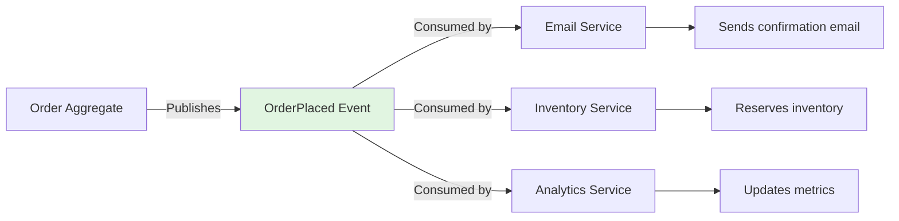
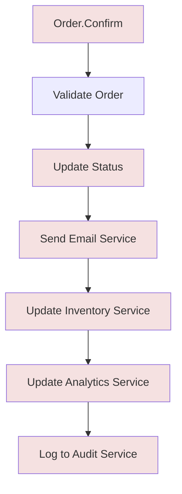
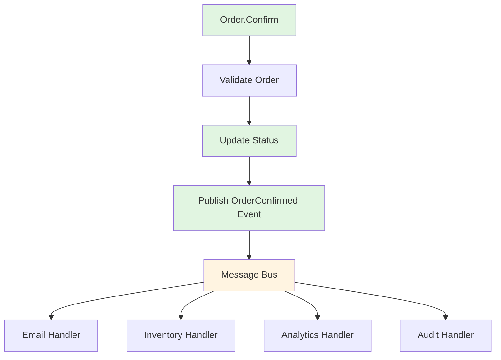
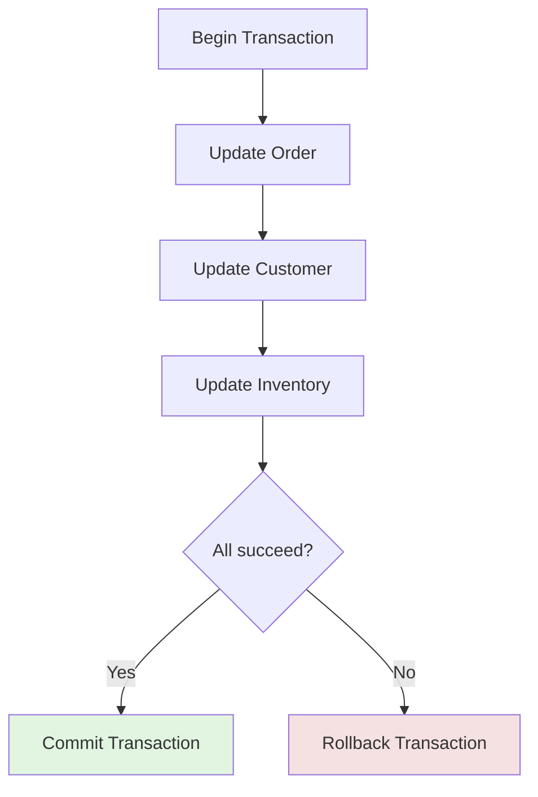
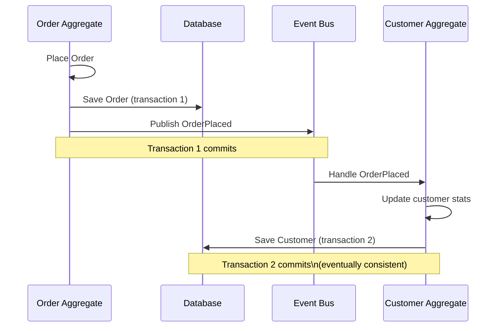
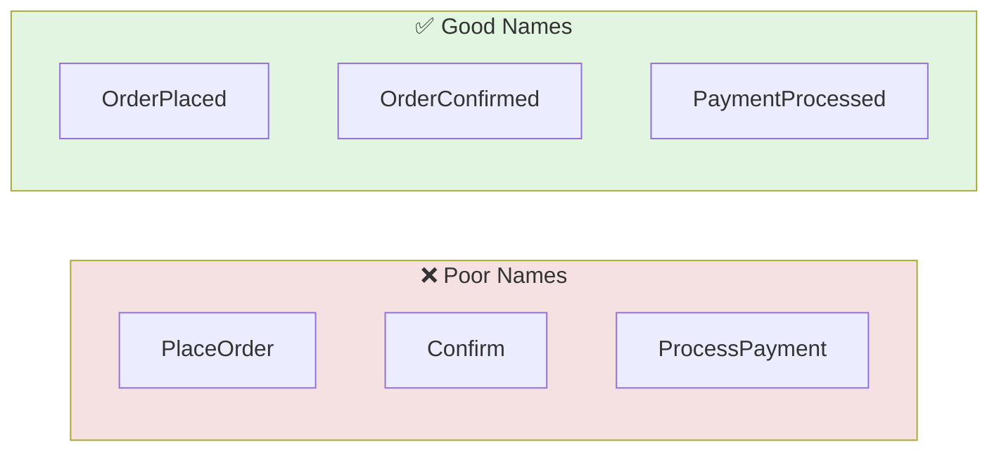
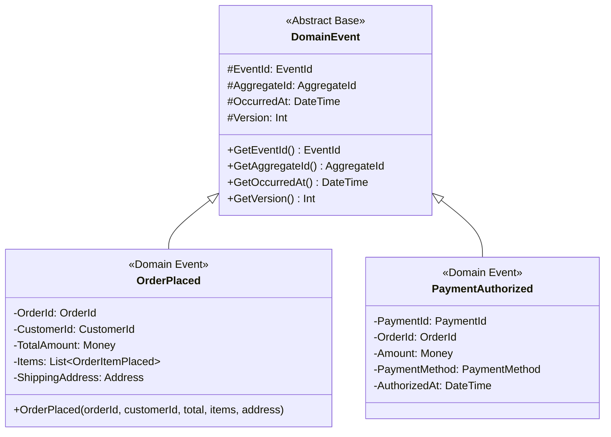
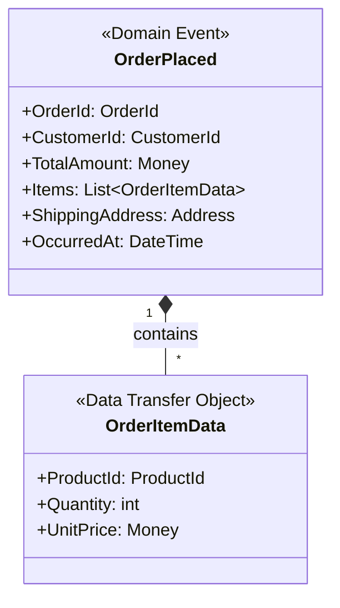
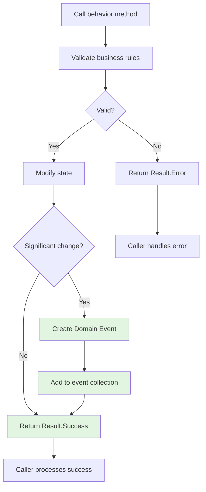
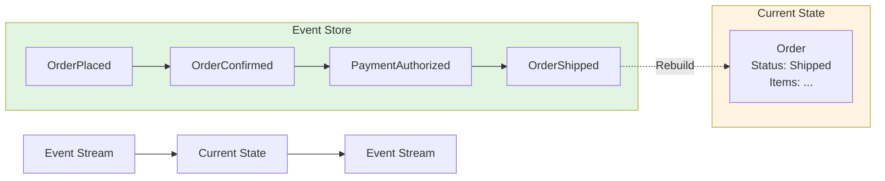

# Domain Events

## Overview

A Domain Event is a record of something significant that happened in the domain. It represents a completed action or state change that other parts of the system may need to react to.

**Core characteristics:**
- **Immutable** - Historical fact that cannot be changed
- **Past-tense naming** - Describes what happened (e.g., `OrderPlaced`, not `PlaceOrder`)
- **Minimal data** - Contains only what consumers need
- **Publish-subscribe** - Decouples producers from consumers



## Purpose and Benefits

### Decoupling Side Effects

**Problem:** Business operations often trigger side effects (emails, notifications, external system updates).

**Without Domain Events (Tightly Coupled):**



**With Domain Events (Loosely Coupled):**



**Benefits:**

- **Single Responsibility** - Aggregate focuses on core logic only
- **Open/Closed Principle** - Add new consumers without modifying producer
- **Testability** - Test aggregate in isolation without side effects
- **Resilience** - Message queues buffer consumers if they're down

### Eventual Consistency Across Aggregates

**Challenge:** Business operations often span multiple aggregates.

**Anti-Pattern:** Distributed transaction (2PC):



**Problems:**
- Locks multiple resources simultaneously
- Reduces throughput
- Doesn't scale across microservices
- Complex failure handling

**With Domain Events (Eventual Consistency):**



**Benefits:**
- Each aggregate updates in its own transaction
- No distributed locks
- Scales across microservices
- Message queues provide reliability

## Event Design

### Naming Conventions

**Rule:** Use past tense to indicate completed action.



**Examples:**

| Context | Event Name |
|---------|------------|
| Customer registers | `CustomerRegistered` |
| Order placed | `OrderPlaced` |
| Payment authorized | `PaymentAuthorized` |
| Payment captured | `PaymentCaptured` |
| Order shipped | `OrderShipped` |
| Inventory reserved | `InventoryReserved` |
| Email sent | `EmailSent` |

### Event Structure



**Standard fields:**

| Field | Purpose | Example |
|-------|---------|---------|
| `EventId` | Unique identifier for this event instance | `550e8400-...` |
| `AggregateId` | ID of the aggregate that emitted the event | `Order("123")` |
| `AggregateType` | Type name of the aggregate | `"Order"` |
| `EventType` | Type name of the event | `"OrderPlaced"` |
| `OccurredAt` | Timestamp when the event occurred | `2025-01-15T10:30:00Z` |
| `Version` | Optimistic concurrency version | `1` |

### Minimal Data Principle

**Rule:** Include only the data consumers need, not the entire aggregate state.

```mermaid
flowchart TB
    subgraph Excessive["❌ Too Much Data"]
        A1[OrderPlaced Event]
        A1 --> A2[Entire Order object]
        A2 --> A3[All OrderItems]
        A2 --> A4[Customer object]
        A2 --> A5[Product objects]
    end

    subgraph Minimal["✅ Minimal Data"]
        B1[OrderPlaced Event]
        B1 --> B2[OrderId]
        B1 --> B3[CustomerId]
        B1 --> B4[TotalAmount]
        B1 --> B5[Item summaries (ID, qty, price)]
    end

    style Excessive fill:#f5e1e1
    style Minimal fill:#e1f5e1
```

**Guidelines:**

- Include aggregate ID (for querying if needed)
- Include fields that changed
- Include identifiers for referenced aggregates
- Don't include unchanged fields
- Don't include entire child object graphs

**Example: OrderPlaced event**



## Event Generation

### When to Emit Events

**Criteria for significance:**

- State change that other systems care about
- Business milestone reached
- Decision point in a process
- Error or exception condition
- Timeout or SLA breach

**Examples:**

| Aggregate State Change | Emit Event? | Reason |
|------------------------|-------------|--------|
| Order created | Yes (`OrderPlaced`) | Triggers inventory, email |
| Order item added | No | Internal to aggregate |
| Order confirmed | Yes (`OrderConfirmed`) | Triggers payment flow |
| Payment status updated | Yes (`PaymentAuthorized`) | Triggers fulfillment |
| Customer address changed | Yes (`CustomerAddressChanged`) | Triggers shipping update |

### Event Generation Pattern



**Implementation with Result pattern:**

```mermaid
classDiagram
    class AggregateRoot {
        <<Abstract Base>>
        #_DomainEvents: List~DomainEvent~
        +GetDomainEvents() List~DomainEvent~
        +ClearDomainEvents() void
        +AddDomainEvent(event: DomainEvent) void
    }

    class Order {
        <<Aggregate Root>>
        +Confirm() Result {
            if (!CanConfirm()) {
                return Result.Error("Order cannot be confirmed: has no items")
            }

            SetStatus(OrderStatus.Confirmed)
            AddDomainEvent(OrderConfirmed(Id, CustomerId, Total))

            return Result.Success
        }
    }

    AggregateRoot <|-- Order
```

### Event vs. State

**Principle:** Events are facts; state is current reality.



**Event Sourcing pattern:** Store events, derive state on read.

## Common Anti-Patterns

### Event Explosion
**Problem:** Emitting events for every minor state change (e.g., `OrderCreated`, `OrderStatusChangedToDraft`, `OrderItemsCollectionModified`) creates event noise.
**Solution:** Emit events only for significant business state changes that other systems need to react to.

### Event God Object
**Problem:** A generic `OrderChanged` event containing entire Order state, old state, new state, user who changed, timestamp, and change reason.
**Solution:** Use specific event types with minimal data (e.g., `OrderPlaced`, `PaymentAuthorized`) containing only what consumers need.

### Synchronous Event Handlers
**Problem:** Aggregate emits event and immediately calls synchronous handler that invokes external service, blocking the aggregate and coupling it to application concerns.
**Solution:** Emits domain events but delegates handling to external consumers.

## Summary Checklist

When designing Domain Events, ensure:

- [ ] Past-tense naming (OrderPlaced, not PlaceOrder)
- [ ] Immutable (events are facts)
- [ ] Minimal data (only what consumers need)
- [ ] Standard metadata (EventId, AggregateId, OccurredAt)
- [ ] Clear correlation (events reference aggregate IDs)
