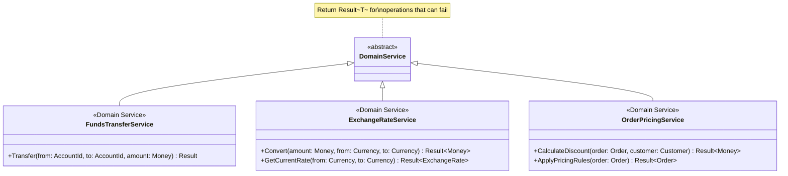

# Domain Services

## Overview

A Domain Service is a stateless operation that represents domain logic which doesn't naturally fit within a single Entity or Value Object. Unlike Application Services which orchestrate workflows, Domain Services contain fundamental business rules that span multiple aggregates or require external dependencies.

**Core characteristics:**
- **Stateless** - No mutable state, operations are pure functions
- **Domain knowledge** - Contains business logic, not just orchestration
- **Ubiquitous Language** - Named using domain terminology
- **Cross-aggregate coordination** - Manages interactions between aggregates
- **Returns `Result<T>`** - Operations that can fail return Result types


## When to Use Domain Services

### Decision Framework


### Use Cases

| Scenario | Solution | Example |
|----------|----------|---------|
| **Operation involves multiple aggregates** | Domain Service | `FundsTransferService.transfer(from, to, amount)` |
| **Logic requires external service** | Domain Service + Port | `ExchangeRateService.getCurrentRate()` |
| **Calculation spanning aggregates** | Domain Service | `OrderPricingService.calculateDiscount(order, customer)` |
| **Natural operation but no single owner** | Domain Service | `PasswordEncryptionService.encrypt(password)` |
| **Workflow coordination** | Application Service | `ProcessPaymentUseCase.execute(command)` |

### Domain Service vs. Application Service


| Aspect | Domain Service | Application Service |
|--------|---------------|---------------------|
| **Purpose** | Execute business logic | Orchestrate workflow |
| **Knowledge** | Domain rules and entities | DTOs, repositories, security |
| **Location** | Domain Layer | Application Layer |
| **Called by** | Other domain components, app services | Controllers, UI |
| **State** | Stateless | Stateless |
| **Returns** | `Result<T>` for validation | `Result<T>` for operation status |
| **Example** | `FundsTransferService` | `ProcessPaymentUseCase` |

### Domain Service vs. Method on Entity


**Example: Funds Transfer**


**Why not `Account.transferTo(other: Account)`?**

- **Tight coupling** - Account would know about other Account instances
- **Violation of aggregate boundaries** - Spans two consistency boundaries
- **Asymmetric responsibility** - Should both accounts handle transfers?
- **Domain concept** - "Transfer" is a fundamental banking operation, not an account behavior

## Domain Service Design

### Naming Conventions


| Pattern | Example | When to Use |
|---------|---------|-------------|
| **Verb + Noun + Service** | `FundsTransferService` | Standard domain operations |
| **Noun + Calculator** | `TaxCalculator`, `PriceCalculator` | Pure calculations |
| **Noun + Engine** | `RecommendationEngine` | Complex algorithms |
| **Verb + Noun** | `PasswordEncryptionService` | Single-responsibility service |

**Good names** (from ubiquitous language):
- ✅ `FundsTransferService` - Banking domain language
- ✅ `ExchangeRateService` - Currency trading language
- ✅ `OrderPricingService` - E-commerce language
- ✅ `InventoryAvailabilityService` - Retail language

**Poor names** (technical jargon):
- ❌ `AccountManager` - Too vague, could be app service
- ❌ `HelperService` - Not domain language
- ❌ `UtilityService` - No domain meaning

### Operation Signature Design



**Signature principles:**

1. **Accept aggregates or IDs** - Domain services work with domain objects
2. **Return `Result<T>`** - Operations can fail with business rules
3. **Stateless** - No instance state, all dependencies injected
4. **Domain types** - Use value objects, not primitives

### Operation Design Patterns


**Pattern 1: State Transition Service** (modifies aggregates)


**Pattern 2: Calculation Service** (pure function)


## Domain Services and External Dependencies

### The Port Pattern

When Domain Services need external dependencies (email, payment gateways, external APIs), use the Port pattern:


**Benefits:**

- **Domain remains pure** - No infrastructure dependencies in domain layer
- **Testability** - Mock ports for unit testing
- **Flexibility** - Swap implementations without changing domain
- **Clear separation** - Domain defines contract, infrastructure provides implementation

### Domain Service with Ports


## Common Domain Service Examples

### 1. Calculation Services


**Characteristics:**
- Pure functions (same input = same output)
- No side effects
- No aggregate modification
- Return calculated values

### 2. Coordination Services


**Characteristics:**
- Modifies multiple aggregates
- Coordinates across consistency boundaries
- Enforces cross-aggregate invariants
- May publish domain events

### 3. Validation Services


**Characteristics:**
- Validates uniqueness across aggregates
- Complex creation logic
- Side effects via ports
- Returns new aggregates

### 4. Domain Logic Services


**Characteristics:**
- Domain-specific algorithm
- No entity/aggregate involvement
- Pure business logic
- Often stateless utilities

## Testing Domain Services

### Unit Testing Strategy


**Test scenarios:**

1. **Success case** - Valid operation completes successfully
2. **Business rule violation** - Returns `Result.Error` with message
3. **External dependency failure** - Port returns error, service propagates
4. **Aggregate state** - Verify aggregates modified correctly
5. **Domain events** - Verify correct events published

## Common Anti-Patterns

### Anemic Domain Service

**Problem:** Domain Service becomes a procedural script with all business logic extracted from entities.


**Solution:** Keep behavior on entities. Use Domain Services only for logic that genuinely spans multiple aggregates.

### Application Service Masquerading as Domain Service

**Problem:** Service orchestrates workflows (loads repositories, saves results, manages transactions) instead of containing business logic.

| Anti-pattern | Correct |
|--------------|---------|
| `PaymentOrchestrator` - manages entire payment flow | `PaymentAuthorizationService` - contains authorization logic |
| Calls repositories directly | Receives aggregates as parameters |
| Manages transactions | Business logic only |
| Returns DTOs | Returns `Result<T>` with domain types |

**Solution:** Move orchestration to Application Services. Domain Services should focus purely on business logic.

### Overused Domain Services

**Problem:** Creating Domain Services for logic that belongs in a single entity.

```mermaid
flowchart TB
    A[domain operation] --> B{One entity owner?}
    B -->|Yes| C[❌ AccountValidationService]
    B -->|Yes| D[✅ Account.Validate()]

    C --> E[Unnecessary indirection]
    D --> F[Logic where it belongs]

    style C fill:#f5e1e1
    style D fill:#e1f5e1
```

**Solution:** If logic naturally belongs to one entity, place it there. Not every service needs to be a "Domain Service."

### God Domain Service

**Problem:** Single service accumulates too many responsibilities.

**Examples:**
- ❌ `AccountService` - Handles transfers, validation, creation, archival, reporting
- ✅ `FundsTransferService`, `AccountValidationService`, `AccountCreationService`

**Solution:** Split by domain concept, following single responsibility principle.

## Summary Checklist

When designing Domain Services, ensure:

- [ ] Logic genuinely doesn't fit in single Entity/Value Object
- [ ] Named using ubiquitous language (verb + noun + service)
- [ ] Stateless operations (no instance state)
- [ ] Returns `Result<T>` for operations that can fail
- [ ] Uses ports for external dependencies
- [ ] Distinguished from Application Services (business logic vs. orchestration)
- [ ] Accepts domain types (aggregates, value objects), not DTOs
- [ ] Keeps entities rich (doesn't become procedural script)
- [ ] Single responsibility (not a "god service")
- [ ] Documented in domain design with clear purpose
- [ ] Testable in isolation (mock ports and repositories)
