# Entities

## Overview

An Entity is an object with a distinct identity that runs through time and different states. Unlike Value Objects, which are defined by their attributes, Entities are defined by their identity.

**Core characteristics:**
- **Identity-based** - Same ID = same entity, even if all attributes change
- **Mutable** - State changes over lifecycle
- **Lifecycle** - Created, modified, archived/deleted
- **Behavioral encapsulation** - Methods that implement business logic

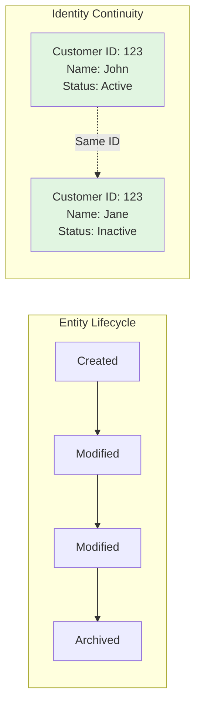
```mermaid
flowchart LR
    subgraph Entity["Entity Lifecycle"]
        A[Created] --> B[Modified]
        B --> C[Modified]
        C --> D[Archived]
    end

    subgraph Identity["Identity Continuity"]
        E[Customer ID: 123<br/>Name: John<br/>Status: Active]
        F[Customer ID: 123<br/>Name: Jane<br/>Status: Inactive]
        E -.->|Same ID| F
    end

    style E fill:#e1f5e1
    style F fill:#e1f5e1
```

## Identity

### The Primacy of Identity

**Rule:** An Entity's identity remains constant throughout its lifecycle, regardless of attribute changes.

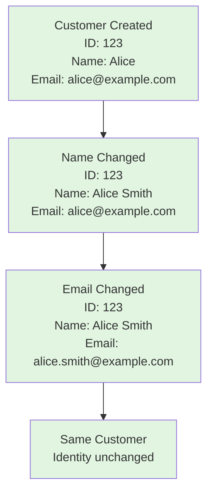
```mermaid
flowchart TD
    A[Customer Created<br/>ID: 123<br/>Name: Alice<br/>Email: alice@example.com]
    A --> B[Name Changed<br/>ID: 123<br/>Name: Alice Smith<br/>Email: alice@example.com]
    B --> C[Email Changed<br/>ID: 123<br/>Name: Alice Smith<br/>Email: alice.smith@example.com]
    C --> D[Same Customer<br/>Identity unchanged]

    style A fill:#e1f5e1
    style B fill:#e1f5e1
    style C fill:#e1f5e1
    style D fill:#e1f5e1
```

**Entity vs. Value Object comparison:**

| Aspect | Entity | Value Object |
|--------|--------|--------------|
| **Definition** | Identity-based | Attribute-based |
| **Equality** | Same ID = equal | Same values = equal |
| **Mutability** | Mutable | Immutable |
| **Lifecycle** | Created → Modified → Deleted | Created and replaced |
| **Example** | Customer, Order, Product | Money, Address, DateRange |

### Identity Generation Strategies

| Strategy | Description | When to Use |
|----------|-------------|-------------|
| Surrogate Keys | Database-generated auto-increment integers | Simple CRUD applications |
| UUID/GUID | Application-generated globally unique IDs | Distributed systems, microservices |
| Natural Keys | Domain-specific unique values | Stable, guaranteed-unique domain identifiers |
| Identity Value Objects | IDs wrapped in type-safe Value Objects | When type safety is critical |

**Best Practice:** Wrap identity primitives in Value Objects (e.g., `CustomerId`, `OrderId`) for compiler-level type safety. This prevents accidentally using a CustomerId where an OrderId is expected.

## Mutability

### Controlled Mutability

**Rule:** Entities are mutable but mutability must be carefully controlled.

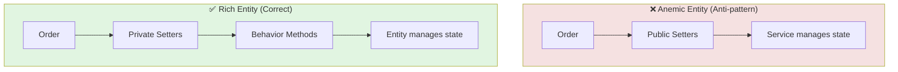
```mermaid
flowchart TB
    subgraph Bad["❌ Anemic Entity (Anti-pattern)"]
        B1[Order]
        B1 --> B2[Public Setters]
        B2 --> B3[Service manages state]
    end

    subgraph Good["✅ Rich Entity (Correct)"]
        G1[Order]
        G1 --> G2[Private Setters]
        G2 --> G3[Behavior Methods]
        G3 --> G4[Entity manages state]
    end

    style Bad fill:#f5e1e1
    style Good fill:#e1f5e1
```

### Behavioral Encapsulation

**Principle:** Expose behavior, not state. Methods that can fail return `Result`.

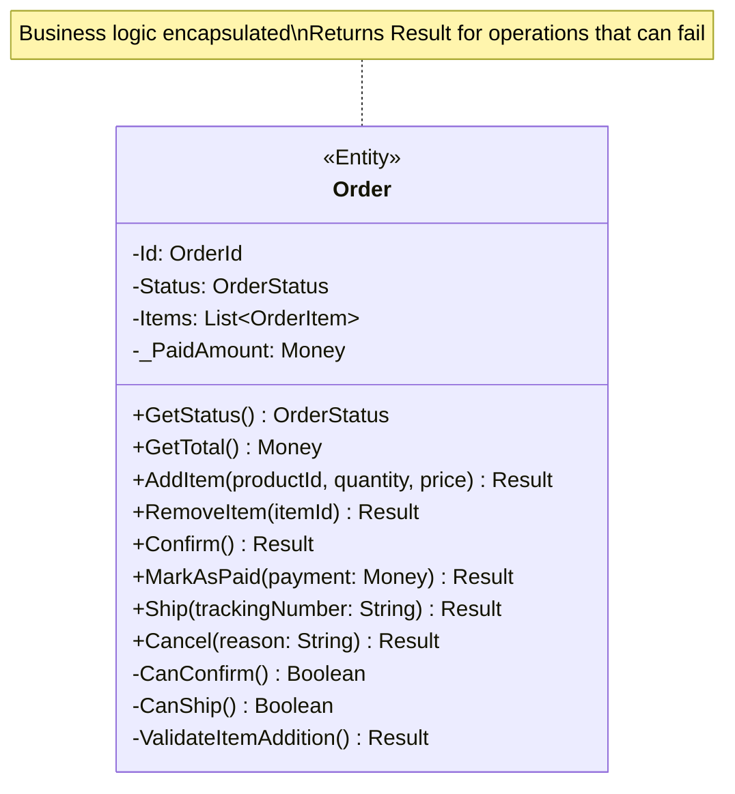
```mermaid
classDiagram
    class Order {
        <<Entity>>
        -Id: OrderId
        -Status: OrderStatus
        -Items: List~OrderItem~
        -_PaidAmount: Money
        +GetStatus() OrderStatus
        +GetTotal() Money
        +AddItem(productId, quantity, price) Result
        +RemoveItem(itemId) Result
        +Confirm() Result
        +MarkAsPaid(payment: Money) Result
        +Ship(trackingNumber: String) Result
        +Cancel(reason: String) Result
        -CanConfirm() Boolean
        -CanShip() Boolean
        -ValidateItemAddition() Result
    }

    note for Order "Business logic encapsulated\nReturns Result for operations that can fail"
```

**Result return types for behavior methods:**

- **State transitions** - Return `Result` if transition may be invalid
- **Invariant enforcement** - Return `Result` with error message if violated
- **Validation failures** - Return `Result.Error` with business rule explanation
- **Success** - Return `Result.Success` for valid operations

**Benefits of Result return types:**

- **Explicit failures** - Type shows operation can fail
- **Rich error messages** - Business rule violations explained
- **No exceptions for flow** - Validation failures aren't exceptional
- **Composable** - Results can be chained or combined

**Naming conventions:**

| Poor (Anemic) | Good (Rich) | Return Type |
|---------------|-------------|-------------|
| `order.Status = Status.Shipped` | `order.Ship()` | `Result` |
| `order.Items.Add(item)` | `order.AddItem(productId, quantity, price)` | `Result` |
| `order.Paid = true` | `order.MarkAsPaid(payment)` | `Result` |
| `order.Deleted = true` | `order.Archive(reason)` | `Result` |

### Private Setters

**Pattern:** Use private or protected setters to prevent external modification.

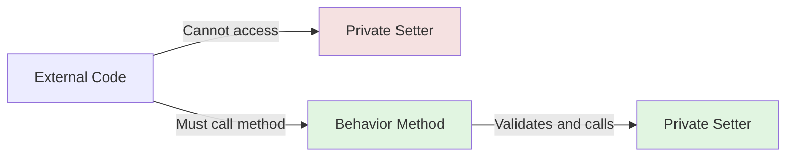
```mermaid
flowchart LR
    A[External Code] -->|Cannot access| B[Private Setter]
    A -->|Must call method| C[Behavior Method]
    C -->|Validates and calls| D[Private Setter]

    style B fill:#f5e1e1
    style C fill:#e1f5e1
    style D fill:#e1f5e1
```

**Implementation:**

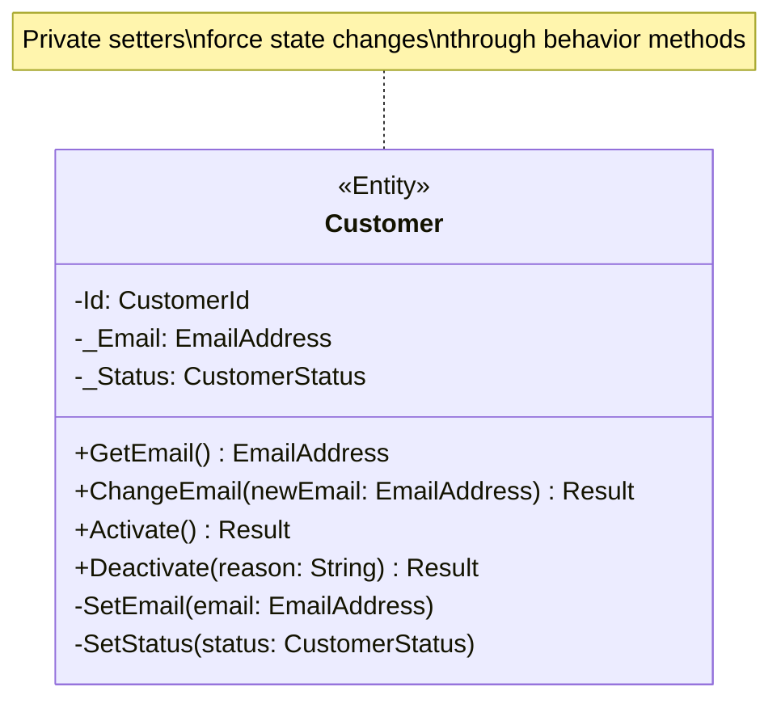
```mermaid
classDiagram
    class Customer {
        <<Entity>>
        -Id: CustomerId
        -_Email: EmailAddress
        -_Status: CustomerStatus
        +GetEmail() EmailAddress
        +ChangeEmail(newEmail: EmailAddress) Result
        +Activate() Result
        +Deactivate(reason: String) Result
        -SetEmail(email: EmailAddress)
        -SetStatus(status: CustomerStatus)
    }

    note for Customer "Private setters\nforce state changes\nthrough behavior methods"
```

**Benefits:**

- Enforces invariant validation before state change
- Captures business logic in one place
- Prevents invalid state transitions
- Makes code more testable

## Lifecycle Management

### Creation

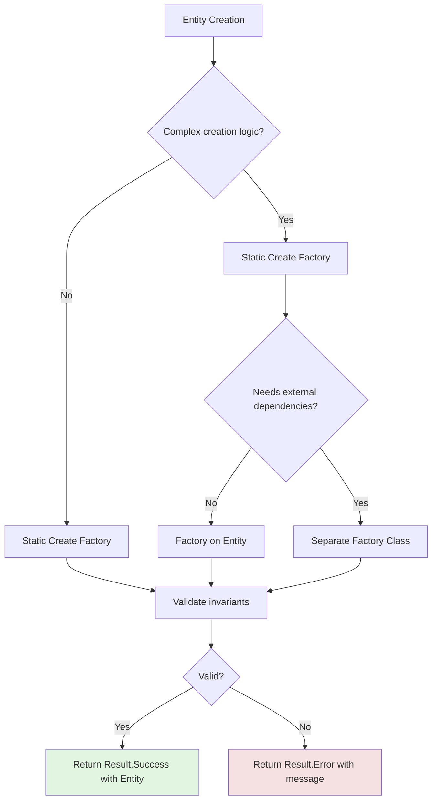
```mermaid
flowchart TD
    A[Entity Creation] --> B{Complex creation logic?}
    B -->|No| C[Static Create Factory]
    B -->|Yes| D[Static Create Factory]
    D --> E{Needs external dependencies?}
    E -->|No| F[Factory on Entity]
    E -->|Yes| G[Separate Factory Class]

    C --> H[Validate invariants]
    F --> H
    G --> H
    H --> I{Valid?}
    I -->|Yes| J[Return Result.Success with Entity]
    I -->|No| K[Return Result.Error with message]

    style J fill:#e1f5e1
    style K fill:#f5e1e1
```

**Creation with Result pattern:**

Entities use static `Create` methods that return `Result<Entity>` to handle validation failures gracefully.

**Benefits of Result<T> for entity creation:**

- **Explicit validation** - Creation failures are visible in type signature
- **No exceptions for validation** - Business rule violations aren't exceptional
- **Better error messages** - Can return specific validation errors
- **Composable** - Results can be combined when creating multiple entities
- **Testable** - Error paths are clear and testable

**Creation patterns:**

1. **Static Create Factory** - Recommended approach, returns `Result<T>`
2. **Factory Class** - For complex creation with external dependencies

**Example: Entity creation with Result pattern**

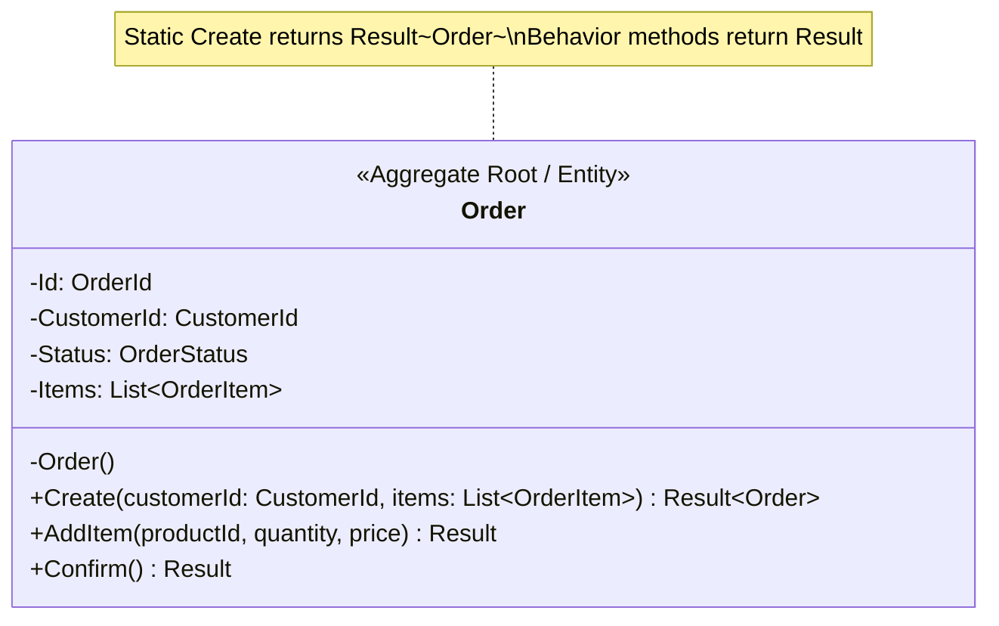
```mermaid
classDiagram
    class Order {
        <<Aggregate Root / Entity>>
        -Id: OrderId
        -CustomerId: CustomerId
        -Status: OrderStatus
        -Items: List~OrderItem~
        -Order()
        +Create(customerId: CustomerId, items: List~OrderItem~) Result~Order~
        +AddItem(productId, quantity, price) Result
        +Confirm() Result
    }

    note for Order "Static Create returns Result~Order~\nBehavior methods return Result"
```

**Create method structure:**

1. **Validate all invariants** - Check all business rules
2. **Construct entity** - Create valid instance if rules pass
3. **Return Result.Success** - With entity instance
4. **Return Result.Error** - With validation error message

**Example: Static Factory**

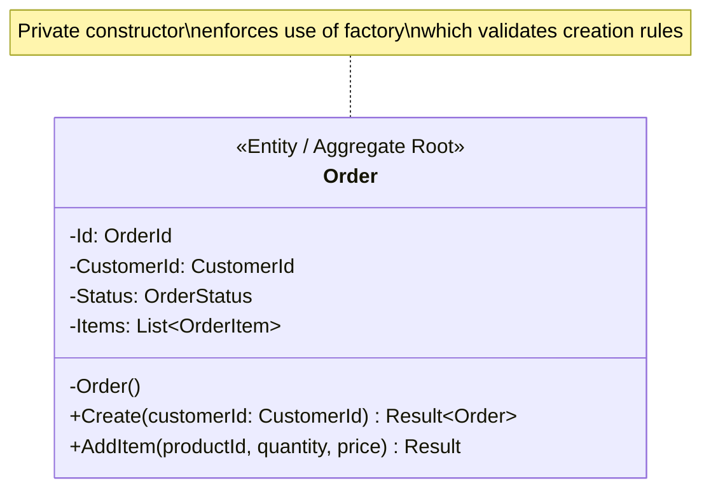
```mermaid
classDiagram
    class Order {
        <<Entity / Aggregate Root>>
        -Id: OrderId
        -CustomerId: CustomerId
        -Status: OrderStatus
        -Items: List~OrderItem~
        -Order()
        +Create(customerId: CustomerId) Result~Order~
        +AddItem(productId, quantity, price) Result
    }

    note for Order "Private constructor\nenforces use of factory\nwhich validates creation rules"
```

### State Transitions

**Principle:** Model valid state transitions explicitly. Transition methods return `Result` to handle invalid transitions.

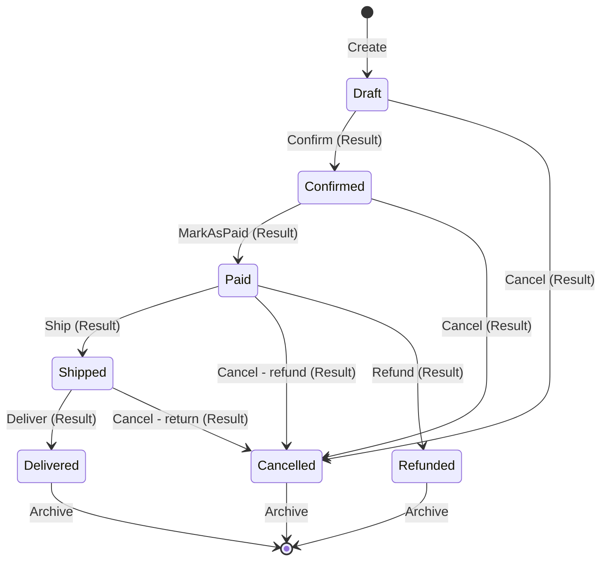
```mermaid
stateDiagram-v2
    [*] --> Draft: Create
    Draft --> Confirmed: Confirm (Result)
    Confirmed --> Paid: MarkAsPaid (Result)
    Paid --> Shipped: Ship (Result)
    Shipped --> Delivered: Deliver (Result)
    Draft --> Cancelled: Cancel (Result)
    Confirmed --> Cancelled: Cancel (Result)
    Paid --> Cancelled: Cancel - refund (Result)
    Shipped --> Cancelled: Cancel - return (Result)
    Delivered --> [*]: Archive
    Cancelled --> [*]: Archive
    Paid --> Refunded: Refund (Result)
    Refunded --> [*]: Archive
```

**State machine enforcement with Result pattern:**

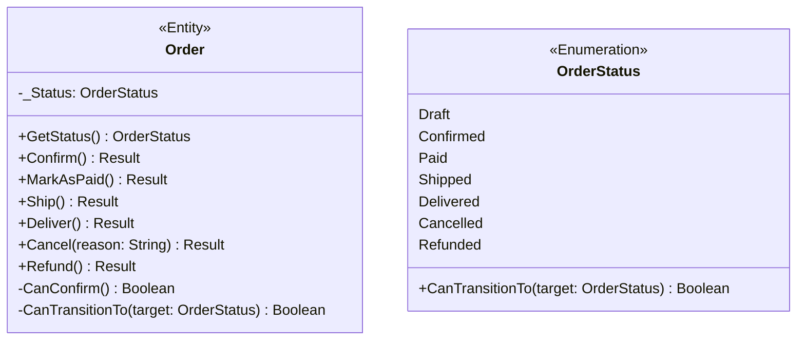
```mermaid
classDiagram
    class Order {
        <<Entity>>
        -_Status: OrderStatus
        +GetStatus() OrderStatus
        +Confirm() Result
        +MarkAsPaid() Result
        +Ship() Result
        +Deliver() Result
        +Cancel(reason: String) Result
        +Refund() Result
        -CanConfirm() Boolean
        -CanTransitionTo(target: OrderStatus) Boolean
    }
    class OrderStatus {
        <<Enumeration>>
        Draft
        Confirmed
        Paid
        Shipped
        Delivered
        Cancelled
        Refunded
        +CanTransitionTo(target: OrderStatus) Boolean
    }
```

**Example transition with Result:**

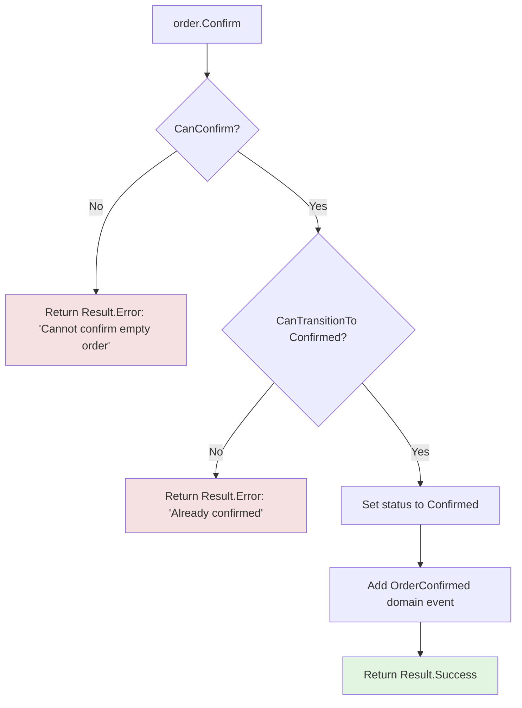
```mermaid
flowchart TD
    A[order.Confirm] --> B{CanConfirm?}
    B -->|No| C[Return Result.Error: 'Cannot confirm empty order']
    B -->|Yes| D{CanTransitionTo Confirmed?}
    D -->|No| E[Return Result.Error: 'Already confirmed']
    D -->|Yes| F[Set status to Confirmed]
    F --> G[Add OrderConfirmed domain event]
    G --> H[Return Result.Success]

    style C fill:#f5e1e1
    style E fill:#f5e1e1
    style H fill:#e1f5e1
```

**Enforcement strategies:**

1. **Method guards** - Check current state before transition, return Result.Error if invalid
2. **State machine class** - Encapsulate transition logic
3. **Enumeration methods** - `OrderStatus.CanTransitionTo()`
4. **Domain events** - Emit events for valid transitions
5. **Result pattern** - Return descriptive error messages for invalid transitions

### Archival and Deletion

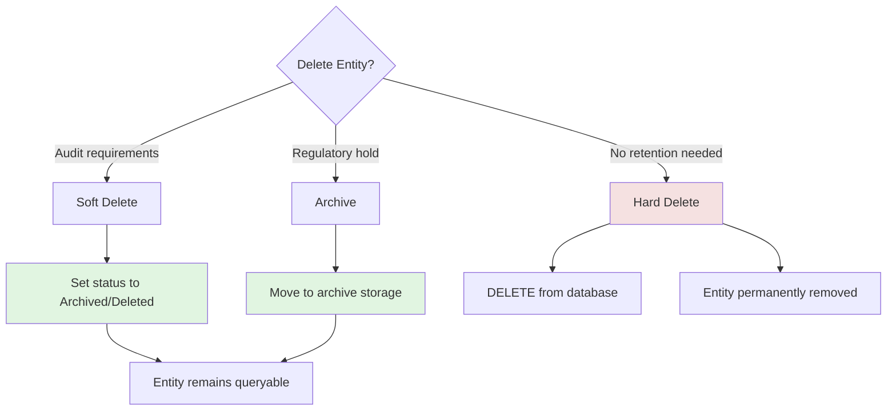
```mermaid
flowchart TD
    A{Delete Entity?}
    A -->|Audit requirements| B[Soft Delete]
    A -->|Regulatory hold| C[Archive]
    A -->|No retention needed| D[Hard Delete]

    B --> E[Set status to Archived/Deleted]
    C --> F[Move to archive storage]
    D --> G[DELETE from database]

    E --> H[Entity remains queryable]
    F --> H
    D --> I[Entity permanently removed]

    style E fill:#e1f5e1
    style F fill:#e1f5e1
    style D fill:#f5e1e1
```

**Approaches:**

| Approach | Description | Use When |
|----------|-------------|----------|
| **Soft Delete** | Set status flag, keep in table | Audit trails, recovery needed |
| **Archive** | Move to separate table/storage | Compliance, long-term retention |
| **Hard Delete** | Actual database deletion | No retention needed, rare |

**Best practice:** Model archival explicitly as domain behavior.

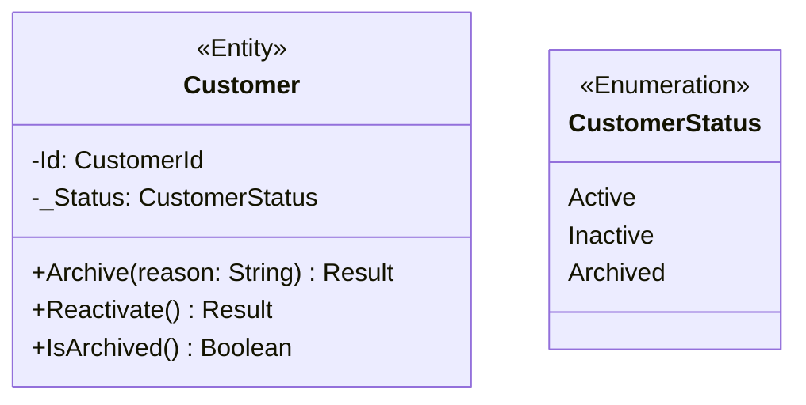
```mermaid
classDiagram
    class Customer {
        <<Entity>>
        -Id: CustomerId
        -_Status: CustomerStatus
        +Archive(reason: String) Result
        +Reactivate() Result
        +IsArchived() Boolean
    }
    class CustomerStatus {
        <<Enumeration>>
        Active
        Inactive
        Archived
    }
```

## Entities vs. Aggregates

### When is an Entity also an Aggregate Root?

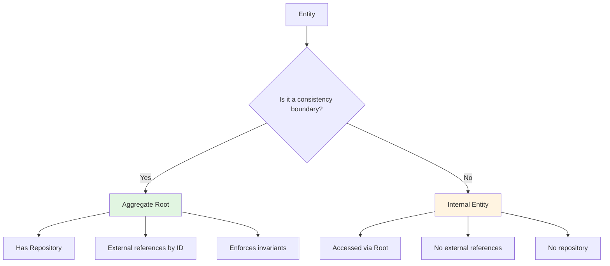
```mermaid
flowchart TB
    A[Entity] --> B{Is it a consistency boundary?}
    B -->|Yes| C[Aggregate Root]
    B -->|No| D[Internal Entity]

    C --> E[Has Repository]
    C --> F[External references by ID]
    C --> G[Enforces invariants]

    D --> H[Accessed via Root]
    D --> I[No external references]
    D --> J[No repository]

    style C fill:#e1f5e1
    style D fill:#fff4e1
```

**Decision criteria:**

- **Aggregate Root:** Is a consistency boundary, has repository, referenced by ID
- **Internal Entity:** Part of aggregate, accessed only through Root

### Internal Entities

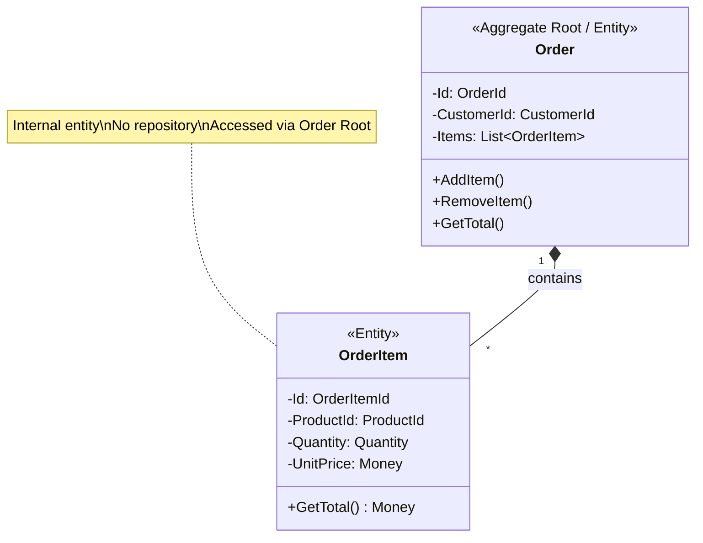
```mermaid
classDiagram
    %% Order Aggregate
    class Order {
        <<Aggregate Root / Entity>>
        -Id: OrderId
        -CustomerId: CustomerId
        -Items: List~OrderItem~
        +AddItem()
        +RemoveItem()
        +GetTotal()
    }
    class OrderItem {
        <<Entity>>
        -Id: OrderItemId
        -ProductId: ProductId
        -Quantity: Quantity
        -UnitPrice: Money
        +GetTotal() Money
    }

    Order "1" *-- "*" OrderItem : contains

    note for OrderItem "Internal entity\nNo repository\nAccessed via Order Root"
```

**Characteristics of internal entities:**
- Have identity (ID) within aggregate
- Cannot exist independently of Root
- No external references (only Root can reference)
- No repository
- Mutable behavior controlled by Root

## Entity Relationships

### One-to-Many (Composition)

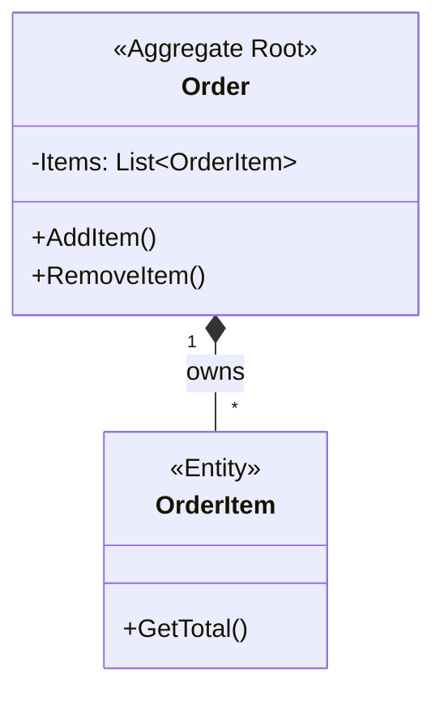
```mermaid
classDiagram
    class Order {
        <<Aggregate Root>>
        -Items: List~OrderItem~
        +AddItem()
        +RemoveItem()
    }
    class OrderItem {
        <<Entity>>
        +GetTotal()
    }

    Order "1" *-- "*" OrderItem : owns
```

**Rules:**
- Parent entity owns child entities
- Child cannot exist without parent
- Modifications go through parent
- Child lifecycle tied to parent

### Many-to-One (Reference by ID)

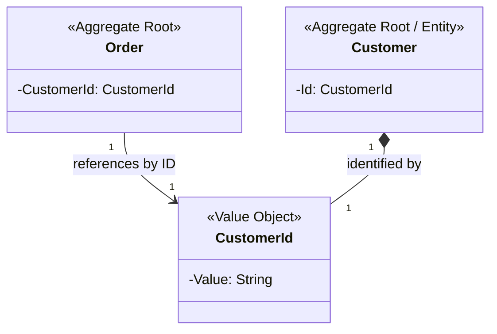
```mermaid
classDiagram
    class Order {
        <<Aggregate Root>>
        -CustomerId: CustomerId
    }
    class Customer {
        <<Aggregate Root / Entity>>
        -Id: CustomerId
    }
    class CustomerId {
        <<Value Object>>
        -Value: String
    }

    Order "1" --> "1" CustomerId : references by ID
    Customer "1" *-- "1" CustomerId : identified by
```

**Rules:**
- Reference other aggregates by ID only
- No object references across aggregates
- Eventual consistency between aggregates

### One-to-One

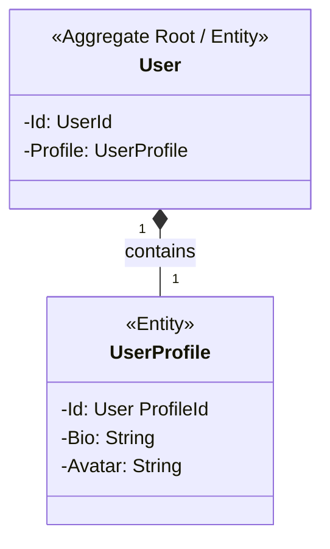
```mermaid
classDiagram
    class User {
        <<Aggregate Root / Entity>>
        -Id: UserId
        -Profile: UserProfile
    }
    class UserProfile {
        <<Entity>>
        -Id: User ProfileId
        -Bio: String
        -Avatar: String
    }

    User "1" *-- "1" UserProfile : contains
```

**When to use:**
- Child has no independent lifecycle
- Child is always accessed with parent
- Child doesn't need its own repository
- Child is part of same consistency boundary

## Common Anti-Patterns

### Anemic Domain Model
**Problem:** Entities become mere data containers with public setters and no business logic, with all behavior moved to service layers.
**Solution:** Use private setters and expose behavior through methods that enforce invariants (e.g., `order.confirm()` instead of `order.status = "CONFIRMED"`).

### God Entity
**Problem:** One entity accumulates too many responsibilities (orders, payments, addresses, reviews, etc.), should be separate aggregates.
**Solution:** Split into multiple focused aggregates, each with its own consistency boundary and repository.

### Identity Leakage
**Problem:** A Value Object with an ID field is actually an Entity, violating the Value Object pattern.
**Solution:** Remove ID fields and treat it as a true Value Object, or if identity is essential, redesign as an Entity.

## Summary Checklist

When designing Entities, ensure:

- [ ] Clear identity strategy (surrogate, UUID, natural)
- [ ] Identity wrapped in Value Object for type safety
- [ ] Private setters (state changes via behavior methods)
- [ ] Business logic encapsulated in methods, not services
- [ ] Clear lifecycle management (creation, transitions, archival)
- [ ] Create methods return `Result<T>` with validation
- [ ] Behavior methods return `Result` for operations that can fail
- [ ] State machine modeled for valid transitions
- [ ] Rich behavior, not anemic data holder
- [ ] Distinction between Aggregate Root and internal entity
- [ ] Cross-aggregate references by ID only
- [ ] Invariants enforced before state changes
- [ ] Descriptive error messages in Result.Error returns
