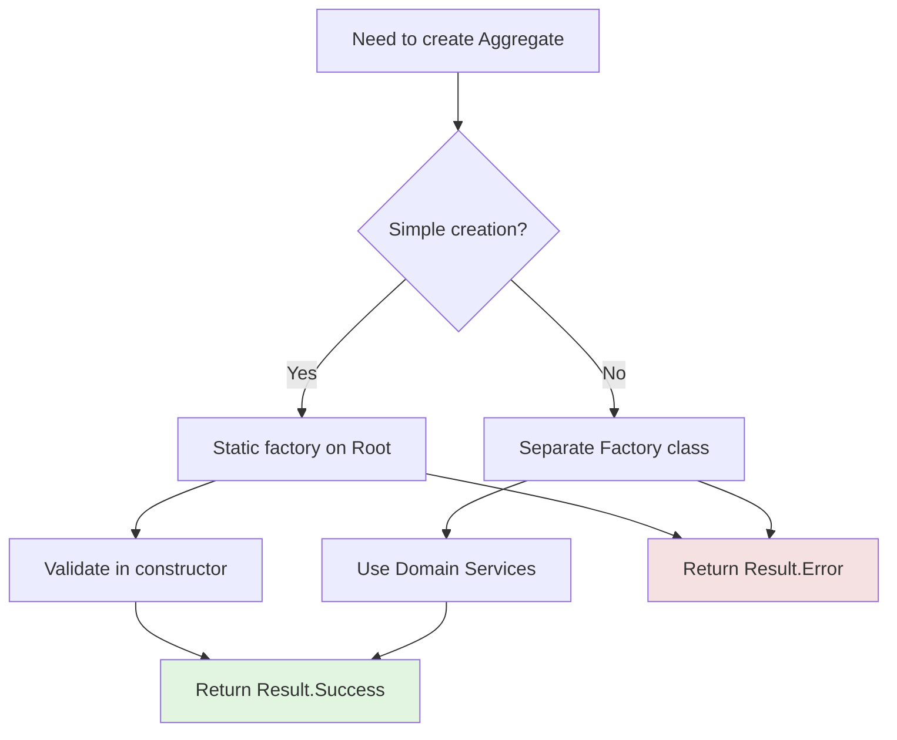
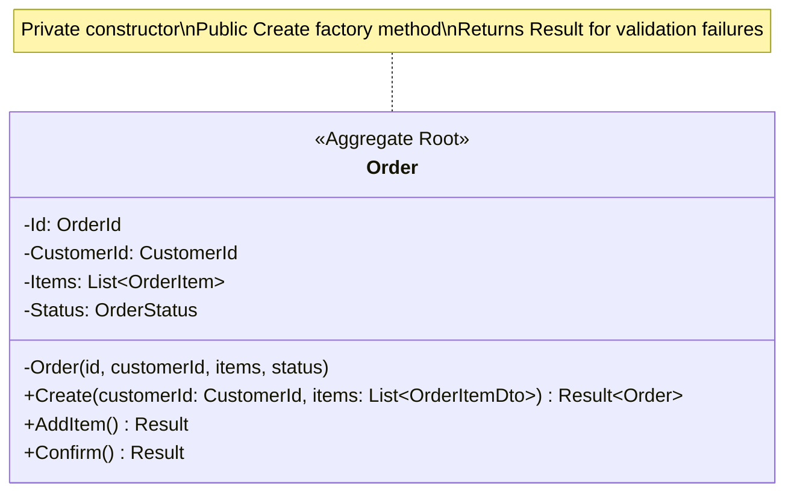
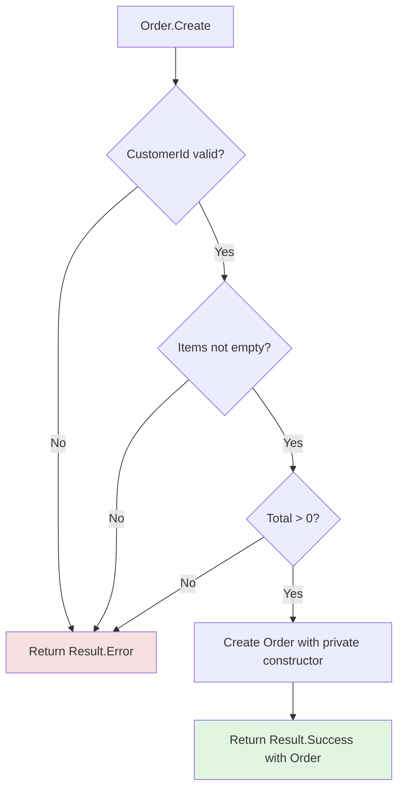
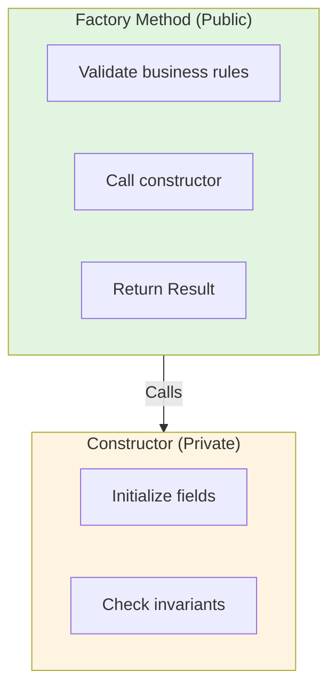

# Factories

## Overview

Factories encapsulate the creation logic of complex objects, ensuring Aggregates are born in a valid state. While simple Aggregates can use static factory methods on the Aggregate Root, complex creation scenarios benefit from dedicated Factory classes.

**Core principles:**
- **Separation of concerns** - Creation logic separated from representation
- **Always valid** - Objects cannot be created in invalid state (uses Result pattern)
- **Encapsulation** - Complex creation details hidden from clients
- **Dependency injection** - Factories can use Domain Services during creation

## When to Use Factories

**Use a Factory when:**
- Creation logic is complex (multiple steps, validations)
- Aggregate requires data from external services
- Multiple ways to create the same object (different constructors)
- Creation involves other domain objects
- You need to hide complex creation logic

**Don't use a Factory when:**
- Simple constructor is sufficient
- Object has only one way to be created
- Creation doesn't require domain logic

## Factory Methods

### Static Factory Methods on Aggregate Root

**Pattern:** Static `Create` method on the Aggregate Root that returns `Result<Aggregate>`.

**Benefits:**
- Creation logic co-located with entity
- Access to private constructor
- Self-contained
- Returns `Result<T>` for validation failures

**Example with Result pattern:**

**Implementation pattern:**
1. Private constructor ensures only factory can create
2. All validations in `Create` method
3. Return `Result.Error` with descriptive message for invalid input
4. Return `Result.Success` with instance for valid input

## Factory Classes

### When to Use Separate Factory Classes

**Use a Factory Class when:**
- Multiple creation strategies for same type
- Creation is a domain concept in itself
- Creation logic is complex and would clutter the entity

**Example concept:** An Order may be created from different sources (Quote, Cart, or Reorder), each requiring different validation logic. A Factory encapsulates these distinct creation strategies while keeping each focused and testable.

**Key aspects:**
- Multiple creation methods for different scenarios
- Validates business rules before creating entity
- Returns `Result<T>` for validation failures
- Factory methods are the only way to create instances (private constructor)

## Creation vs. Construction

### Constructor
- Simple initialization
- No business logic
- Minimal validation (only invariant checks)

### Factory
- Complex creation logic
- Multiple creation strategies
- Comprehensive validation with Result pattern

## Common Anti-Patterns

### Factory as Entity Manager
**Problem:** Factory doing too much - creating, validating, persisting to repository, publishing events, and sending emails.
**Solution:** Factory should only create objects in valid state.

### Bypassing Validation
**Problem:** Factory creates objects in invalid state when input validation fails, breaking the "Always Valid" principle.
**Solution:** Always return `Result.Error` for invalid input; never create invalid objects.

### Factory Gods
**Problem:** One generic factory creates all domain objects (CreateOrder, CreateCustomer, CreateProduct, etc.).
**Solution:** Use separate factories per aggregate or factory methods on entities.

## Summary Checklist

When designing Factories, ensure:

- [ ] Creation logic separated from representation
- [ ] Factory methods return `Result<T>` for validation failures
- [ ] Private constructor on entity (public factory)
- [ ] Invalid objects cannot be created
- [ ] Error messages are descriptive
- [ ] Creation strategies are clear and focused
