# Policies

## Overview

A **Policy** is an object that encapsulates a specific business rule, algorithm, or decision-making process. By isolating varying logic from the domain objects that use it, Policies clarify the main domain object's responsibility and make the specific rule explicit and testable.

In Domain-Driven Design, we prefer the term "Policy" over the technical "Strategy Pattern" because it emphasizes the business rule or motivation behind the logic rather than the implementation mechanism.

**Core characteristics:**
- **Encapsulates algorithms** - Separates the rule from the behavior governed by that rule
- **Explicit business concept** - Named using ubiquitous language
- **Interchangeable** - Multiple variations of a rule can be substituted
- **Immutable** - Policies are typically value objects or stateless services
- **Testable** - Complex rules isolated in one place

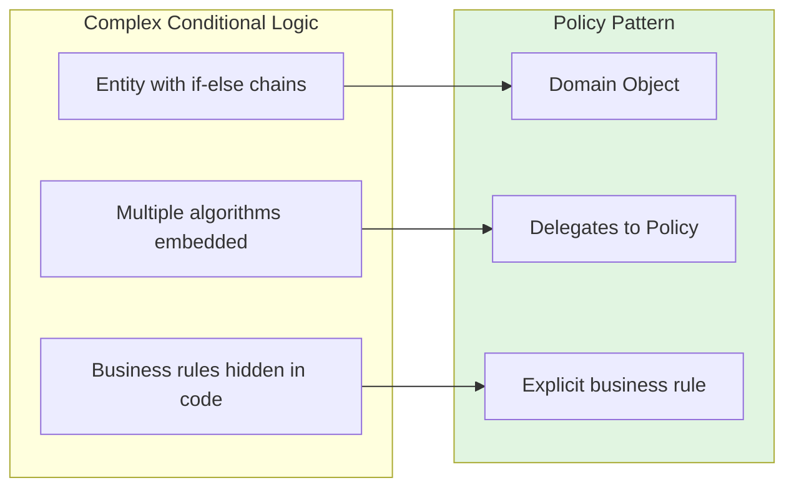

**Policy vs Specification:**

While similar, they serve different purposes:

| Pattern | Purpose | Returns | Example |
|---------|---------|---------|---------|
| **Specification** | Predicate evaluation | Boolean | `IsSatisfied(customer)` - does this meet criteria? |
| **Policy** | Execute algorithm/process | Value/Result | `CalculatePrice(order)` - how should this be done? |

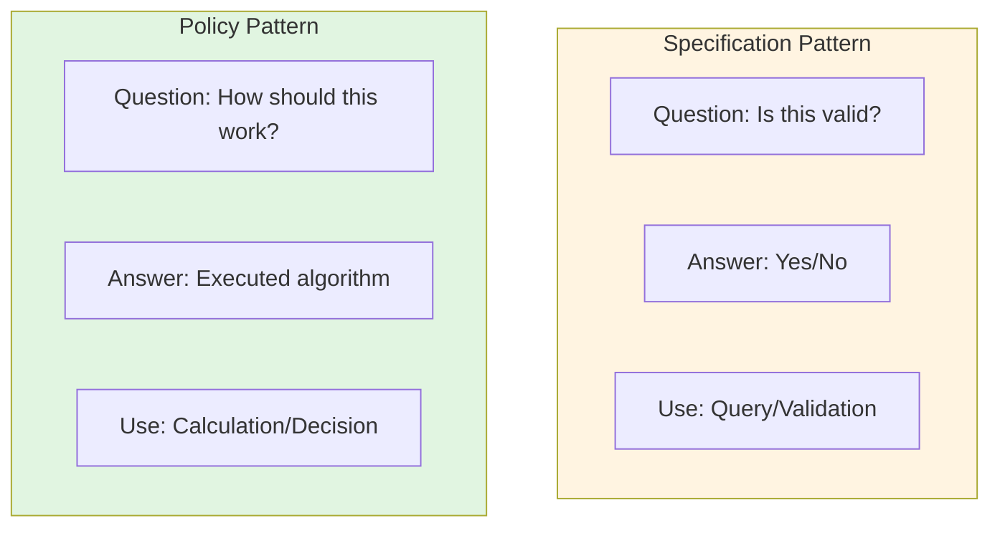

## When to Use Policies

### Decision Framework

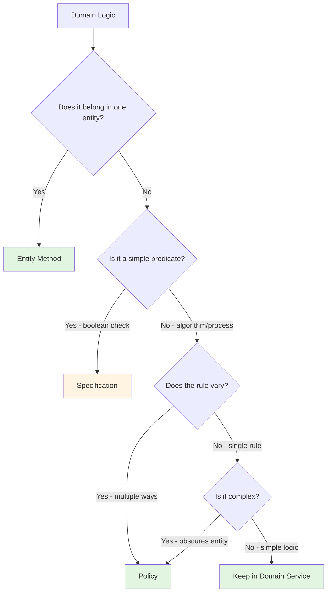

### Use Cases

| Scenario | Example | Why Policy helps |
|----------|---------|------------------|
| **Varying algorithms** | Pricing: Standard, Discount, VIP rules | Swap algorithm without changing domain objects |
| **Obscured domain logic** | Entity swamped with `if-else` for different rules | Clarifies main object's responsibility |
| **Independent evolution** | Rule changes frequently independently of object | Prevents constant "surgery" on stable objects |
| **EventStorming automation** | Policy listens to Domain Event, decides which Command to execute | `PaymentFailed` → `RetryPayment` command |
| **Complex calculations** | Business priority formula with multiple factors | Centralizes calculation logic |

### Policy vs Domain Service

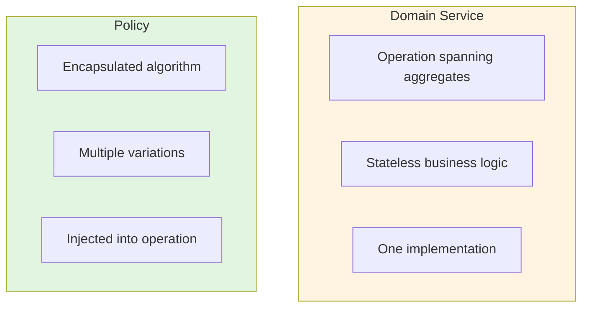

| Aspect | Domain Service | Policy |
|--------|---------------|--------|
| **Purpose** | Stateless operation | Encapsulated algorithm |
| **Variations** | Typically one implementation | Multiple interchangeable implementations |
| **Usage** | Called directly | Injected as parameter |
| **State** | Stateless | Immutable/stateless |
| **Example** | `FundsTransferService` | `OverbookingPolicy`, `RoutingPolicy` |

## Core Rules

### Rule 1: Policies Encapsulate Varying Business Rules

**Rule:** Extract logic into a Policy when an operation can be executed in multiple ways.

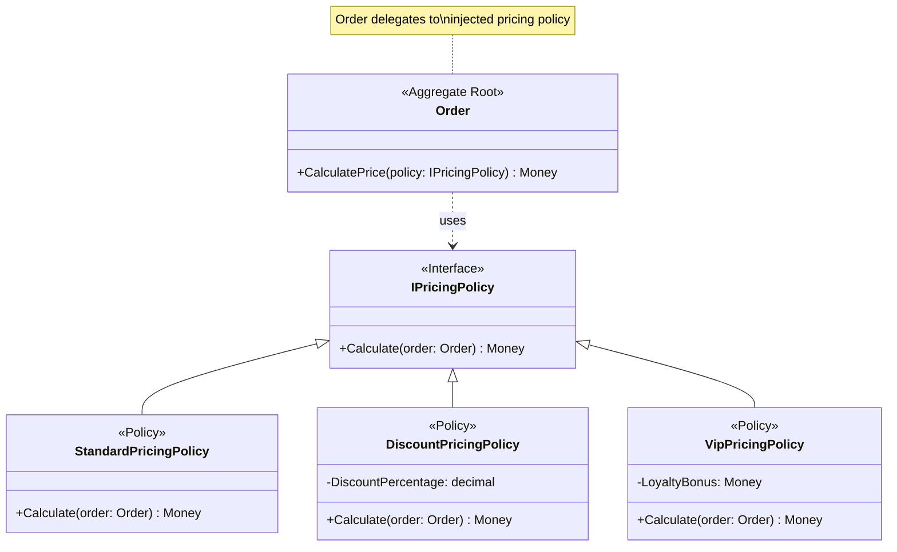

**Key principles:**

- Policy defines **how** a calculation or decision is made
- Multiple implementations for different business scenarios
- Domain object delegates to policy, doesn't implement the rule

### Rule 2: Policies Use Ubiquitous Language

**Rule:** Policy names reflect business concepts, not technical implementation.

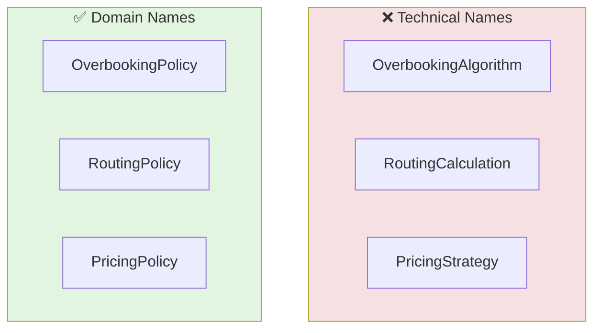

**Examples:**

| Business Concept | Policy Name |
|-----------------|-------------|
| Allow 10% overbooking on voyages | `OverbookingPolicy` |
| Find fastest vs cheapest route | `RoutingPolicy` |
| Calculate business priority | `BusinessPriorityCalculator` (or Policy) |
| Determine payment retry timing | `PaymentRetryPolicy` |

### Rule 3: Policies Are Injected as Parameters

**Rule:** Pass the Policy into the method that needs it, allowing the domain object to delegate the specific calculation or decision.

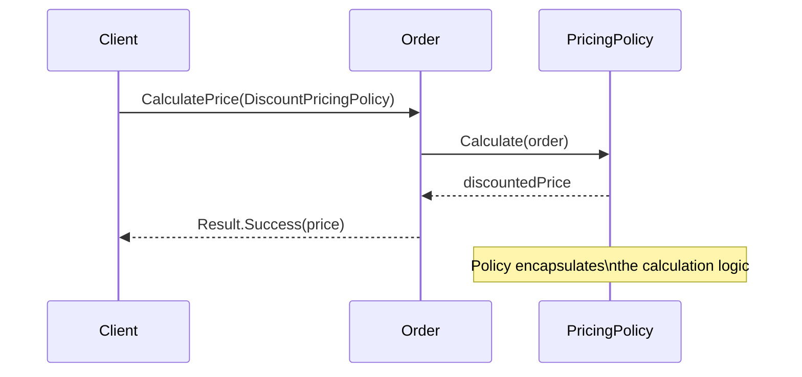

**Injection patterns:**

| Pattern | When to Use | Example |
|---------|-------------|---------|
| **Method parameter** | Policy varies per call | `order.CalculatePrice(policy)` |
| **Constructor parameter** | Policy fixed for object lifetime | `RoutingService(policy)` |
| **Domain Service dependency** | Policy coordinates across aggregates | `PricingService` uses `PricingPolicy` |

### Rule 4: Policies Can Be Value Objects or Services

**Rule:** Policies are often implemented as Value Objects (immutable configuration) or stateless Services.

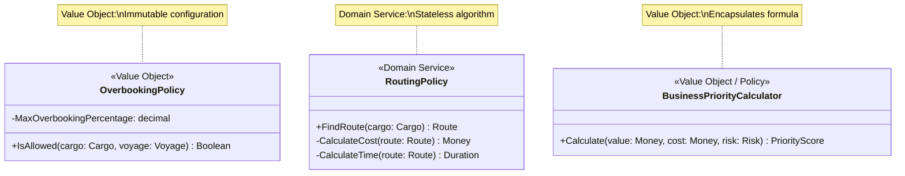

**When to use which:**

| Use Value Object when | Use Domain Service when |
|----------------------|-------------------------|
| Rule is simple data/configuration | Rule involves complex multi-step logic |
| No dependencies on external services | Requires repositories or ports |
| Pure calculation based on parameters | Needs domain data to make decisions |

### Rule 5: Policies in EventStorming

**Rule:** In process modeling, a Policy often listens to a Domain Event and determines which Command to execute next.

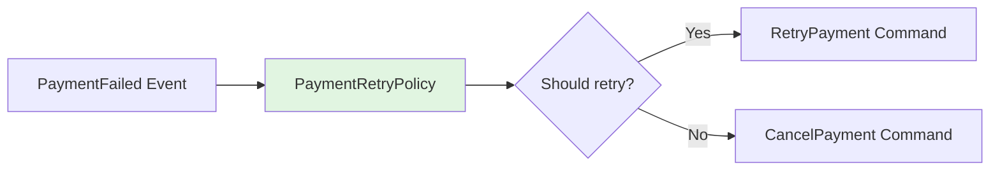

**EventStorming pattern:**

1. **Domain Event occurs** (e.g., `PaymentFailed`)
2. **Policy evaluates** (e.g., `PaymentRetryPolicy` checks retry count, amount)
3. **Command executes** (e.g., `RetryPayment` or `CancelPayment`)

## Policy Design Examples

### Example 1: Overbooking Policy (Validation)

**Scenario:** A shipping `Voyage` can accept cargo. The business allows 10% overbooking to account for cancellations.

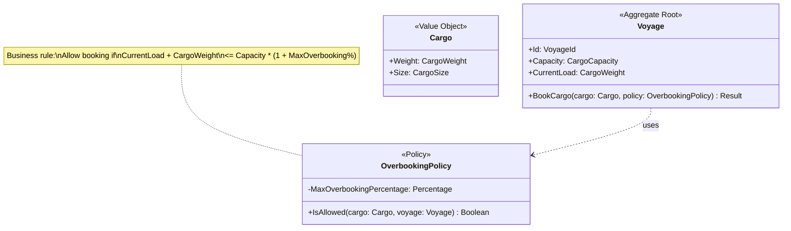

**Business rule documented:**

> "A voyage may be overbooked by up to 10% to account for last-minute cancellations."

**Without Policy (anti-pattern):**
```typescript
// ❌ Hidden business rule
if (voyage.CurrentLoad + cargo.Weight > voyage.Capacity * 1.1) {
  return Result.Error("Exceeds capacity");
}
```

**With Policy:**
```typescript
// ✅ Explicit business rule
if (!policy.IsAllowed(cargo, voyage)) {
  return Result.Error("Exceeds overbooking policy limit");
}
```

### Example 2: Routing Policy (Algorithm Selection)

**Scenario:** A shipping system needs to find routes for cargo. Different optimization goals: "Fastest Route," "Cheapest Route," or "Avoid Restricted Areas."

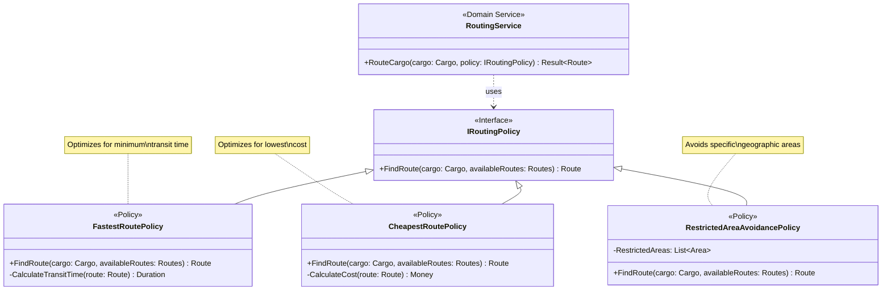

**Business value:**

- **Explicitness** - Each routing strategy has a clear name
- **Testability** - Test each routing algorithm in isolation
- **Flexibility** - Add new routing strategies without modifying service
- **Decoupling** - Generic "routing" separated from specific criteria

### Example 3: Business Priority Calculator

**Scenario:** In an Agile Project Management context, calculating the "Business Priority" of a backlog item involves weighing value, cost, and risk.

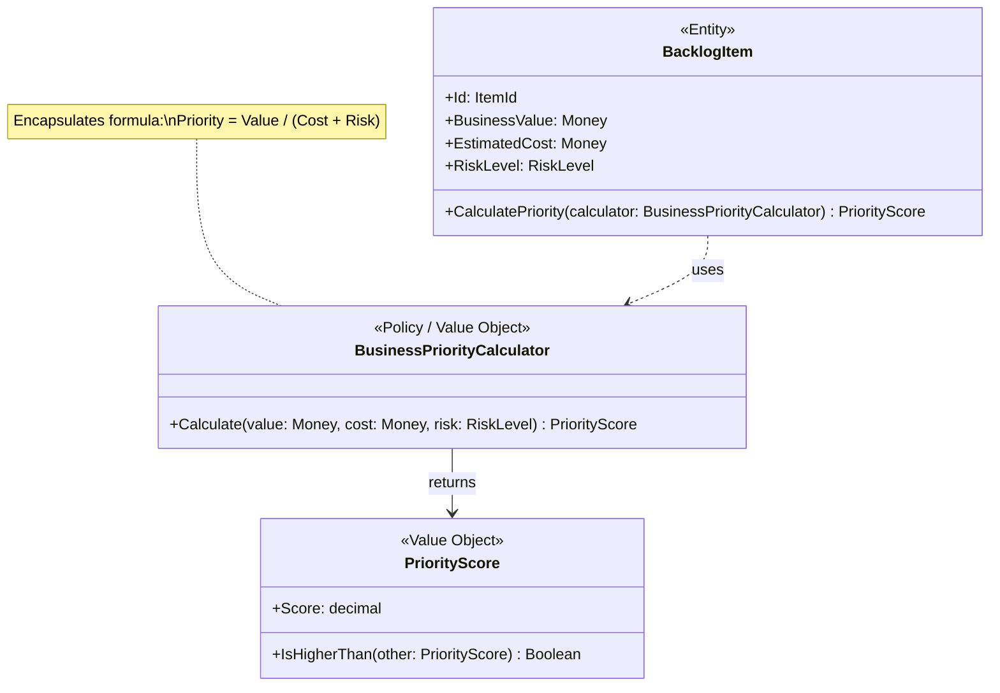

**Benefits:**

- **Single place to update** - Formula changes only in the calculator
- **Testable** - Verify calculation logic without setting up complex backlog state
- **Explicit** - The formula is documented in code, not hidden in calculations

### Example 4: Payment Retry Policy

**Scenario:** When a payment fails, the system must decide whether to retry and when.

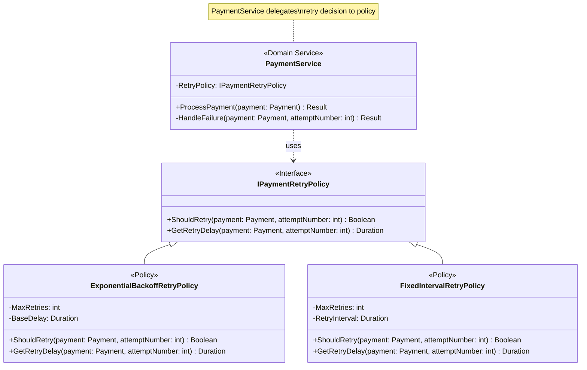

**EventStorming integration:**

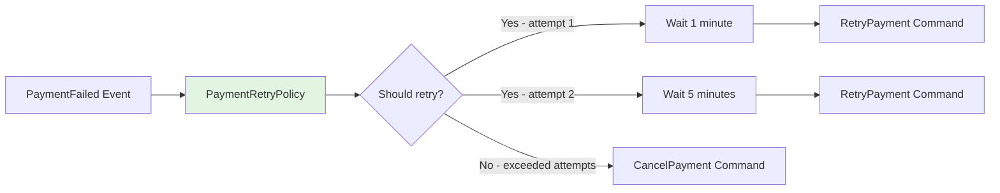

## Policies vs Alternatives

### Policy vs Specification

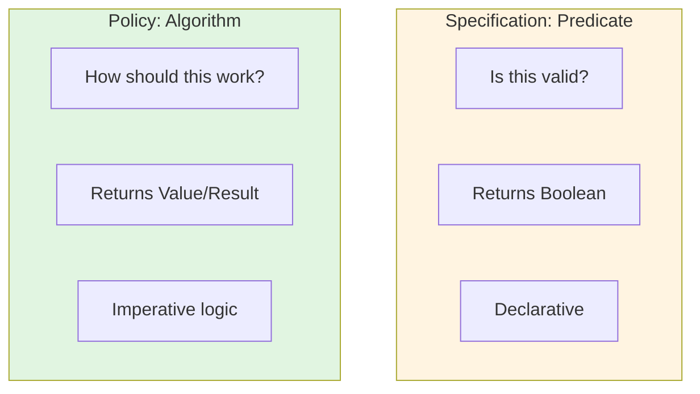

| Aspect | Specification | Policy |
|--------|--------------|--------|
| **Question** | Is this satisfied? | How should this be executed? |
| **Return** | Boolean | Value, Result, Object |
| **Usage** | Query, Validation | Calculation, Decision-making |
| **Composition** | AND, OR, NOT | Strategy selection |
| **Example** | `ActiveCustomerSpecification` | `OverbookingPolicy` |

### Policy vs Domain Service

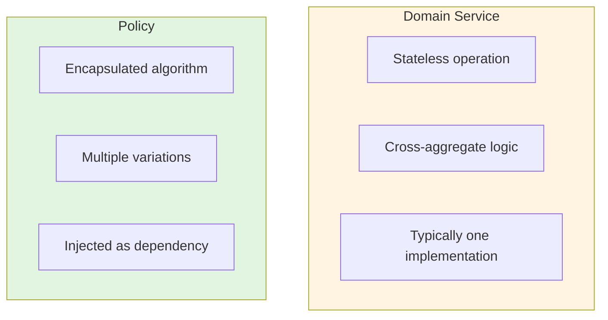

| Aspect | Domain Service | Policy |
|--------|---------------|--------|
| **Responsibility** | Coordinate across aggregates | Encapsulate specific algorithm |
| **Variations** | Usually single implementation | Multiple interchangeable implementations |
| **State** | Always stateless | Stateless or immutable VO |
| **Usage** | Called directly | Injected as parameter |
| **Example** | `FundsTransferService` | `PricingPolicy` (Standard/Discount/VIP) |

**When to use both:**

A Domain Service can use Policies to delegate specific algorithms:

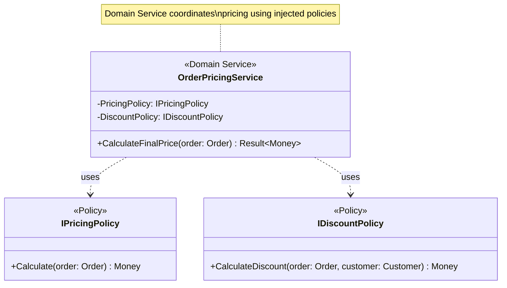

### Policy vs Entity Method

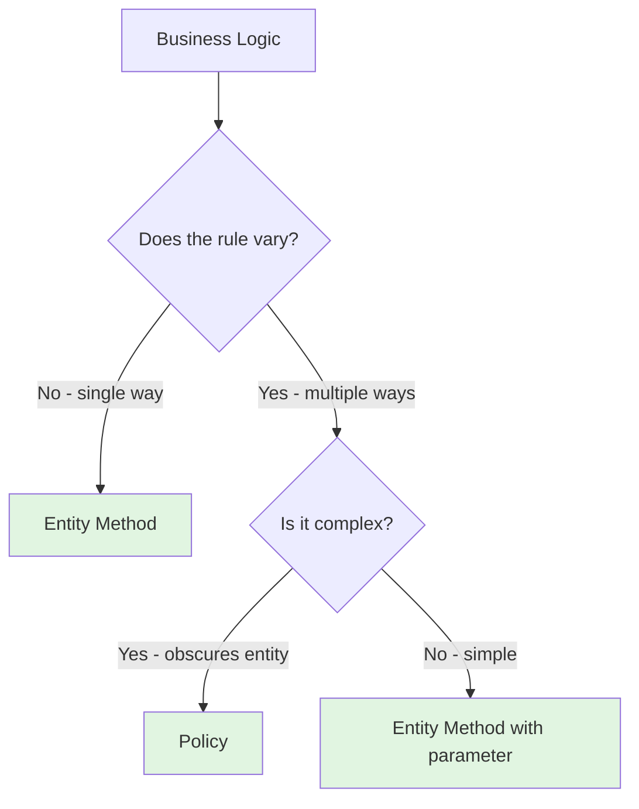

**Use Entity Method when:**
- Single, unchanging way to perform the operation
- Logic is intrinsic to the entity's nature
- Simple calculation

**Use Policy when:**
- Multiple valid ways to perform the operation
- Rule varies by context (customer type, region, time)
- Extracting it clarifies the entity's responsibility

**Example:** Payment calculation

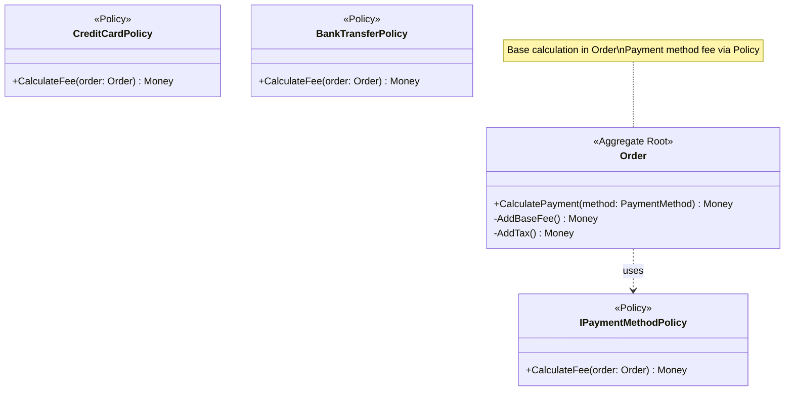

## Policies in Domain Documents

### When to Include Policies in DOMAIN.md

Include policies in your domain design when:

1. **Multiple algorithms exist** for the same operation
2. **Business rules are complex** and would obscure entity logic
3. **Rules change independently** of the objects they apply to
4. **Automation logic** exists (EventStorming: event → policy → command)
5. **Calculation logic** needs to be centralized and explicit

### How to Document Policies

**Option 1: In Types section**

```markdown
## Types

### OverbookingPolicy

Encapsulates the business rule for allowing cargo bookings above vessel capacity. The policy allows overbooking up to 10% of capacity to account for last-minute cancellations. Validates whether new cargo can be added to a voyage.
```

**Option 2: In Class Diagrams**

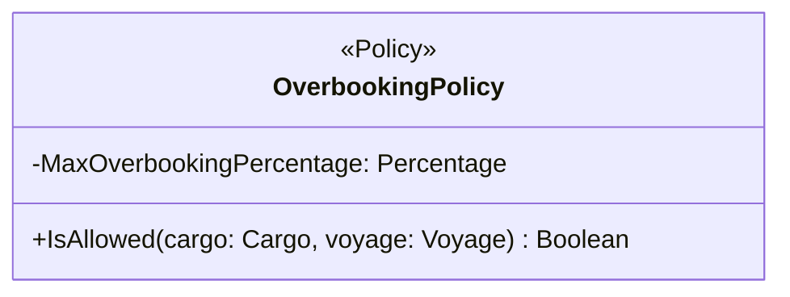

**Option 3: In Design Explanations**

```markdown
## Design Explanations

### Overbooking Policy

The domain extracts overbooking logic into a `OverbookingPolicy` to:
- Make the 10% overbooking rule explicit and named
- Allow the rule to change without modifying the Voyage aggregate
- Enable testing of the rule in isolation
- Add the concept to the ubiquitous language

The Voyage aggregate delegates to the policy when booking cargo.
```

**Option 4: In Invariants section**

```markdown
## Invariants

### OverbookingPolicy Invariants

| ID | Invariant | Notes |
|----|-----------|-------|
| OVERBOOK-1 | Maximum overbooking is 10% of voyage capacity | Configured percentage |
| OVERBOOK-2 | Overbooking only allowed for cargo with confirmed status | Prevents speculative bookings |
```

## Common Anti-Patterns

### Policy for Simple Logic

**Problem:** Creating a Policy for trivial calculations that don't vary.

```mermaid
flowchart TB
    subgraph Excessive["❌ Over-Engineered"]
        E1[AddNumbersPolicy]
        E2[SimpleDateFormatPolicy]
        E3[BasicValidationPolicy]
    end

    subgraph Appropriate["✅ Appropriate"]
        A1[OverbookingPolicy]
        A2[RoutingPolicy]
        A3[PricingPolicy]
    end

    style Excessive fill:#f5e1e1
    style Appropriate fill:#e1f5e1
```

**Solution:** Only extract Policies for meaningful business rules that vary or are complex.

### Policy as Anemic Domain

**Problem:** Extracting all entity behavior into Policies, leaving entities with no behavior.

```mermaid
flowchart LR
    subgraph Bad["❌ Anemic with Policies"]
        B1[Account - data only]
        B2[AccountValidationPolicy]
        B3[AccountStateChangePolicy]
        B4[AccountCalculationPolicy]
    end

    subgraph Good["✅ Rich Domain"]
        G1[Account - core behavior]
        G2[OverdraftPolicy for bank-specific rules]
    end

    style Bad fill:#f5e1e1
    style Good fill:#e1f5e1
```

**Solution:** Keep core entity behavior in the entity. Use Policies only for varying rules.

### God Policy

**Problem:** One Policy that handles multiple, unrelated concerns.

```mermaid
flowchart TB
    subgraph Bad["❌ God Policy"]
        B1[OrderProcessingPolicy<br/>Validation<br/>Pricing<br/>Discount<br/>Shipping<br/>Notification]
    end

    subgraph Good["✅ Focused Policies"]
        G1[PricingPolicy]
        G2[DiscountPolicy]
        G3[ShippingPolicy]
    end

    style Bad fill:#f5e1e1
    style Good fill:#e1f5e1
```

**Solution:** Split by business concept. One policy per cohesive rule.

### Policy That Modifies State

**Problem:** Policies that directly modify aggregate state.

```mermaid
flowchart TB
    subgraph Bad["❌ Policy Modifies State"]
        B1[Policy saves to repository]
        B2[Policy modifies aggregate directly]
    end

    subgraph Good["✅ Policy Returns Decisions"]
        G1[Policy returns calculation/result]
        G2[Domain Service applies change]
    end

    style Bad fill:#f5e1e1
    style Good fill:#e1f5e1
```

**Solution:** Policies should calculate or decide, not modify. Let Domain Services or Entities apply state changes based on Policy results.

### Technical Naming

**Problem:** Policy names reflect implementation patterns, not business concepts.

```mermaid
flowchart TB
    subgraph Bad["❌ Technical Names"]
        B1[OverbookingStrategy]
        B2[PricingAlgorithm]
        B3[RoutingCalculator]
    end

    subgraph Good["✅ Domain Names"]
        G1[OverbookingPolicy]
        G2[PricingPolicy]
        G3[RoutingPolicy]
    end

    style Bad fill:#f5e1e1
    style Good fill:#e1f5e1
```

**Solution:** Use ubiquitous language. The word "Policy" signals business intent.

## Summary Checklist

When designing Policies, ensure:

- [ ] Encapsulates varying business rule or algorithm
- [ ] Named using ubiquitous language (domain terminology)
- [ ] Multiple variations exist or are planned
- [ ] Logic is complex enough to warrant extraction
- [ ] Clarifies domain object's responsibility (doesn't create anemic model)
- [ ] Stateless or immutable value object
- [ ] Injected as parameter or dependency
- [ ] Returns decisions/calculations, doesn't modify state
- [ ] Testable in isolation
- [ ] Documented in DOMAIN.md with business rule explanation
- [ ] Distinguished from Specifications (algorithms vs predicates)
- [ ] Distinguished from Domain Services (encapsulated rule vs stateless operation)
