# Driven Ports (Domain Interfaces)

## Overview

In Hexagonal Architecture (also known as Ports and Adapters), **Driven Ports** are interfaces defined in the Domain layer that represent contracts the domain needs from external dependencies. The domain layer defines the port (interface), while the infrastructure layer provides the adapter (implementation).

**Core principles:**
- **Port in Domain** - Interface defined in Domain layer
- **Adapter in Infrastructure** - Implementation in Infrastructure layer
- **Domain depends on abstraction** - Domain depends on port, not concrete implementation
- **Adapters depend on domain** - Infrastructure implements domain interface

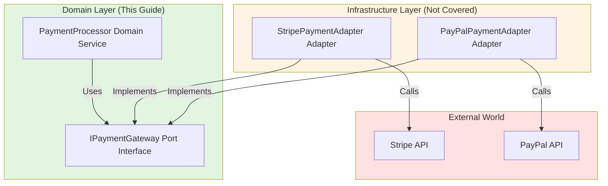

## Port vs Adapter Distinction

### Ports (Domain Concern)

**Ports are interfaces** defined in the Domain layer that represent:

- Contracts the domain needs from external services
- Abstractions over infrastructure concerns
- Domain-specific vocabulary (ubiquitous language)

**Examples of Ports:**
- `IEmailGateway` - sending emails
- `ISmsGateway` - sending SMS messages
- `IPaymentGateway` - processing payments
- `IExchangeRateService` - getting currency exchange rates
- `INotificationService` - sending notifications

### Adapters (Infrastructure Concern)

**Adapters are implementations** that:

- Implement port interfaces
- Handle integration with external services
- Contain infrastructure-specific code

**Examples of Adapters:**
- `SendGridEmailAdapter` - implements `IEmailGateway` using SendGrid
- `TwilioSmsAdapter` - implements `ISmsGateway` using Twilio
- `StripePaymentAdapter` - implements `IPaymentGateway` using Stripe
- `FixerExchangeRateAdapter` - implements `IExchangeRateService` using Fixer.io

**Note:** This guide covers Ports (domain interfaces). Adapters (implementations) are infrastructure concerns and are not covered.

## When to Use Driven Ports

Use driven ports when domain logic requires:

- **External service calls** - Email, SMS, payment gateways
- **Data from other bounded contexts** - External APIs, microservices
- **Infrastructure operations** - File system, logging (sometimes)
- **Third-party integrations** - Shipping providers, geocoding services

### Decision Flow

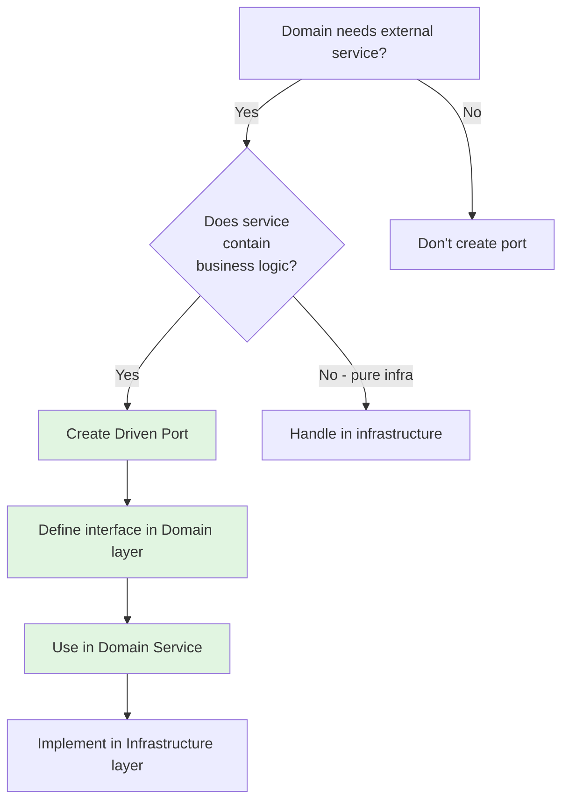

**Examples:**

| External Service | Contains Business Logic? | Create Port? |
|-----------------|------------------------|--------------|
| Payment gateway | ✅ Yes (charge, refund) | ✅ Yes |
| Email service | ❌ No (delivery mechanism) | ✅ Yes (if domain needs "send email") |
| Database access | ❌ No (persistence detail) | ❌ No (use repository) |
| Exchange rate API | ✅ Yes (currency conversion) | ✅ Yes |
| Logging framework | ❌ No (infrastructure) | ❌ No |

## Port Interface Rules

### Rule 1: Define Interface in Domain Layer

**Rule:** Port interfaces are defined in the Domain layer using domain terminology.

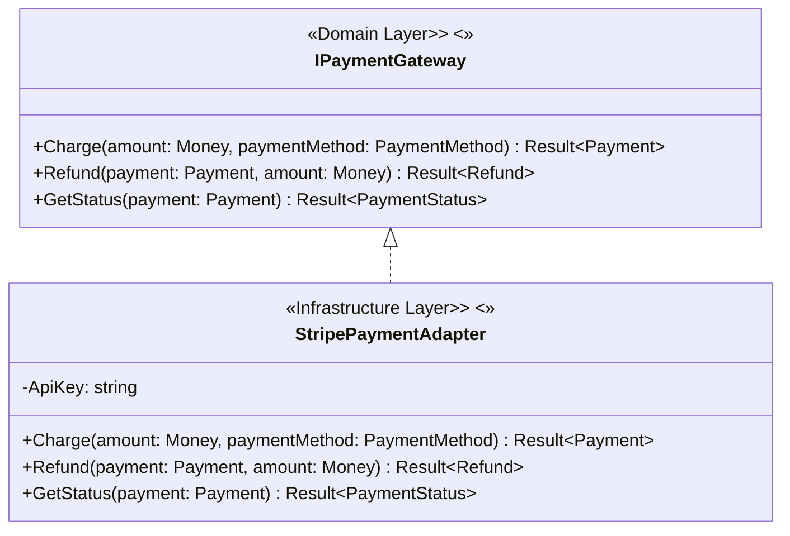

**Benefits:**

- Domain controls the contract it needs
- Infrastructure adapts to domain requirements
- Easy to swap implementations
- Testable with fake adapters

### Rule 2: Use Domain Terminology

**Rule:** Port interfaces use domain language, not technical jargon.

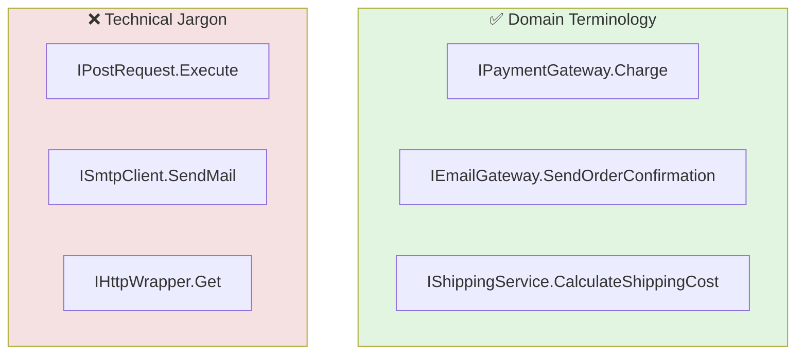

### Rule 3: Return Result for Operations That Can Fail

**Rule:** Port operations return `Result<T>` for operations that can fail (network errors, validation, business rules).

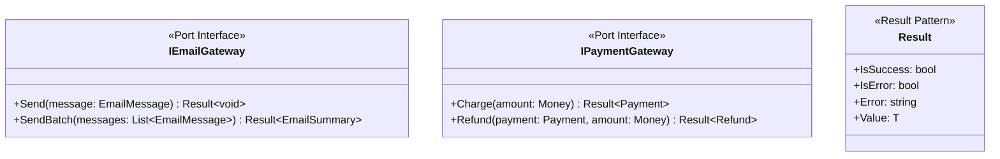

**Examples:**
- `Charge(amount)` → `Result<Payment>` (network failure, declined card = error)
- `Send(email)` → `Result<void>` (delivery failure = error)
- `GetExchangeRate(from, to)` → `Result<ExchangeRate>` (API unavailable = error)

### Rule 4: Ports Return Domain Types

**Rule:** Port methods accept and return domain types (Value Objects, Entities), not primitives.

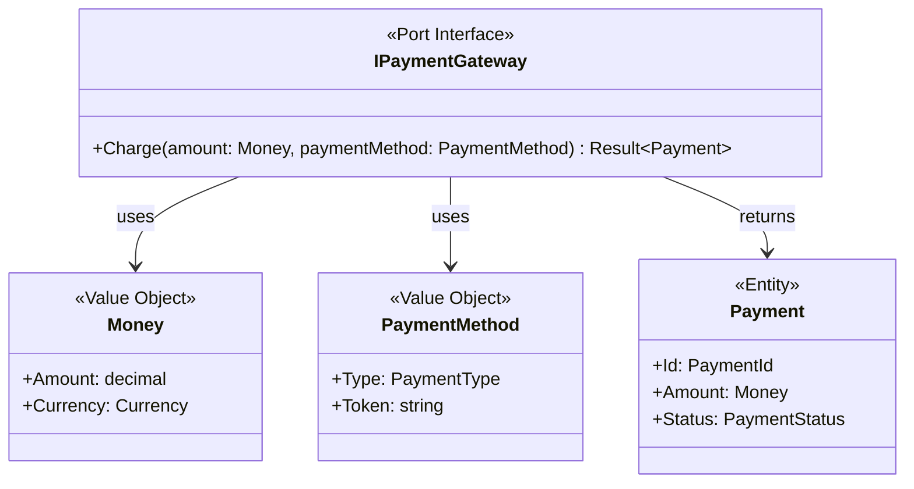

## Domain Services Using Ports

### Pattern: Domain Service Coordinates Port Calls

Domain Services use ports when they need to coordinate domain logic with external service calls.

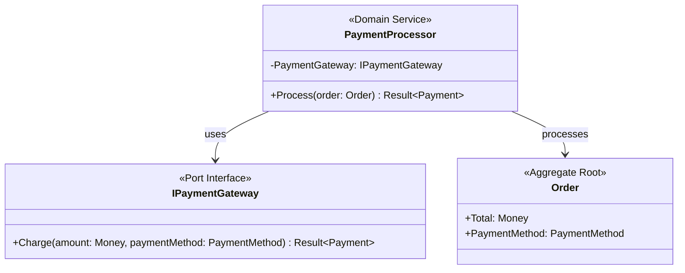

### Example: Payment Processing with Port

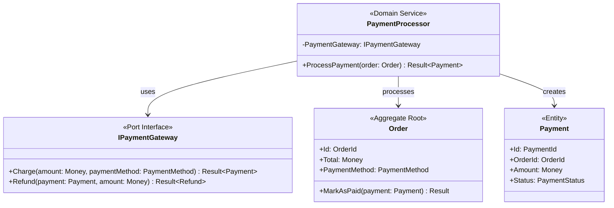

**Domain Logic:**

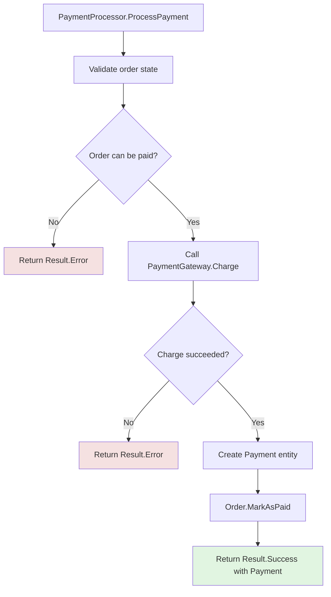

## Common Port Examples

### Example 1: Email Gateway

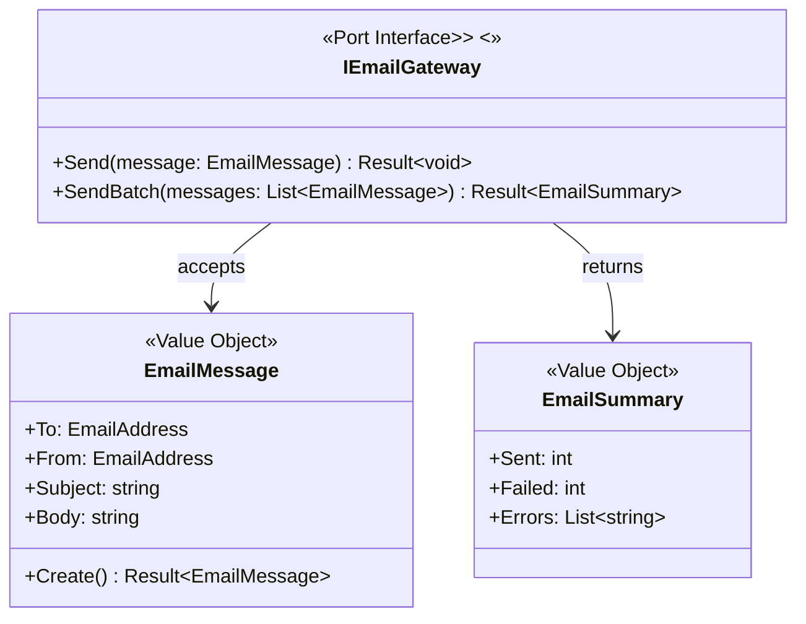

**Usage in Domain:**

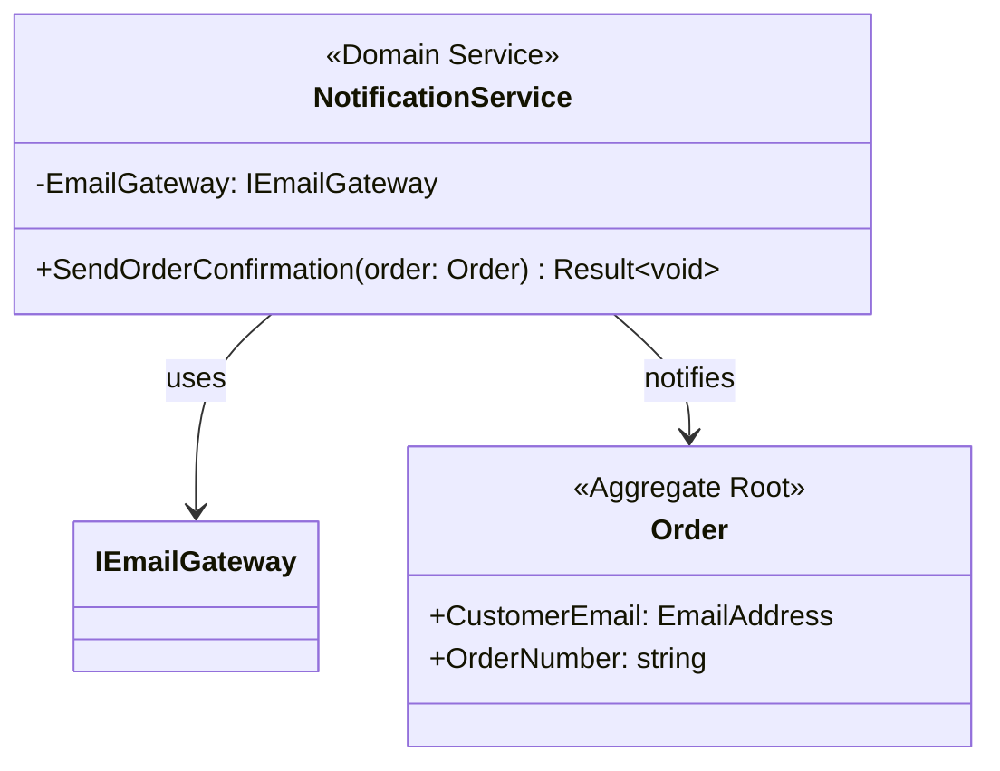

### Example 2: Exchange Rate Service

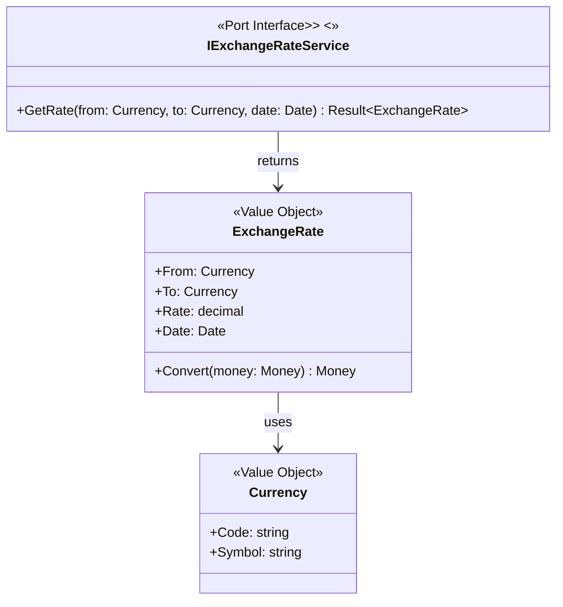

**Usage in Domain:**

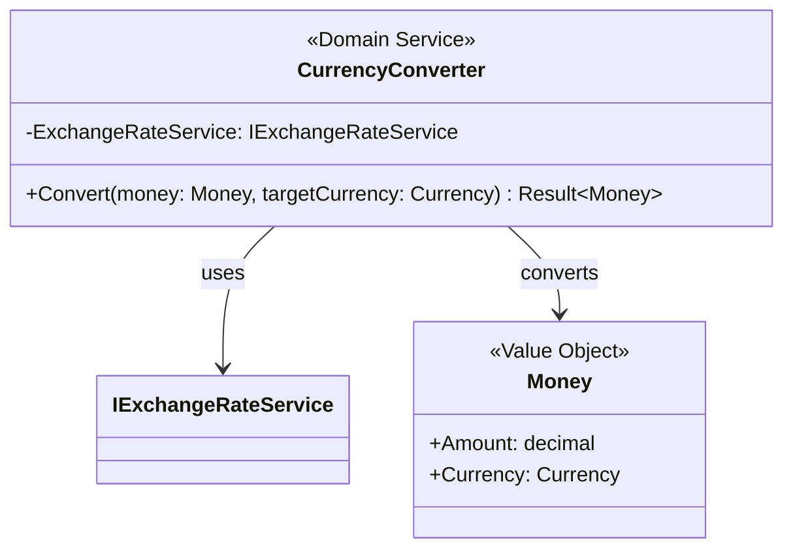

### Example 3: Shipping Service

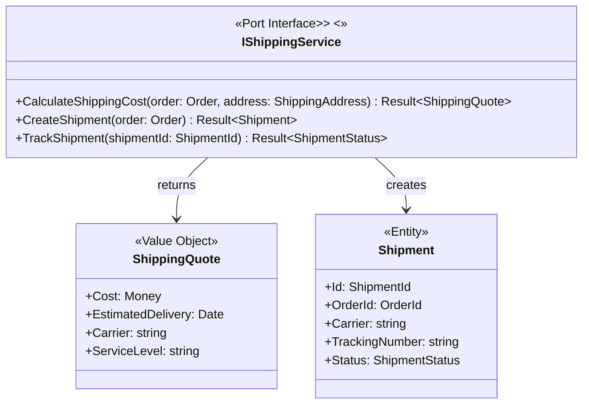

## Ports vs Repositories

Both ports and repositories are interfaces in the domain layer, but they serve different purposes.

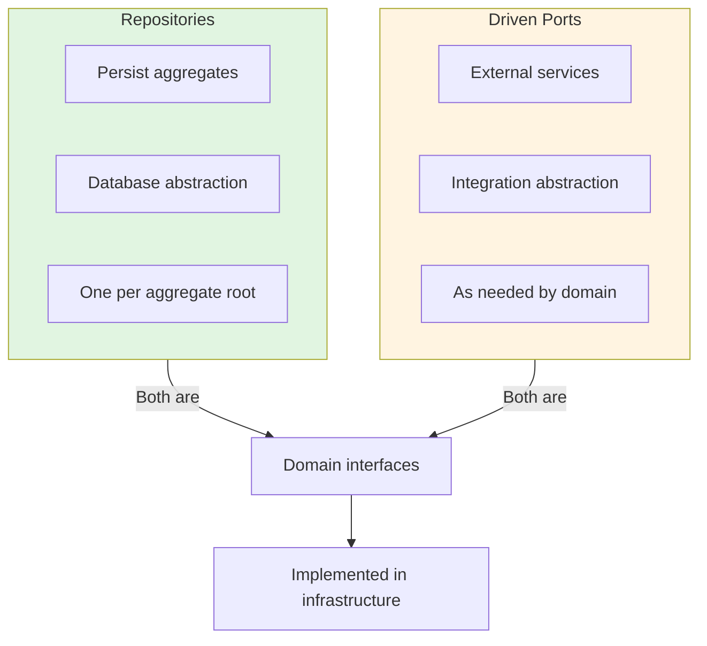

| Aspect | Repository | Driven Port |
|--------|-----------|-------------|
| **Purpose** | Persist aggregates | Integrate external services |
| **Abstraction** | Database storage | External service/API |
| **Cardinality** | One per aggregate root | As needed |
| **Operations** | CRUD-like | Domain-specific |
| **Returns** | `Result<T>` (aggregate) | `Result<T>` (domain type) |

## Common Anti-Patterns

### Port with Implementation Details
**Problem:** Port interface exposes implementation details like `SendWithSendGrid(apiKey: string, to: string, from: string)` or `SetSmtpConfig(host: string, port: int)`.
**Solution:** Use domain types and terminology (e.g., `Send(message: EmailMessage)` where EmailMessage is a domain value object).

### Port for Pure Infrastructure
**Problem:** Creating ports for pure infrastructure concerns like `ILogger` or `ICache` that contain no business logic.
**Solution:** Handle pure infrastructure concerns in the infrastructure layer, not as domain ports. Ports are for external services with business logic.

### Port Returning Primitive Types
**Problem:** Port methods return primitive types like `Charge(amount: decimal, currency: string) Result<string>`.
**Solution:** Return domain types (Value Objects, Entities) to maintain domain language and type safety.

## Summary Checklist

When designing driven ports in the domain layer:

- [ ] Interface defined in Domain layer
- [ ] Use domain terminology (ubiquitous language)
- [ ] Return `Result<T>` for operations that can fail
- [ ] Accept and return domain types (not primitives)
- [ ] Used by Domain Services (not directly by Aggregates)
- [ ] Abstract external services containing business logic
- [ ] No implementation details in interface
- [ ] Enable testing with fake adapters
- [ ] One port per external service concern
- [ ] Distinguish from repositories (persistence vs integration)

## Port vs Adapter

This guide focuses on **Ports** (domain interfaces).

**Adapters** (implementations) are **infrastructure concerns** and are not covered in this guide. When implementing:

1. Define the port interface in the Domain layer (this guide)
2. Implement the adapter in the Infrastructure layer
3. Use dependency injection to provide the adapter
4. Test domain logic with fake/test adapters
