# Driven Ports (Domain Interfaces)

## Overview

**Driven Ports** are interfaces defined in the Domain layer that represent contracts the domain needs from external dependencies. The domain layer defines the port (interface), while the infrastructure layer provides the adapter (implementation).

## Ports (Domain Concern)

**Ports are interfaces** defined in the Domain layer that represent:

- Contracts the domain needs from external services
- Abstractions over infrastructure concerns
- Domain-specific vocabulary (ubiquitous language)

**Examples of Ports:**
- `IEmailGateway` - sending emails
- `ISmsGateway` - sending SMS messages
- `IPaymentGateway` - processing payments
- `IExchangeRateService` - getting currency exchange rates
- `INotificationService` - sending notifications

## When to Use Driven Ports

Use driven ports when domain logic requires:

- **External service calls** - Email, SMS, payment gateways
- **Data from other bounded contexts** - External APIs, microservices
- **Infrastructure operations** - File system, logging (sometimes)
- **Third-party integrations** - Shipping providers, geocoding services

## Core Design Principles

### Principle 1: Dependency Inversion Principle (DIP)

**Rule:** Source code dependencies must point inward, toward the high-level policy. The business logic defines the port (interface), and the infrastructure layer provides the adapter (implementation).

**Key implications:**
- **Interface ownership:** The interface belongs to the domain layer, not infrastructure
- **Direction of dependency:** Infrastructure depends on domain, not vice versa
- **Protection:** Domain is shielded from volatile technical details

### Principle 2: Interface Segregation Principle (ISP)

**Rule:** Avoid creating massive, monolithic interfaces. Interfaces should be specific to the client using them.

**Benefits:**
- **Client-specific:** If a use case only needs to charge payments, it depends only on `IPaymentGateway`, not a 20-method interface
- **Reduced recompilation:** In statically typed languages, changes to unrelated methods don't force recompilation of clients
- **Clearer intent:** Each interface has a single, focused purpose

**Example:**
- ❌ Monolithic: `INotificationService` with email, SMS, push, in-app, webhook methods
- ✅ Segregated: `IEmailGateway`, `ISmsGateway`, `IPushNotificationGateway`

### Principle 3: Define by Intent, Not Implementation

**Rule:** Port interfaces should reflect business intent, not underlying technology.

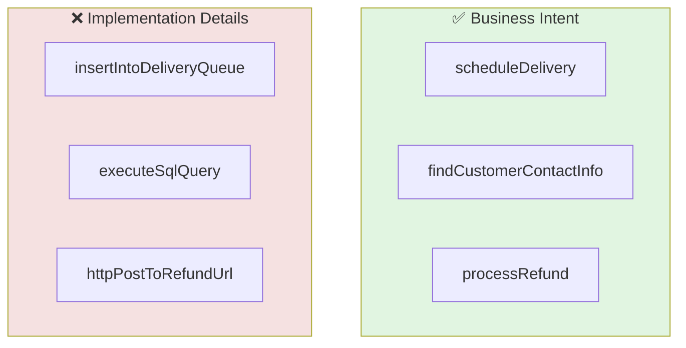
```mermaid
flowchart TB
    subgraph Good["✅ Business Intent"]
        G1[scheduleDelivery]
        G2[findCustomerContactInfo]
        G3[processRefund]
    end

    subgraph Bad["❌ Implementation Details"]
        B1[insertIntoDeliveryQueue]
        B2[executeSqlQuery]
        B3[httpPostToRefundUrl]
    end

    style Good fill:#e1f5e1
    style Bad fill:#f5e1e1
```

**Guidelines:**
- Use Ubiquitous Language from the domain
- Avoid technical jargon (SQL, HTTP, REST, queue)
- Don't leak implementation exceptions (e.g., `SQLException`, `HttpException`)
- Don't accept framework-specific types (e.g., `JdbcConnection`, `HttpClient`)

## Port Interface Rules

### Rule 1: Define Interface in Domain Layer

**Rule:** Port interfaces are defined in the Domain layer using domain terminology.

**Good exmaple:**
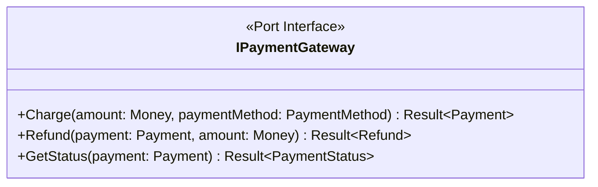
```mermaid
classDiagram
    class IPaymentGateway {
        <<Port Interface>>
        +Charge(amount: Money, paymentMethod: PaymentMethod) Result~Payment~
        +Refund(payment: Payment, amount: Money) Result~Refund~
        +GetStatus(payment: Payment) Result~PaymentStatus~
    }


```

**Bad example:**
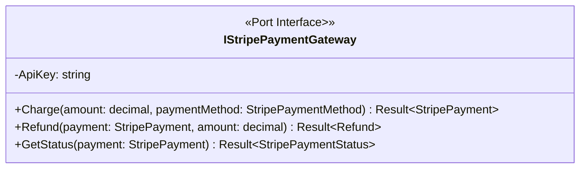
```mermaid
classDiagram
    class IStripePaymentGateway {
        <<Port Interface>>>
        -ApiKey: string
        +Charge(amount: decimal, paymentMethod: StripePaymentMethod) Result~StripePayment~
        +Refund(payment: StripePayment, amount: decimal) Result~Refund~
        +GetStatus(payment: StripePayment) Result~StripePaymentStatus~
    }
```

### Rule 2: Use Domain Terminology

**Rule:** Port interfaces use domain language, not technical jargon.

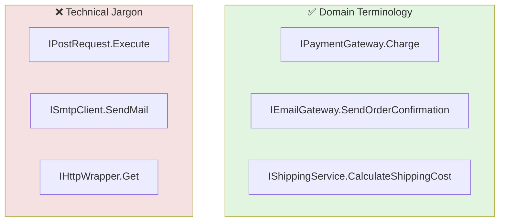
```mermaid
flowchart TB
    subgraph Good["✅ Domain Terminology"]
        G1[IPaymentGateway.Charge]
        G2[IEmailGateway.SendOrderConfirmation]
        G3[IShippingService.CalculateShippingCost]
    end

    subgraph Bad["❌ Technical Jargon"]
        B1[IPostRequest.Execute]
        B2[ISmtpClient.SendMail]
        B3[IHttpWrapper.Get]
    end

    style Good fill:#e1f5e1
    style Bad fill:#f5e1e1
```

### Rule 3: Return Result for Operations That Can Fail

(when the Result pattern is used)

**Rule:** Port operations return `Result<T>` for operations that can fail (network errors, validation, business rules).

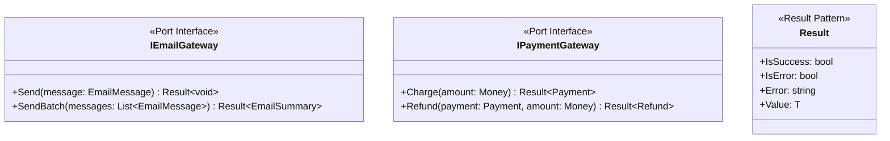
```mermaid
classDiagram
    class IEmailGateway {
        <<Port Interface>>
        +Send(message: EmailMessage) Result~void~
        +SendBatch(messages: List~EmailMessage~) Result~EmailSummary~
    }

    class IPaymentGateway {
        <<Port Interface>>
        +Charge(amount: Money) Result~Payment~
        +Refund(payment: Payment, amount: Money) Result~Refund~
    }

    class Result {
        <<Result Pattern>>
        +IsSuccess: bool
        +IsError: bool
        +Error: string
        +Value: T
    }
```

**Examples:**
- `Charge(amount)` → `Result<Payment>` (network failure, declined card = error)
- `Send(email)` → `Result<void>` (delivery failure = error)
- `GetExchangeRate(from, to)` → `Result<ExchangeRate>` (API unavailable = error)

### Rule 4: Ports Return Domain Types

**Rule:** Port methods accept and return domain types (Value Objects, Entities), not primitives.

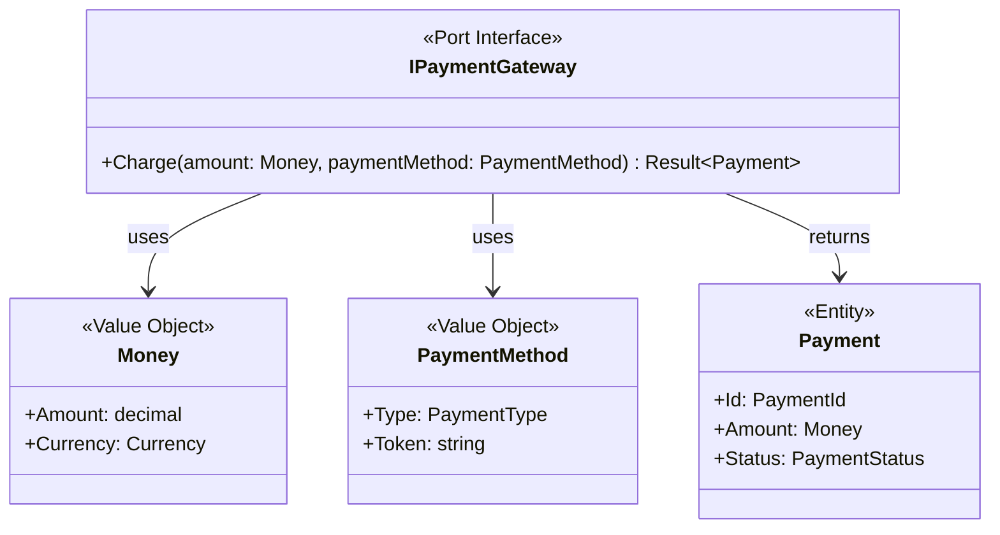
```mermaid
classDiagram
    class IPaymentGateway {
        <<Port Interface>>
        +Charge(amount: Money, paymentMethod: PaymentMethod) Result~Payment~
    }

    class Money {
        <<Value Object>>
        +Amount: decimal
        +Currency: Currency
    }

    class PaymentMethod {
        <<Value Object>>
        +Type: PaymentType
        +Token: string
    }

    class Payment {
        <<Entity>>
        +Id: PaymentId
        +Amount: Money
        +Status: PaymentStatus
    }

    IPaymentGateway --> Money : uses
    IPaymentGateway --> PaymentMethod : uses
    IPaymentGateway --> Payment : returns
```

## Common Patterns for Driven Ports

### Pattern 1: Gateway / Proxy Pattern

**Purpose:** Communicate with external services (payment processors, legacy monoliths, third-party APIs) while encapsulating the underlying mechanism (REST, gRPC, SOAP, etc.).

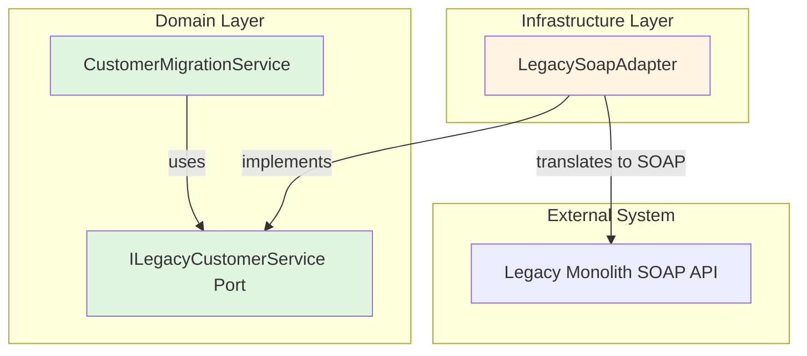
```mermaid
flowchart TB
    subgraph Domain["Domain Layer"]
        Port[ILegacyCustomerService Port]
        DomainService[CustomerMigrationService]
    end

    subgraph Infrastructure["Infrastructure Layer"]
        Adapter[LegacySoapAdapter]
    end

    subgraph External["External System"]
        Legacy[Legacy Monolith SOAP API]
    end

    DomainService -->|uses| Port
    Adapter -->|implements| Port
    Adapter -->|translates to SOAP| Legacy

    style Port fill:#e1f5e1
    style DomainService fill:#e1f5e1
    style Adapter fill:#fff4e1
```

**Key characteristics:**
- **Encapsulation:** The port interface hides the communication mechanism (REST vs gRPC vs SOAP)
- **Protocol-agnostic:** Domain doesn't know if the external system uses REST, GraphQL, SOAP, or a message queue

**Example:**
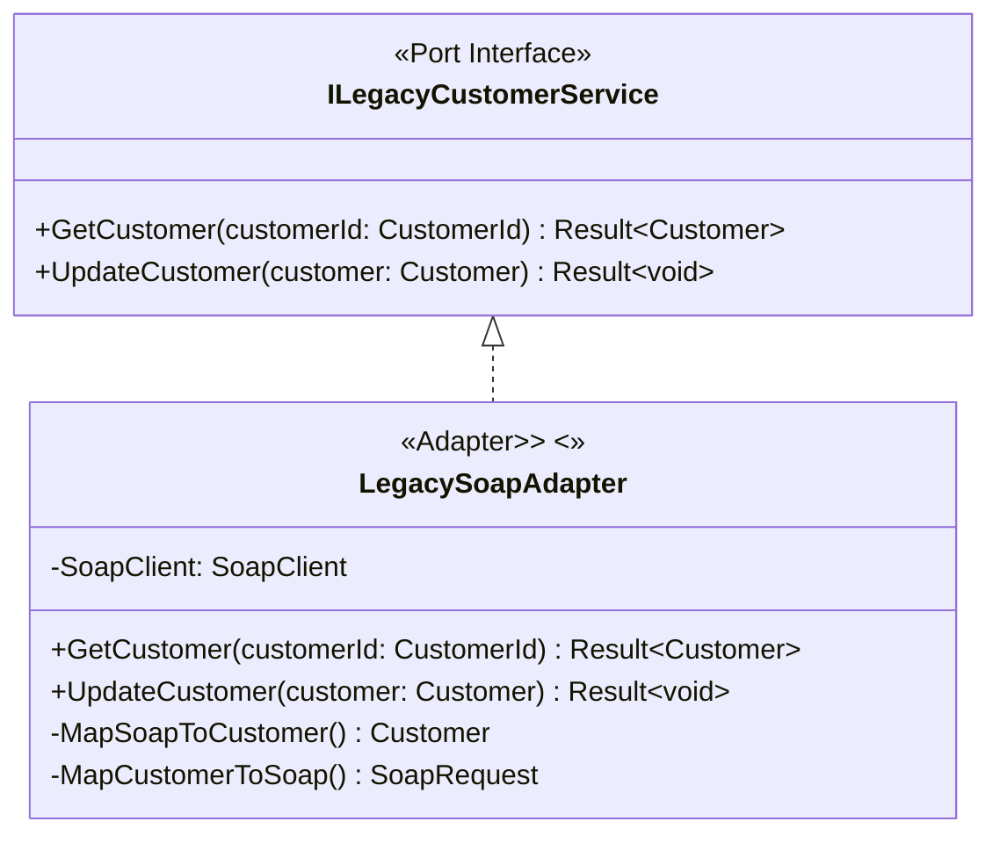
```mermaid
classDiagram
    class ILegacyCustomerService {
        <<Port Interface>>
        +GetCustomer(customerId: CustomerId) Result~Customer~
        +UpdateCustomer(customer: Customer) Result~void~
    }

    class LegacySoapAdapter {
        <<Adapter>> <<Infrastructure>>
        +GetCustomer(customerId: CustomerId) Result~Customer~
        +UpdateCustomer(customer: Customer) Result~void~
        -SoapClient: SoapClient
        -MapSoapToCustomer() Customer
        -MapCustomerToSoap() SoapRequest
    }

    ILegacyCustomerService <|.. LegacySoapAdapter
```

### Pattern 2: Output Port (Event Publisher)

**Purpose:** Enable asynchronous communication or event-driven architectures by providing a write-only interface for publishing domain events.

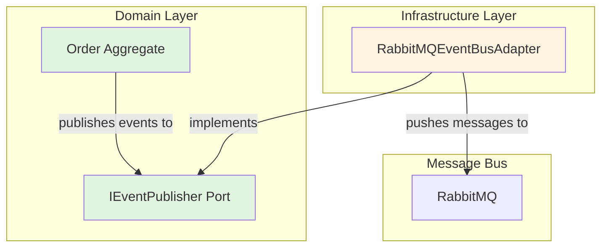
```mermaid
flowchart TB
    subgraph Domain["Domain Layer"]
        Aggregate[Order Aggregate]
        Port[IEventPublisher Port]
    end

    subgraph Infrastructure["Infrastructure Layer"]
        Adapter[RabbitMQEventBusAdapter]
    end

    subgraph External["Message Bus"]
        RabbitMQ[RabbitMQ]
    end

    Aggregate -->|publishes events to| Port
    Adapter -->|implements| Port
    Adapter -->|pushes messages to| RabbitMQ

    style Port fill:#e1f5e1
    style Aggregate fill:#e1f5e1
    style Adapter fill:#fff4e1
```

**Key characteristics:**
- **Write-only:** The application only writes events to the port, never reads from it
- **Observer/Mediator pattern:** The domain defines an interface (observer) that infrastructure implements
- **Decoupling:** Domain publishes events without knowing who consumes them or how they're delivered

**Example:**
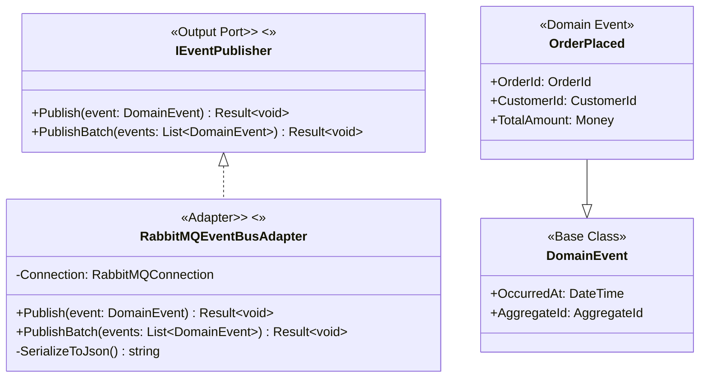
```mermaid
classDiagram
    class IEventPublisher {
        <<Output Port>> <<Write-Only>>
        +Publish(event: DomainEvent) Result~void~
        +PublishBatch(events: List~DomainEvent~) Result~void~
    }

    class DomainEvent {
        <<Base Class>>
        +OccurredAt: DateTime
        +AggregateId: AggregateId
    }

    class OrderPlaced {
        <<Domain Event>>
        +OrderId: OrderId
        +CustomerId: CustomerId
        +TotalAmount: Money
    }

    class RabbitMQEventBusAdapter {
        <<Adapter>> <<Infrastructure>>
        +Publish(event: DomainEvent) Result~void~
        +PublishBatch(events: List~DomainEvent~) Result~void~
        -Connection: RabbitMQConnection
        -SerializeToJson() string
    }

    IEventPublisher <|.. RabbitMQEventBusAdapter
    OrderPlaced --|> DomainEvent
```

**Usage in Domain Service:**
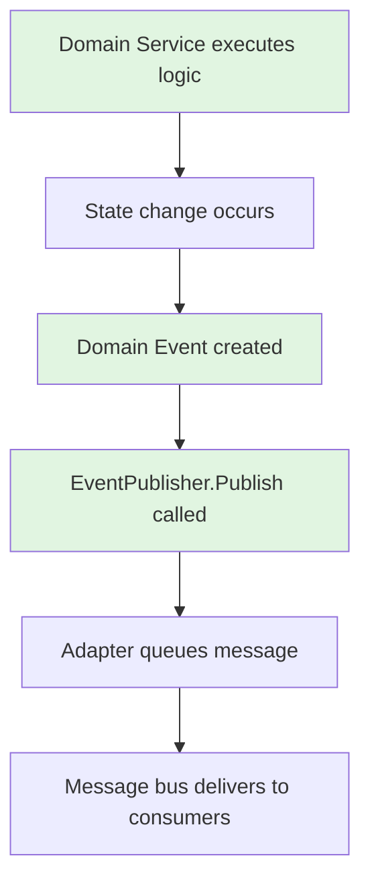
```mermaid
flowchart TD
    A[Domain Service executes logic] --> B[State change occurs]
    B --> C[Domain Event created]
    C --> D[EventPublisher.Publish called]
    D --> E[Adapter queues message]
    E --> F[Message bus delivers to consumers]

    style A fill:#e1f5e1
    style C fill:#e1f5e1
    style D fill:#e1f5e1
```

## Data Exchange Guidance

### Data Structures vs Domain Objects

There is a tension between strict decoupling and pragmatism regarding what data crosses port boundaries.

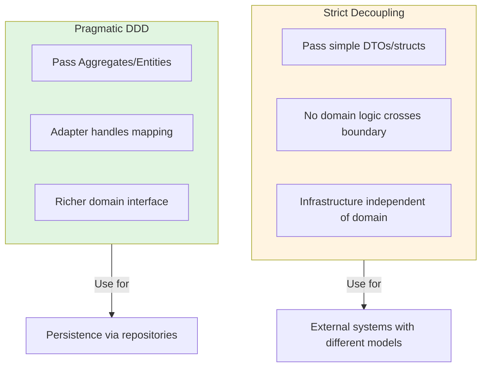
```mermaid
flowchart TB
    subgraph Strict["Strict Decoupling"]
        S1[Pass simple DTOs/structs]
        S2[No domain logic crosses boundary]
        S3[Infrastructure independent of domain]
    end

    subgraph Pragmatic["Pragmatic DDD"]
        P1[Pass Aggregates/Entities]
        P2[Adapter handles mapping]
        P3[Richer domain interface]
    end

    Strict -->|Use for| External[External systems with different models]
    Pragmatic -->|Use for| Repositories[Persistence via repositories]

    style Strict fill:#fff4e1
    style Pragmatic fill:#e1f5e1
```

**Guidelines:**

| Scenario | What to Pass | Rationale |
|----------|--------------|-----------|
| **Repository** | Aggregates/Entities | Pragmatic DDD: Adapter maps domain objects to database rows |
| **External Service (matching model)** | Aggregates/Entities or DTOs | Either works; choose based on model similarity |
| **External Service (different model)** | Simple DTOs | Strict decoupling prevents external model from leaking |
| **Event Publishing** | Domain Events (Value Objects) | Events are domain concepts; serializable by infrastructure |

**Rule of thumb:** Do not pass framework-specific objects (Hibernate proxies, active records, HTTP responses) into the domain.

## Domain Services Using Ports

### Pattern: Domain Service Coordinates Port Calls

Domain Services use ports when they need to coordinate domain logic with external service calls.

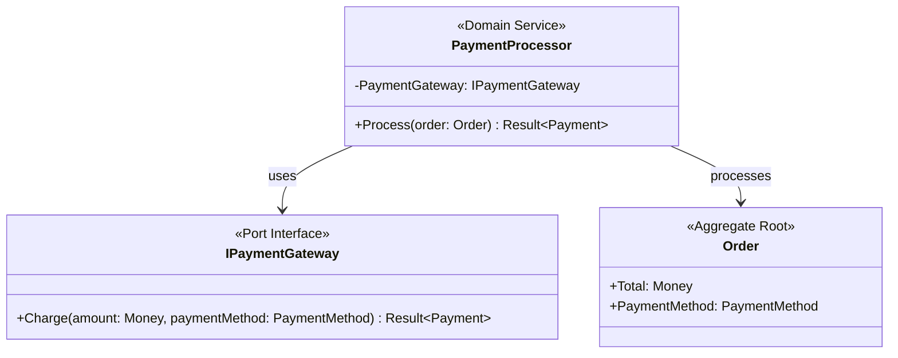
```mermaid
classDiagram
    class PaymentProcessor {
        <<Domain Service>>
        -PaymentGateway: IPaymentGateway
        +Process(order: Order) Result~Payment~
    }

    class IPaymentGateway {
        <<Port Interface>>
        +Charge(amount: Money, paymentMethod: PaymentMethod) Result~Payment~
    }

    class Order {
        <<Aggregate Root>>
        +Total: Money
        +PaymentMethod: PaymentMethod
    }

    PaymentProcessor --> IPaymentGateway : uses
    PaymentProcessor --> Order : processes
```

### Example: Payment Processing with Port

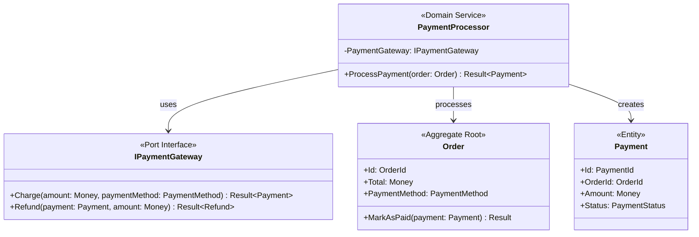
```mermaid
classDiagram
    class IPaymentGateway {
        <<Port Interface>>
        +Charge(amount: Money, paymentMethod: PaymentMethod) Result~Payment~
        +Refund(payment: Payment, amount: Money) Result~Refund~
    }

    class PaymentProcessor {
        <<Domain Service>>
        -PaymentGateway: IPaymentGateway
        +ProcessPayment(order: Order) Result~Payment~
    }

    class Order {
        <<Aggregate Root>>
        +Id: OrderId
        +Total: Money
        +PaymentMethod: PaymentMethod
        +MarkAsPaid(payment: Payment) Result
    }

    class Payment {
        <<Entity>>
        +Id: PaymentId
        +OrderId: OrderId
        +Amount: Money
        +Status: PaymentStatus
    }

    PaymentProcessor --> IPaymentGateway : uses
    PaymentProcessor --> Order : processes
    PaymentProcessor --> Payment : creates
```

**Domain Logic:**

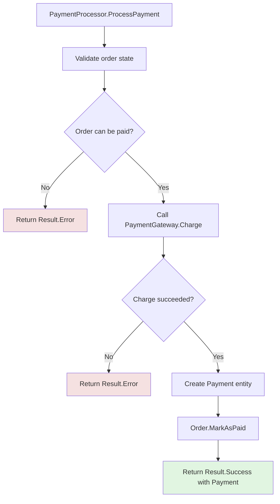
```mermaid
flowchart TD
    A[PaymentProcessor.ProcessPayment] --> B[Validate order state]
    B --> C{Order can be paid?}
    C -->|No| D[Return Result.Error]
    C -->|Yes| E[Call PaymentGateway.Charge]
    E --> F{Charge succeeded?}
    F -->|No| G[Return Result.Error]
    F -->|Yes| H[Create Payment entity]
    H --> I[Order.MarkAsPaid]
    I --> J[Return Result.Success with Payment]

    style D fill:#f5e1e1
    style G fill:#f5e1e1
    style J fill:#e1f5e1
```

## Common Port Examples

### Example 1: Email Gateway

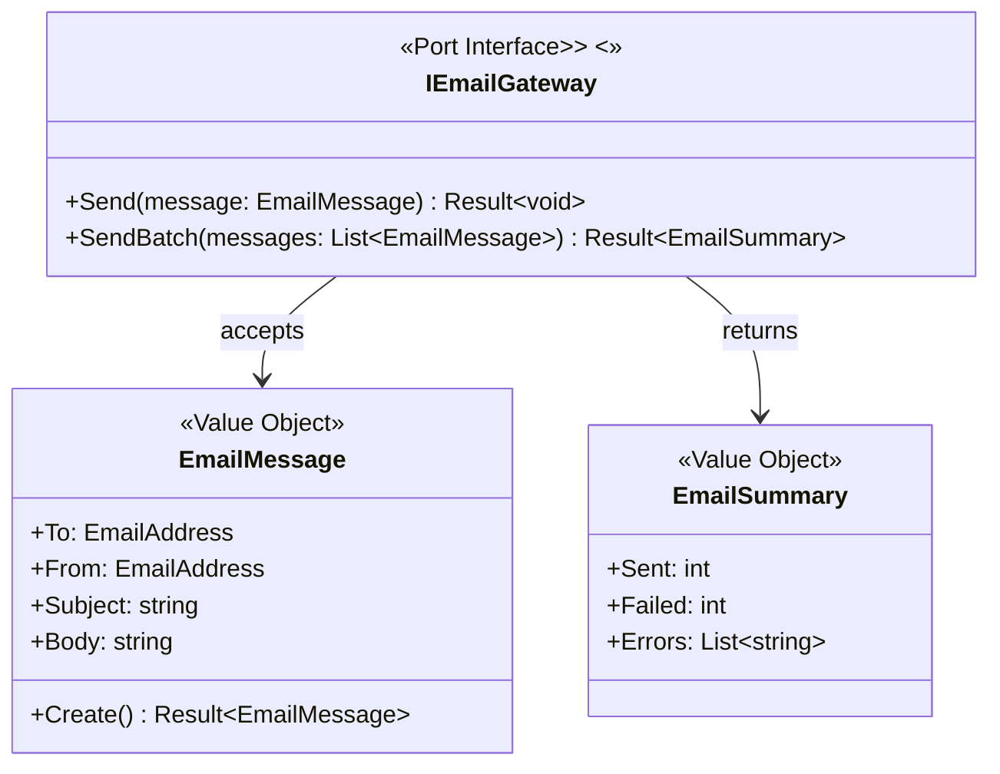
```mermaid
classDiagram
    class IEmailGateway {
        <<Port Interface>> <<Domain Layer>>
        +Send(message: EmailMessage) Result~void~
        +SendBatch(messages: List~EmailMessage~) Result~EmailSummary~
    }

    class EmailMessage {
        <<Value Object>>
        +To: EmailAddress
        +From: EmailAddress
        +Subject: string
        +Body: string
        +Create() Result~EmailMessage~
    }

    class EmailSummary {
        <<Value Object>>
        +Sent: int
        +Failed: int
        +Errors: List~string~
    }

    IEmailGateway --> EmailMessage : accepts
    IEmailGateway --> EmailSummary : returns
```

**Usage in Domain:**

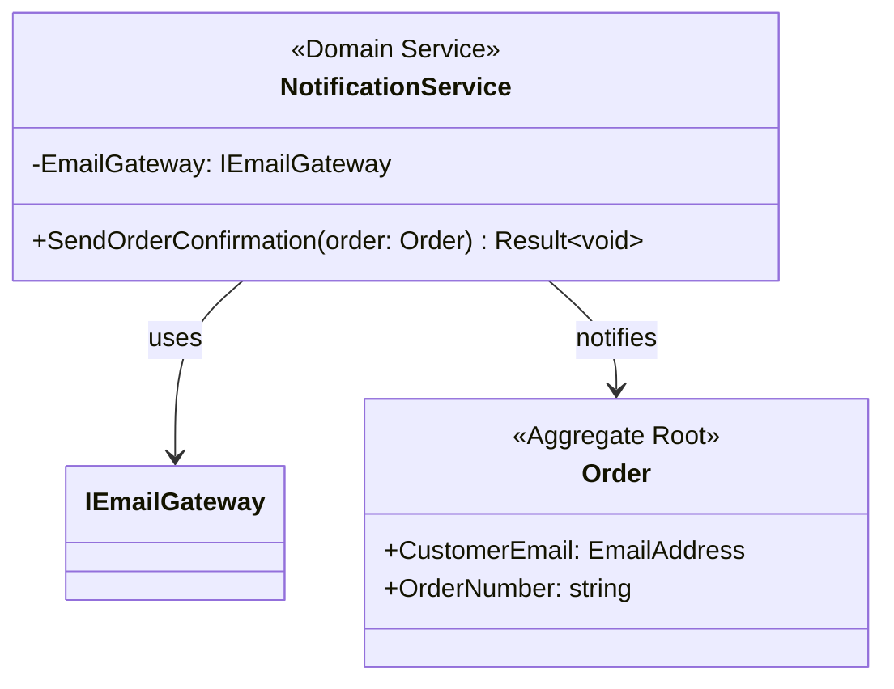
```mermaid
classDiagram
    class NotificationService {
        <<Domain Service>>
        -EmailGateway: IEmailGateway
        +SendOrderConfirmation(order: Order) Result~void~
    }

    class Order {
        <<Aggregate Root>>
        +CustomerEmail: EmailAddress
        +OrderNumber: string
    }

    NotificationService --> IEmailGateway : uses
    NotificationService --> Order : notifies
```

### Example 2: Exchange Rate Service

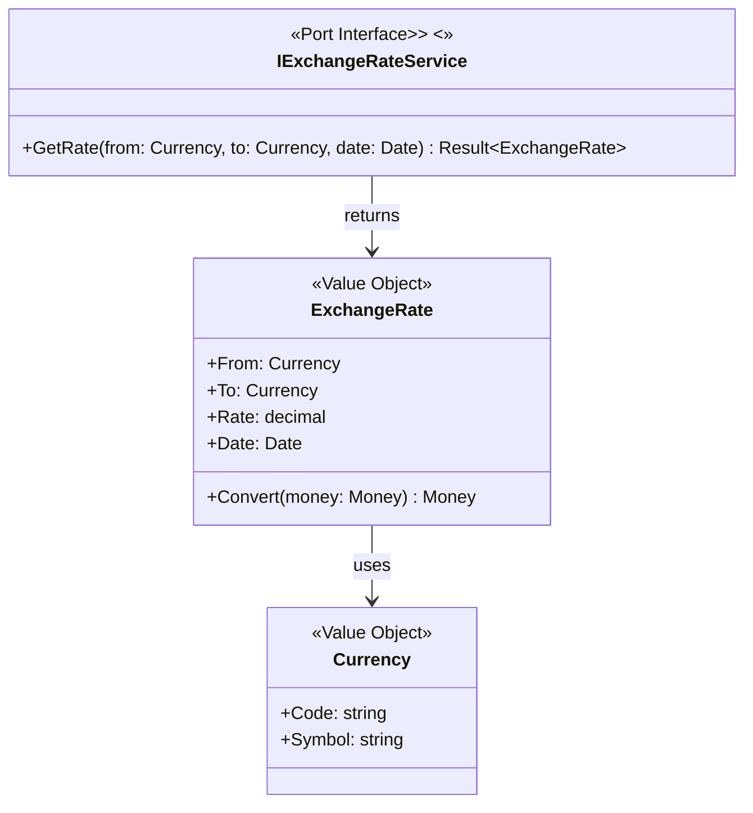
```mermaid
classDiagram
    class IExchangeRateService {
        <<Port Interface>> <<Domain Layer>>
        +GetRate(from: Currency, to: Currency, date: Date) Result~ExchangeRate~
    }

    class ExchangeRate {
        <<Value Object>>
        +From: Currency
        +To: Currency
        +Rate: decimal
        +Date: Date
        +Convert(money: Money) Money
    }

    class Currency {
        <<Value Object>>
        +Code: string
        +Symbol: string
    }

    IExchangeRateService --> ExchangeRate : returns
    ExchangeRate --> Currency : uses
```

**Usage in Domain:**

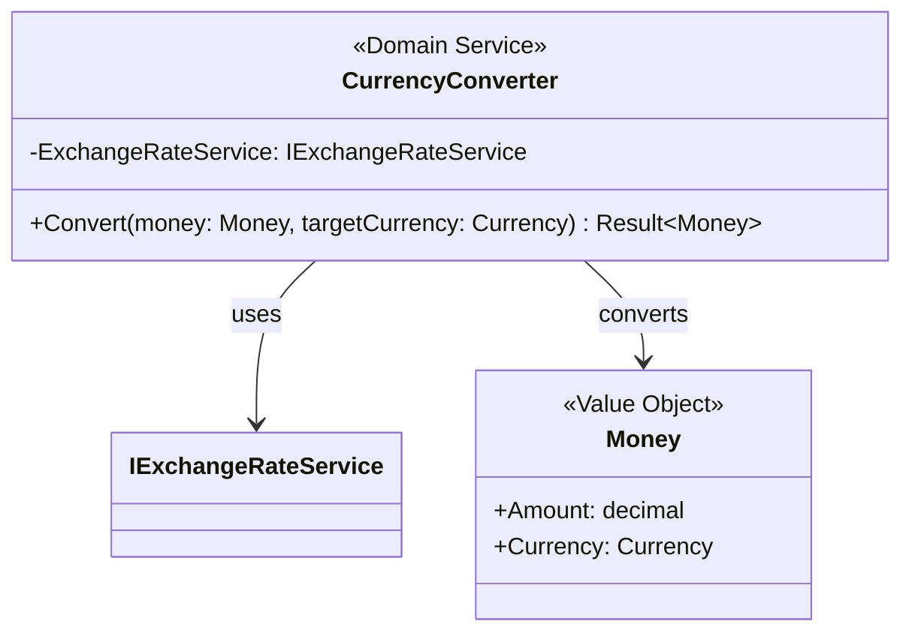
```mermaid
classDiagram
    class CurrencyConverter {
        <<Domain Service>>
        -ExchangeRateService: IExchangeRateService
        +Convert(money: Money, targetCurrency: Currency) Result~Money~
    }

    class Money {
        <<Value Object>>
        +Amount: decimal
        +Currency: Currency
    }

    CurrencyConverter --> IExchangeRateService : uses
    CurrencyConverter --> Money : converts
```

### Example 3: Shipping Service

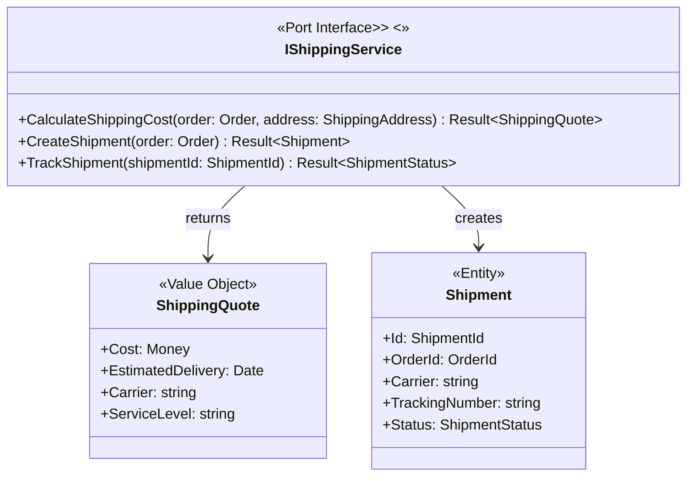
```mermaid
classDiagram
    class IShippingService {
        <<Port Interface>> <<Domain Layer>>
        +CalculateShippingCost(order: Order, address: ShippingAddress) Result~ShippingQuote~
        +CreateShipment(order: Order) Result~Shipment~
        +TrackShipment(shipmentId: ShipmentId) Result~ShipmentStatus~
    }

    class ShippingQuote {
        <<Value Object>>
        +Cost: Money
        +EstimatedDelivery: Date
        +Carrier: string
        +ServiceLevel: string
    }

    class Shipment {
        <<Entity>>
        +Id: ShipmentId
        +OrderId: OrderId
        +Carrier: string
        +TrackingNumber: string
        +Status: ShipmentStatus
    }

    IShippingService --> ShippingQuote : returns
    IShippingService --> Shipment : creates
```

## Ports vs Repositories

Both ports and repositories are interfaces in the domain layer, but they serve different purposes.

```mermaid
flowchart TB
    subgraph Repositories["Repositories"]
        R1[Persist aggregates]
        R2[Database abstraction]
        R3[One per aggregate root]
    end

    subgraph Ports["Driven Ports"]
        P1[External services]
        P2[Integration abstraction]
        P3[As needed by domain]
    end

    Repositories -->|Both are| Both[Domain interfaces]
    Ports -->|Both are| Both
    Both --> Infrastructure[Implemented in infrastructure]

    style Repositories fill:#e1f5e1
    style Ports fill:#fff4e1
```

| Aspect | Repository | Driven Port |
|--------|-----------|-------------|
| **Purpose** | Persist aggregates | Integrate external services |
| **Abstraction** | Database storage | External service/API |
| **Cardinality** | One per aggregate root | As needed |
| **Operations** | CRUD-like | Domain-specific |
| **Returns** | `Result<T>` (aggregate) | `Result<T>` (domain type) |

## Common Anti-Patterns

### Port with Implementation Details
**Problem:** Port interface exposes implementation details like `SendWithSendGrid(apiKey: string, to: string, from: string)` or `SetSmtpConfig(host: string, port: int)`.
**Solution:** Use domain types and terminology (e.g., `Send(message: EmailMessage)` where EmailMessage is a domain value object).

### Port for Pure Infrastructure
**Problem:** Creating ports for pure infrastructure concerns like `ILogger` or `ICache` that contain no business logic.
**Solution:** Handle pure infrastructure concerns in the infrastructure layer, not as domain ports. Ports are for external services with business logic.

### Port Returning Primitive Types
**Problem:** Port methods return primitive types like `Charge(amount: decimal, currency: string) Result<string>`.
**Solution:** Return domain types (Value Objects, Entities) to maintain domain language and type safety.

## Summary Checklist

When reviewing a DOMAIN.md for Driven Port compliance, ask:

### Design Principles
- [ ] Is there interface segregation (specific interfaces for specific clients, avoiding monolithic ports)?
- [ ] Is there intent-based naming (business language, not technical jargon)?
- [ ] Is the port technology agnostic (no HTTP, SQL, REST in method names)?

### Interface Design
- [ ] Is the port interface defined in the Domain layer?
- [ ] Does the port use domain terminology (ubiquitous language)?
- [ ] Does the port interface allow for swapping implementations?
- [ ] Do port operations return `Result<T>` for operations that can fail?
- [ ] Does the port accept and return domain types (not primitives)?
- [ ] Are there no implementation details in the port interface?
- [ ] Are there no framework-specific types in port method signatures?
- [ ] Do technical exceptions get caught in the adapter and re-thrown as business exceptions?

### Patterns
- [ ] Is the Gateway Pattern used for external service communication (REST, gRPC, SOAP)?
- [ ] Is the Output Port Pattern used for event publishing (write-only, observer pattern)?
- [ ] Is the Repository Pattern distinguished from ports (for persistence)?

### Data Exchange
- [ ] Are framework-specific objects (Hibernate proxies, HTTP responses) never passed through ports?

### Usage
- [ ] Is the port used by Domain Services (not directly by Aggregates)?
- [ ] Does the port abstract external services containing business logic?
- [ ] Is there one port per external service concern?

## Port vs Adapter

This guide focuses on **Ports** (domain interfaces).

**Adapters** (implementations) are **infrastructure concerns** and are not covered in this guide. When implementing:

1. Define the port interface in the Domain layer (this guide)
2. Implement the adapter in the Infrastructure layer
3. Use dependency injection to provide the adapter
4. Test domain logic with fake/test adapters
