# Repository Interfaces (Domain Layer)

## Overview

In Tactical DDD, a **Repository Interface** is a domain concern that provides an abstraction simulating a collection of Aggregates in memory. The interface is defined in the Domain layer, while implementations are Infrastructure concerns.

**Core principles:**
- **Collection-like interface** - Mimics in-memory collection semantics
- **Aggregate Root only** - Repository interfaces exist only for Aggregate Roots
- **Domain interface** - Interface defined in Domain layer
- **Infrastructure implementation** - Implementation in Infrastructure layer (not covered in this guide)

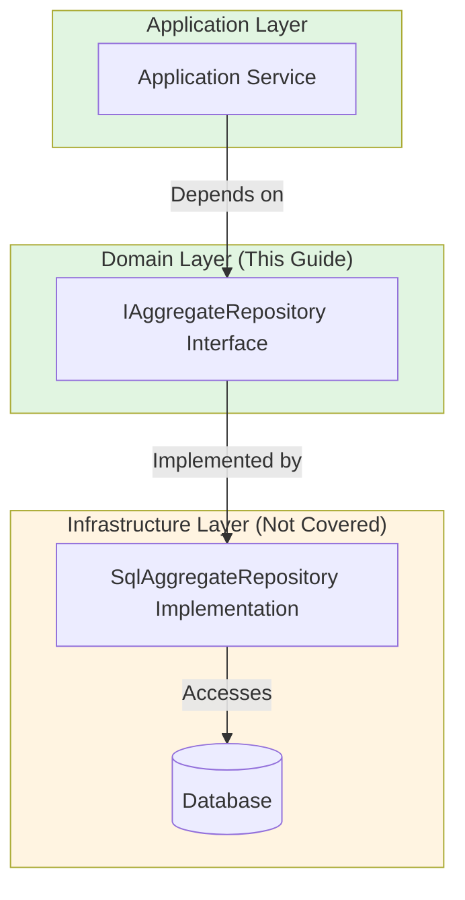

## Repository Interface Rules

### Rule 1: One Repository Interface Per Aggregate Root

**Rule:** Only Aggregate Roots have repository interfaces. Internal entities never have repositories.

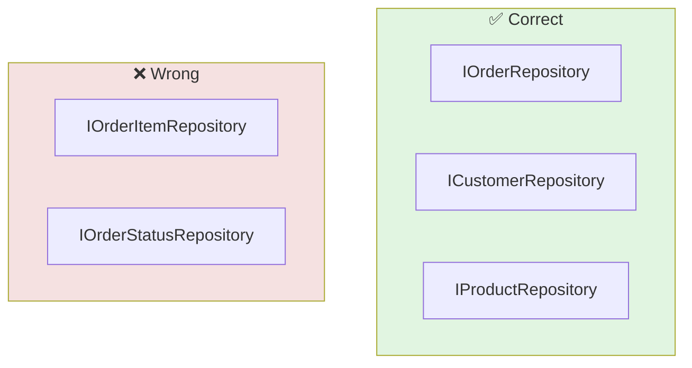

**Rationale:**

- Internal entities are accessed through their Aggregate Root
- Direct access to internal entities bypasses invariant enforcement
- Repository represents a consistency boundary
- Only Roots can be independently loaded and saved

**Example:**

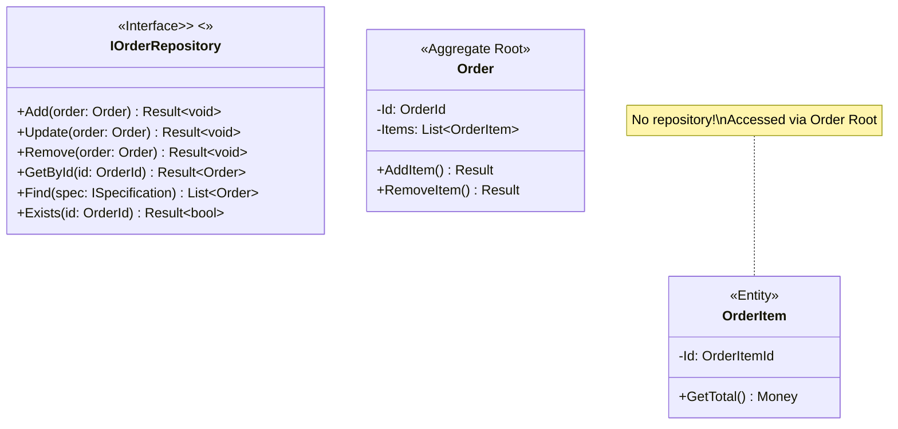

### Rule 2: Interface in Domain Layer

**Rule:** Repository interface defined in Domain layer, implementation in Infrastructure layer.

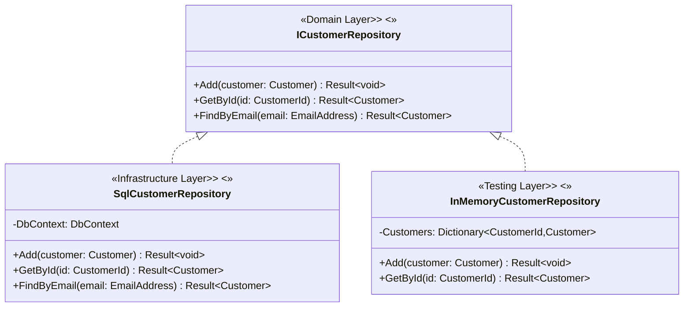

**Benefits:**

- **Dependency Inversion** - Domain doesn't depend on Infrastructure
- **Testability** - Swap in fake repository for unit tests
- **Flexibility** - Change persistence strategy without affecting domain

**Layer dependencies:**

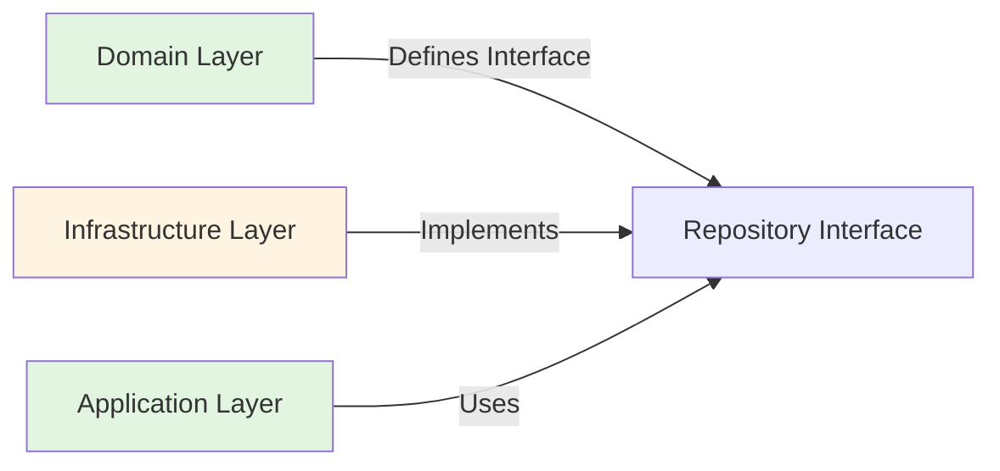

### Rule 3: Collection-Like Semantics

**Rule:** Repository interface should feel like an in-memory collection, not a database access layer.

```mermaid
flowchart TB
    subgraph Good["✅ Collection-like"]
        G1[repo.Add(order)]
        G2[repo.Update(order)]
        G3[repo.GetById(id)]
        G4[repo.Find(spec)]
        G5[repo.Remove(order)]
    end

    subgraph Bad["❌ Database-like"]
        B1[repo.ExecuteSql(sql)]
        B2[repo.SelectFromWhere(query)]
        B3[repo.CallStoredProcedure(name)]
    end

    style Good fill:#e1f5e1
    style Bad fill:#f5e1e1
```

**Standard operations:**

| Operation | Semantic | Example |
|-----------|----------|---------|
| `Add()` | Insert new aggregate | `repo.Add(order)` |
| `Update()` | Modify existing aggregate | `repo.Update(order)` |
| `Remove()` | Delete aggregate | `repo.Remove(order)` |
| `GetById()` | Find by ID | `repo.GetById(orderId)` |
| `Find()` | Query with specification | `repo.Find(spec)` |
| `Exists()` | Check existence | `repo.Exists(orderId)` |
| `Count()` | Count matching aggregates | `repo.Count(spec)` |

### Rule 4: Return Result for Operations That Can Fail

**Rule:** Repository operations return `Result<T>` for operations that can fail (not found, concurrency violations, etc.).

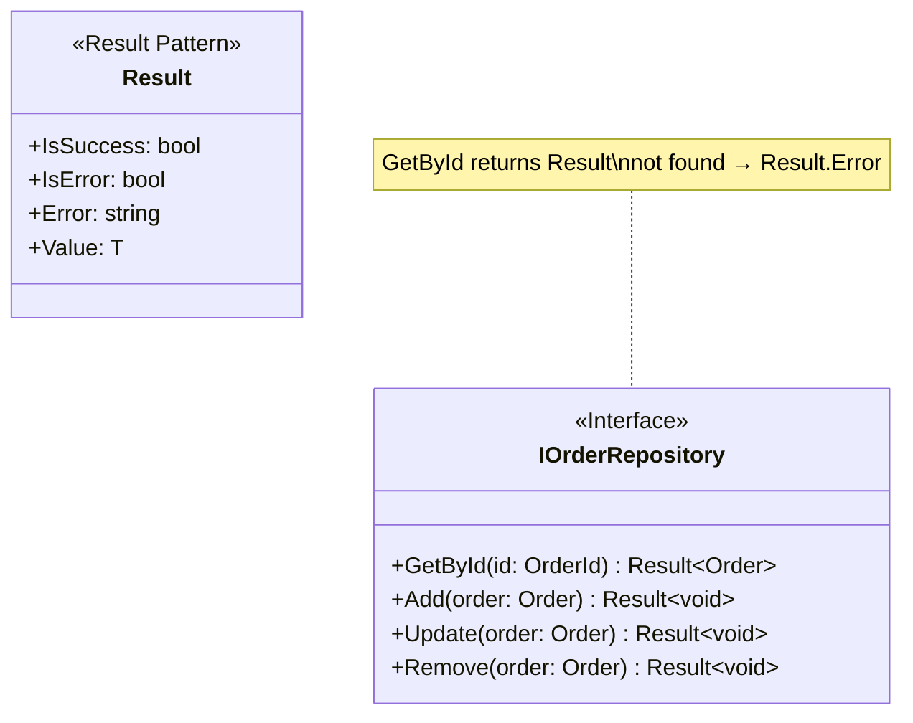

**Examples:**
- `GetById(id)` → `Result<Order>` (not found = error)
- `Update(order)` → `Result<void>` (concurrency violation = error)
- `Add(order)` → `Result<void>` (constraint violation = error)

## Query Patterns

### Specification Pattern

**Problem:** Repository interfaces become cluttered with specific query methods.

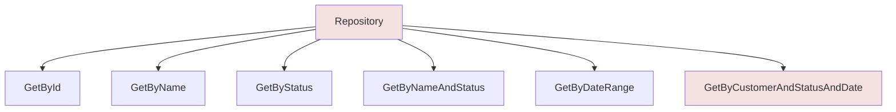

**Solution:** Encapsulate query logic in Specification objects.

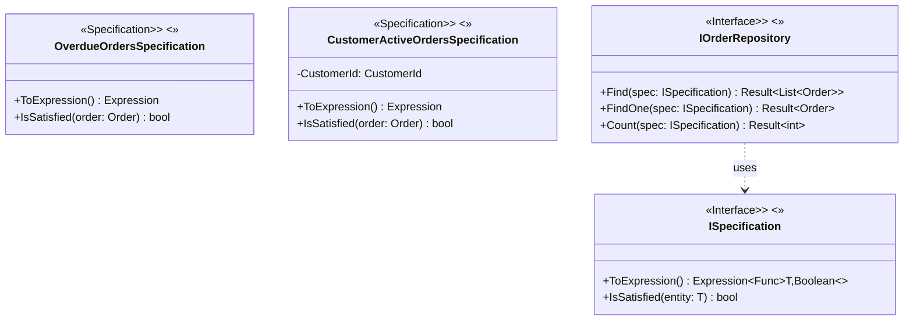

**Benefits:**

- Encapsulates business rules in Domain layer
- Keeps repository interface stable
- Composable specifications
- Testable query logic

### Query vs. Command

**CQRS Principle:** Separate read and write models.

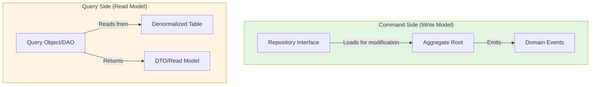

**When to use:**

- **Repository Interface:** For transactional operations (writes)
- **Query Object/DAO:** For reporting and queries (reads) - not a domain concern

## Repository Interface Examples

### Example 1: Order Repository

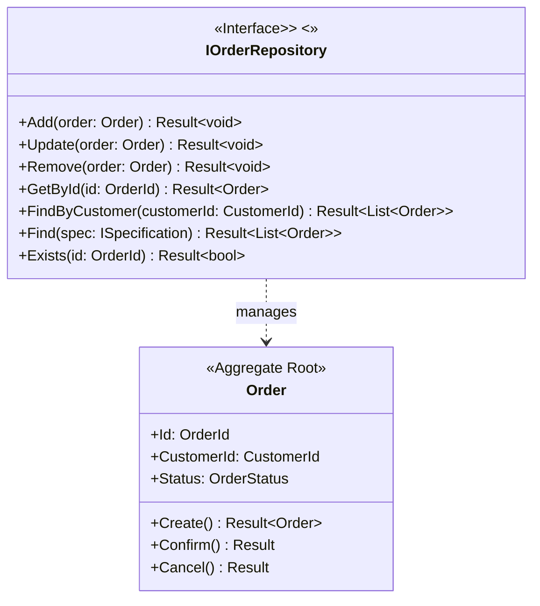

### Example 2: Customer Repository with Specifications

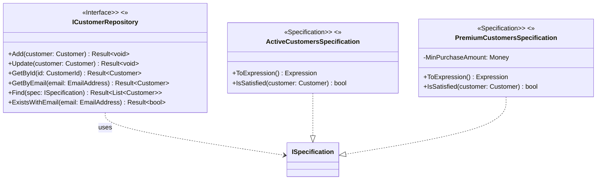

### Example 3: Repository with Domain Events

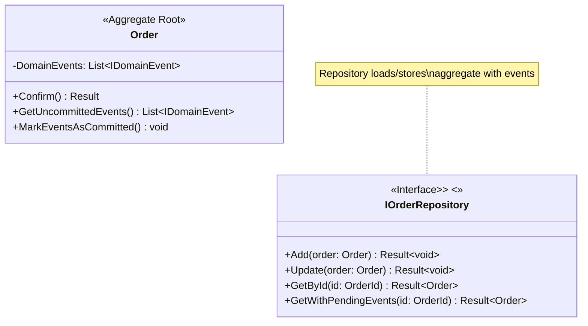

## Common Anti-Patterns

### Repository for Internal Entities
**Problem:** Creating a repository for internal entities (e.g., `IOrderItemRepository`) bypasses aggregate root and invariant enforcement.
**Solution:** Access internal entities only through their aggregate root. Only aggregate roots have repositories.

### Database-Like Interface
**Problem:** Repository exposes database-specific methods like `ExecuteQuery`, `CallStoredProcedure`, `GetRawData`.
**Solution:** Use collection-like semantics (Add, Update, Remove, GetById, Find) that mimic in-memory collections.

### Not Returning Result for Failure Cases
**Problem:** Repository methods like `GetById(id: OrderId) Order` throw exceptions or return null for not-found cases.
**Solution:** Return `Result<T>` for operations that can fail, making failures explicit in the type signature.

## Summary Checklist

When designing repository interfaces in the domain layer:

- [ ] Interface defined in Domain layer
- [ ] One interface per Aggregate Root
- [ ] Collection-like semantics (Add, Update, Remove, GetById, Find)
- [ ] Return `Result<T>` for operations that can fail
- [ ] GetById returns `Result<T>` for not-found cases
- [ ] Use Specification pattern for complex queries
- [ ] No database-specific methods
- [ ] No repository for internal entities
- [ ] Enable testing with fake implementations
- [ ] Keep interface stable (implementation details hidden)

## Repository Interface vs Implementation

This guide focuses on **Repository Interfaces** as domain concerns.

**Repository Implementations** (SQL, NoSQL, in-memory, etc.) are **infrastructure concerns** and are not covered in this guide. When implementing:

- Define the interface in the Domain layer (this guide)
- Implement the interface in the Infrastructure layer
- Use dependency injection to provide the implementation
- Test domain logic with fake/test implementations
