# Specifications

## Overview

A **Specification** is a named, reusable business rule that encapsulates domain logic for querying or validating objects. It represents a predicate that determines whether an object satisfies a business criterion.

**Core characteristics:**
- **Named business concept** - Uses ubiquitous language (e.g., `ActiveCustomerSpecification`, not `GetActiveCustomers`)
- **Composable** - Can be combined with AND, OR, NOT operators
- **Reusable** - Used across multiple queries and validations
- **Testable** - Business rule isolated in one place

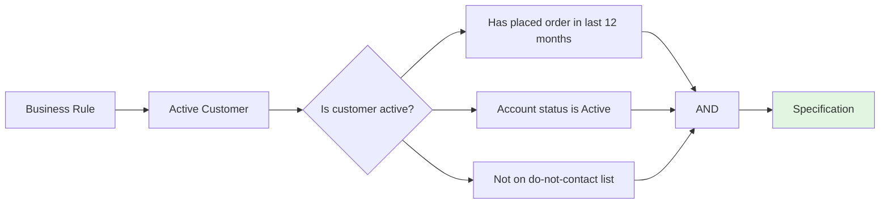

**When Specifications are useful:**

- Complex business queries with multiple conditions
- Rules that change frequently and need centralization
- Criteria reused across multiple use cases
- Validations that depend on querying the domain

## When to Use Specifications

### Use a Specification when:

| Scenario | Example | Why Specification helps |
|----------|---------|------------------------|
| **Complex query criteria** | Find premium customers who spent >$1000 in electronics category last quarter | Centralizes business logic, reusable |
| **Frequently changing rules** | "Active customer" definition changes quarterly | Single place to update |
| **Composable conditions** | Overdue orders OR high-priority orders OR VIP customer orders | Combine specifications like building blocks |
| **Cross-use-case validation** | "Is this customer eligible for discount?" used in ordering, marketing, support | Consistent rule enforcement |
| **Readable domain queries** | `Find(OverdueOrders)` vs `Find(o => o.DueDate < now && o.Status != Paid)` | Ubiquitous language |

### Don't use a Specification when:

| Scenario | Alternative |
|----------|-------------|
| **Simple ID lookup** | `GetById(id)` |
| **One-off query** | Won't be reused |
| **Pure infrastructure** | Database-specific optimization |
| **Aggregate internal logic** | Keep inside aggregate behavior methods |

## Core Rules

### Rule 1: Name Business Concepts, Not Technical Conditions

**Rule:** Specifications use domain language from the ubiquitous language glossary.

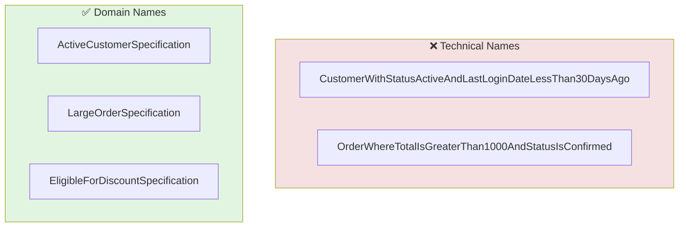

**Examples:**

| Business Concept | Specification Name |
|-----------------|-------------------|
| Customers who recently purchased | `RecentCustomerSpecification` |
| Orders ready to ship | `ShippableOrderSpecification` |
| Products low in stock | `LowStockSpecification` |
| Accounts requiring verification | `RequiresVerificationSpecification` |

### Rule 2: Specifications Are Domain Concerns

**Rule:** Specifications encapsulate business rules, not query implementation details.

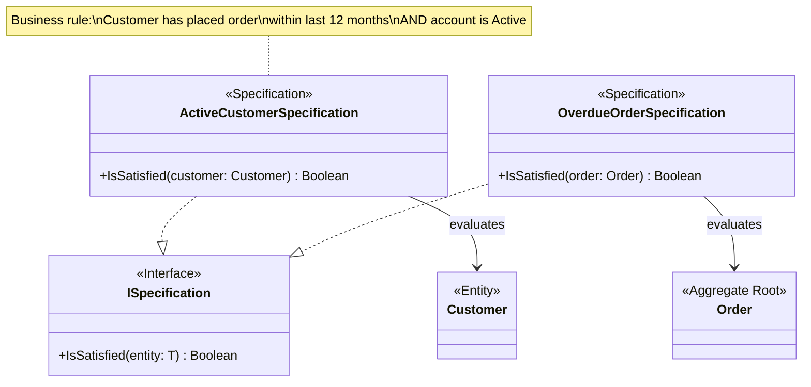

**Key principles:**

- Specification defines **what** the business rule is (domain concern)
- Repository implementation handles **how** to query efficiently (infrastructure concern)
- Domain documents specify the rule, not the SQL/LINQ

### Rule 3: Specifications Can Be Composed

**Rule:** Combine specifications with logical operators to create complex rules.

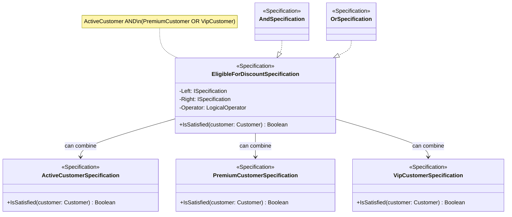

**Composition patterns:**

| Composition | Meaning | Example |
|-------------|---------|---------|
| `ActiveCustomer AND PremiumCustomer` | Must satisfy both | Active premium customers |
| `PremiumCustomer OR VipCustomer` | Must satisfy at least one | High-value customers |
| `NOT SuspendedCustomer` | Must not satisfy | Customers in good standing |
| `(A OR B) AND C` | Nested logic | Complex business rules |

### Rule 4: Specifications for Both Queries and Validation

**Rule:** Specifications serve two purposes: querying collections and validating single objects.

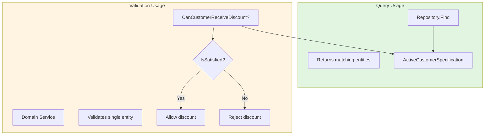

**Examples in DOMAIN.md:**

| Usage | Example |
|-------|---------|
| **Query** | `Find all ActiveCustomerSpecification` for newsletter campaign |
| **Validation** | `IsSatisfied(customer)` before offering loyalty discount |

### Construction (Object Generation)

Specifications can define constraints for objects being created or configured by generators or builders.

**Use cases:**

| Scenario | Example |
|----------|---------|
| **Test data generation** | A `ValidCustomerSpecification` passed to a test data factory ensures generated customers meet business rules |
| **Configuration building** | A `CompliantOrderSpecification` used when building sample orders for compliance testing |
| **Constraint validation** | A generator creates objects until they satisfy a `SufficientInventorySpecification` |

**Example:**

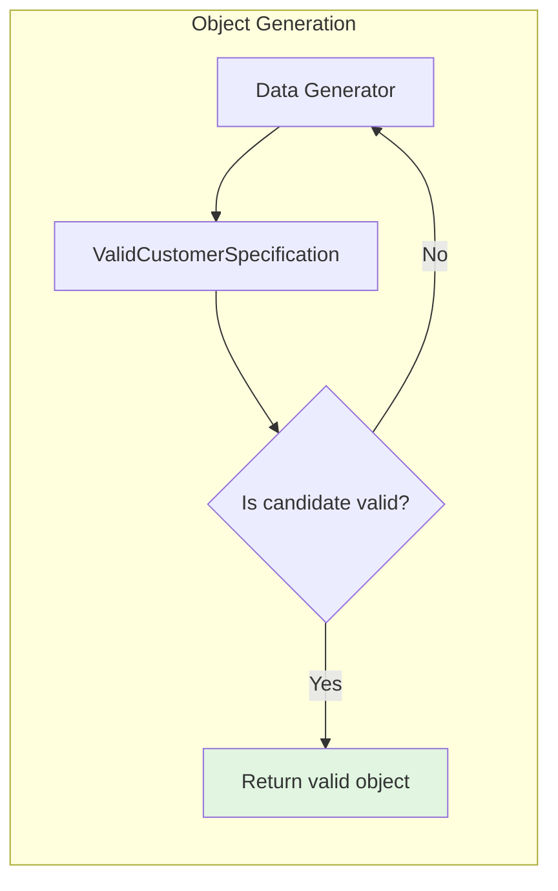

**Note:** Construction is a specialized use case. Validation and Querying are the primary uses in most domain designs.

### Rule 5: State-Based Assertions

**Rule:** Specifications describe **what** state an object must have, not **how** to achieve that state.

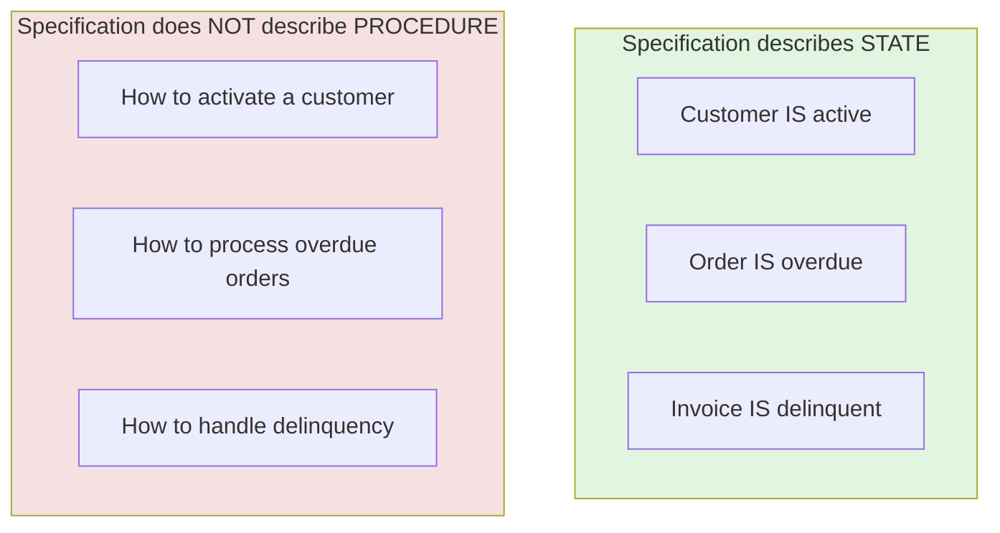

**Why this matters:**

| Describes State ✅ | Describes Procedure ❌ |
|-------------------|----------------------|
| `ActiveCustomerSpecification` | `ActivateCustomerService` |
| `OverdueOrderSpecification` | `ProcessOverdueOrdersCommand` |
| `DelinquentInvoiceSpecification` | `HandleDelinquencyWorkflow` |

**Benefits:**

- **Easier to analyze** - Rules are declarative and self-contained
- **Easier to test** - No side effects, just predicate evaluation
- **More composable** - State descriptions combine naturally with logic operators
- **Clear separation of concerns** - Validation separate from execution

## Specification Design Examples

### Example 1: Customer Specifications

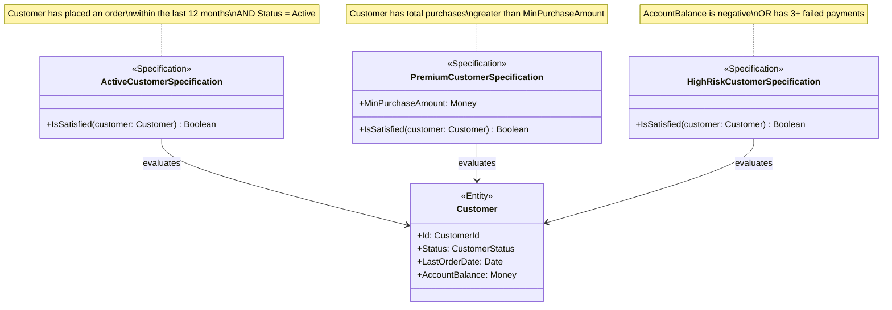

**Business rules documented:**

| Specification | Business Rule |
|---------------|---------------|
| `ActiveCustomerSpecification` | Customer has ordered within 12 months AND account is Active |
| `PremiumCustomerSpecification` | Total lifetime purchases > $10,000 |
| `HighRiskCustomerSpecification` | Balance < 0 OR 3+ failed payments in last month |

### Example 2: Order Specifications

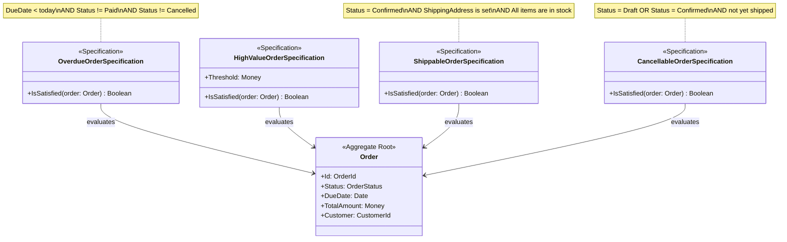

**Composed specification:**

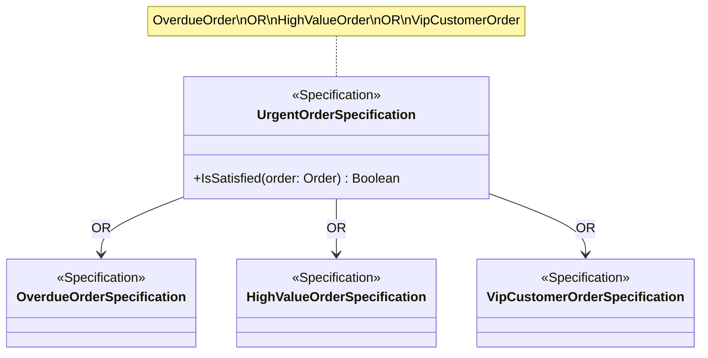

### Example 3: Composed Business Rule

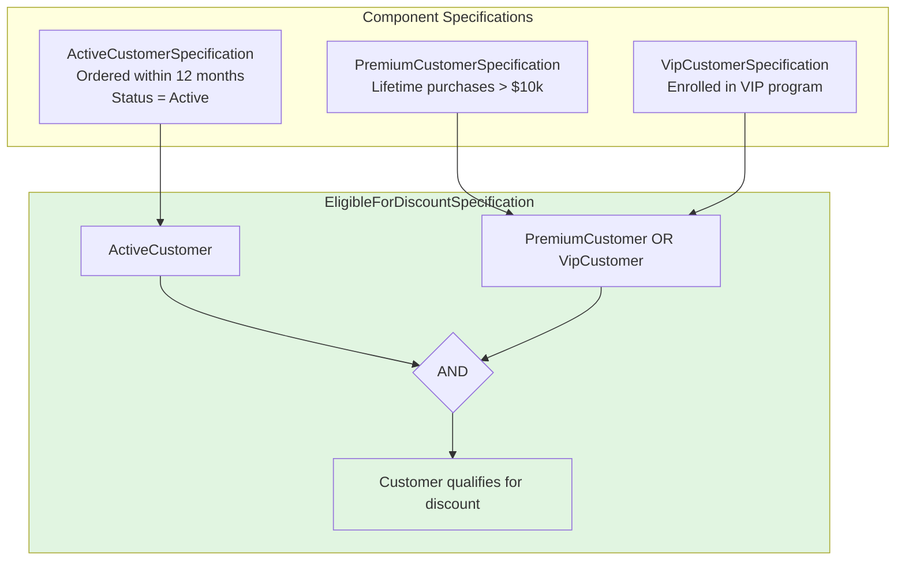

**Business rule:**

> "A customer is eligible for a discount if they are an active customer AND (either a premium customer OR a VIP customer)."

**Specification composition:**

```
EligibleForDiscountSpecification
  = ActiveCustomerSpecification
    AND (
      PremiumCustomerSpecification
      OR VipCustomerSpecification
    )
```

## Specifications in Domain Documents

### When to Include Specifications in DOMAIN.md

Include specifications in your domain design when:

1. **Complex business queries** exist that aren't simple ID lookups
2. **Business rules are reused** across multiple use cases
3. **Query logic needs documentation** beyond what's obvious from entity structure
4. **Validation rules** depend on domain state that must be queried

### How to Document Specifications

**Option 1: In Types section**

```markdown
## Types

### ActiveCustomerSpecification

Encapsulates the business rule for determining if a customer is considered active. A customer is active if they have placed at least one order within the last 12 months and their account status is Active.
```

**Option 2: As part of Repository interface**

```markdown
## Class Diagrams

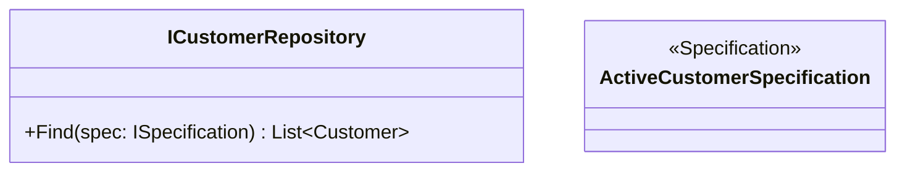

**Option 3: In Design Explanations**

```markdown
## Design Explanations

### Customer Query Specifications

The domain defines several specifications for common customer queries:
- **ActiveCustomerSpecification** - Customers with orders in last 12 months
- **PremiumCustomerSpecification** - Customers with lifetime purchases > $10,000
- **HighRiskCustomerSpecification** - Customers with negative balance or payment failures

These specifications are composable and reusable across the domain.
```

### Specification Invariants

Document specification business rules in the Invariants section:

```markdown
## Invariants

### ActiveCustomerSpecification Invariants

| ID | Invariant | Notes |
|----|-----------|-------|
| CUST-SPEC-1 | Customer must have at least one order in the last 12 months | Calculated from order history |
| CUST-SPEC-2 | Customer account status must be Active | Checked against Customer.Status |
```

## Specifications vs Alternatives

### Specification vs Hardcoded Query

```mermaid
flowchart TB
    subgraph Hardcoded["❌ Hardcoded Query"]
        H1[repo.Find(c => c.Status == 'Active'\n&& c.LastOrderDate > today - 365 days)]
    end

    subgraph Specification["✅ Specification"]
        S1[repo.Find(ActiveCustomerSpecification)]
    end

    style Hardcoded fill:#f5e1e1
    style Specification fill:#e1f5e1
```

**Benefits of Specification:**

- Named business concept (ubiquitous language)
- Reusable across multiple queries
- Single place to update when business rule changes
- Testable without database
- Self-documenting domain logic

### Specification vs Aggregate Behavior

**Use Aggregate Behavior when:**
- Logic operates on a single aggregate instance
- Rule is enforced by the aggregate itself
- Validation happens within a transaction

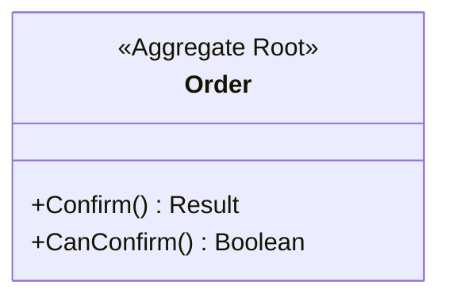

**Use Specification when:**
- Logic evaluates criteria across multiple potential candidates
- Rule is used for querying/filtering
- Rule is used for validation outside aggregate boundary

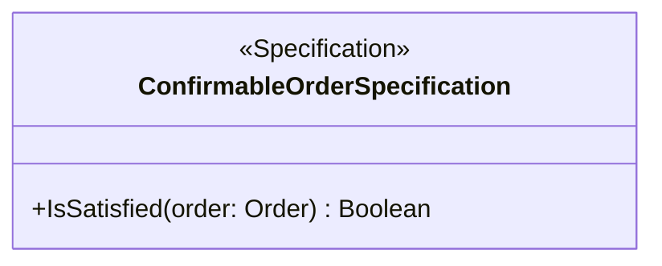

### Specification vs Domain Service

**Use Domain Service when:**
- Operation involves multiple aggregates
- Logic requires orchestration or coordination
- Action performs state changes

**Use Specification when:**
- Pure predicate evaluation (true/false)
- No side effects
- Used for filtering or validation

## Common Anti-Patterns

### Over-Specification

**Problem:** Creating a specification for every simple query condition.

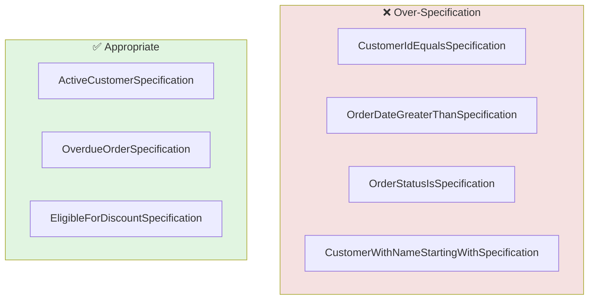

**Solution:** Only create specifications for meaningful business concepts, not technical query conditions. Use repository methods for simple lookups.

### Leaking Implementation Details

**Problem:** Specification names or structure reflect database schema or query implementation.

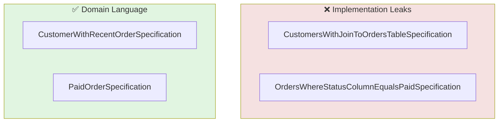

**Solution:** Use ubiquitous language. Specifications should describe business rules, not how to query them.

### God Specifications

**Problem:** One specification that knows too much or does too much.

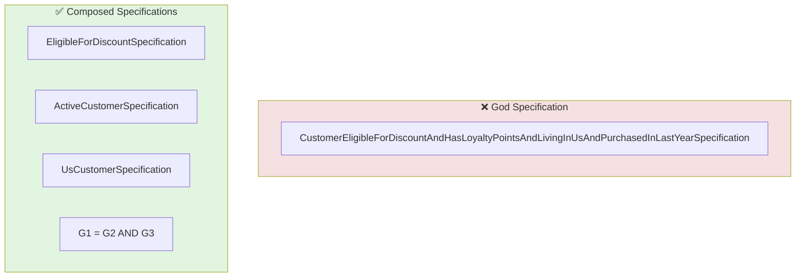

**Solution:** Break into smaller, composable specifications that can be combined.

### Specifications That Modify State

**Problem:** Specifications that have side effects or modify state.

**Solution:** Specifications should be pure predicates (return true/false). Use Domain Services for operations that modify state.

## Benefits of Declarative Design

By adopting the Specification pattern, you achieve a **Declarative Style of Design**—stating relationships and rules without defining execution flow.

| Benefit | Explanation |
|---------|-------------|
| **Expressive** | State rules without defining procedures |
| **Composable** | Combine specifications dynamically with logical operators |
| **Testable** | Test complex business rules in isolation |
| **Self-documenting** | Named business concepts reveal intent |
| **Maintainable** | Single source of truth for each business rule |

**Imperative vs Declarative:**

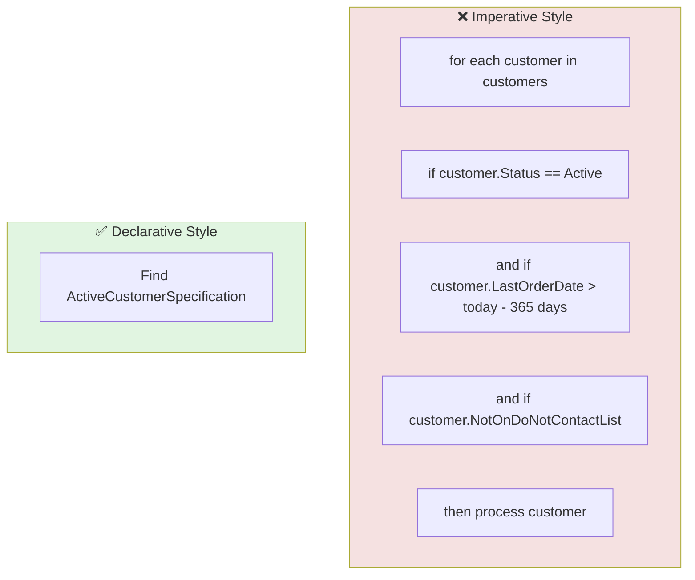

---

## Summary Checklist

When reviewing a DOMAIN.md for Specification compliance, ask:

- [ ] Is the Specification named using ubiquitous language (domain terminology)?
- [ ] Does the Specification encapsulate a meaningful business concept?
- [ ] Is the Specification reusable across multiple use cases?
- [ ] Is the Specification composable (can be combined with AND, OR, NOT)?
- [ ] Is the Specification a pure predicate (no side effects)?
- [ ] Is the Specification used for both queries and validation?
- [ ] Is the Specification documented in DOMAIN.md when complex or reused?
- [ ] Is the business rule of the Specification clearly defined?
- [ ] Is the Specification not over-used (avoiding trivial one-off conditions)?
- [ ] Is the Specification distinguished from aggregate behavior methods?
- [ ] Is the Specification distinguished from domain services (stateless operations)?
