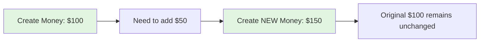
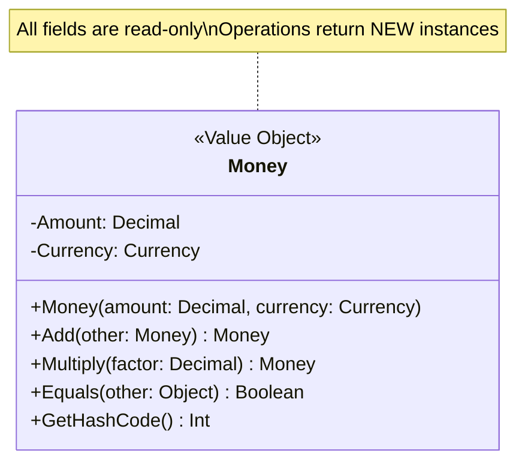
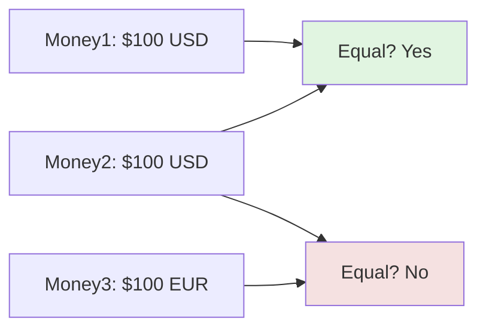
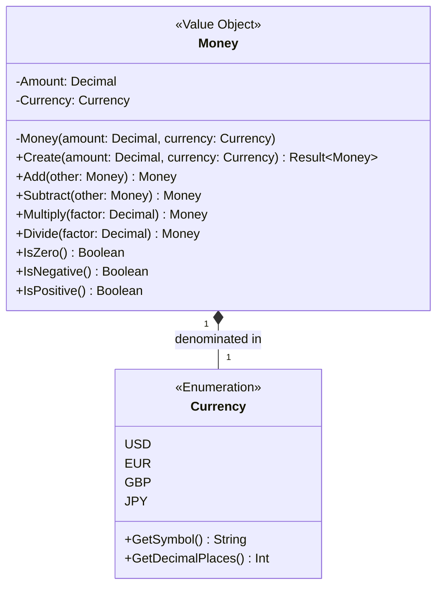
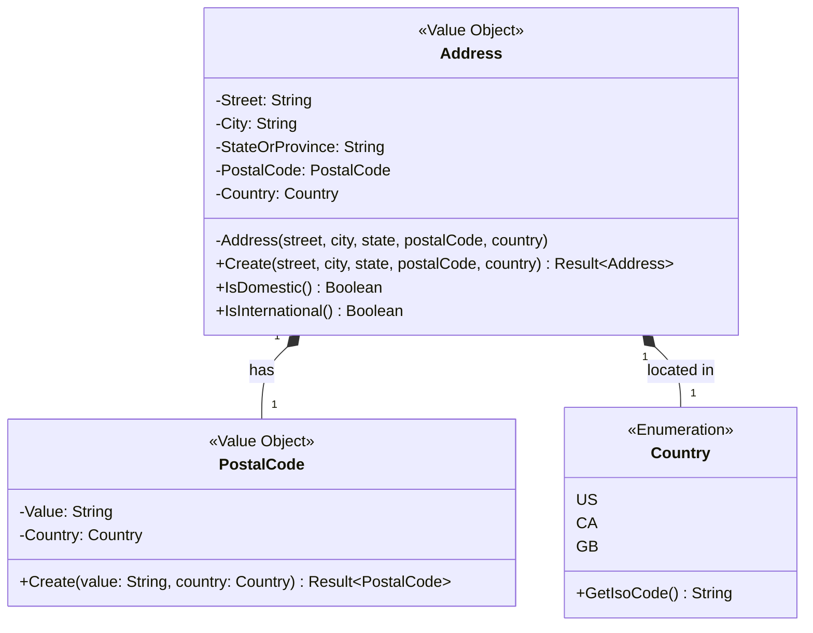
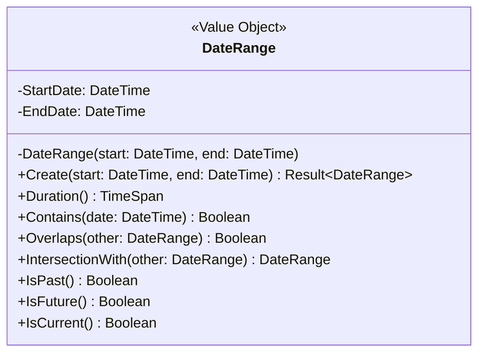
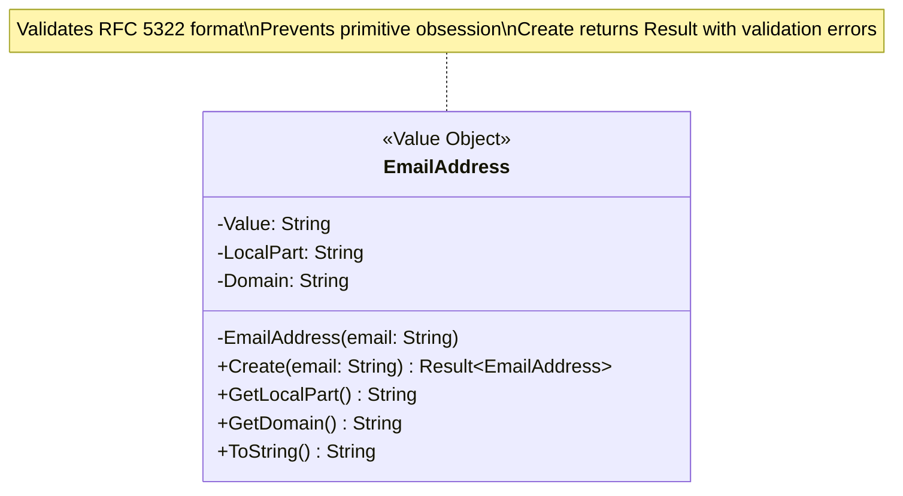
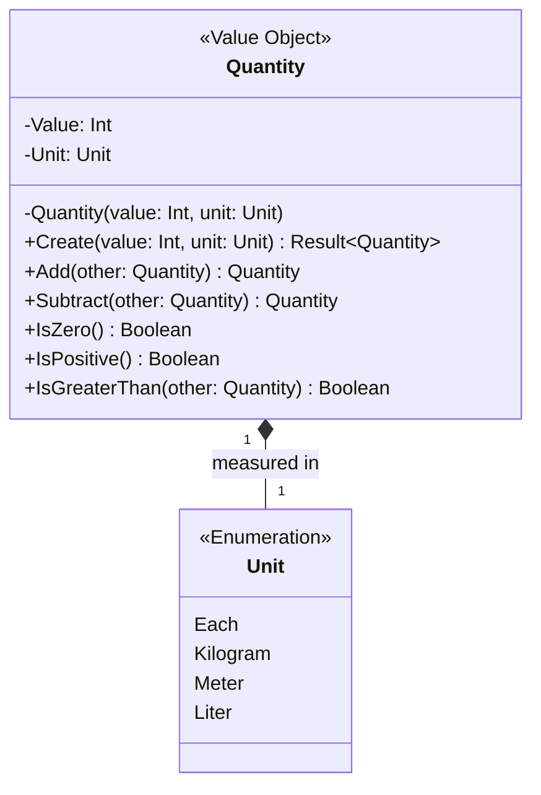
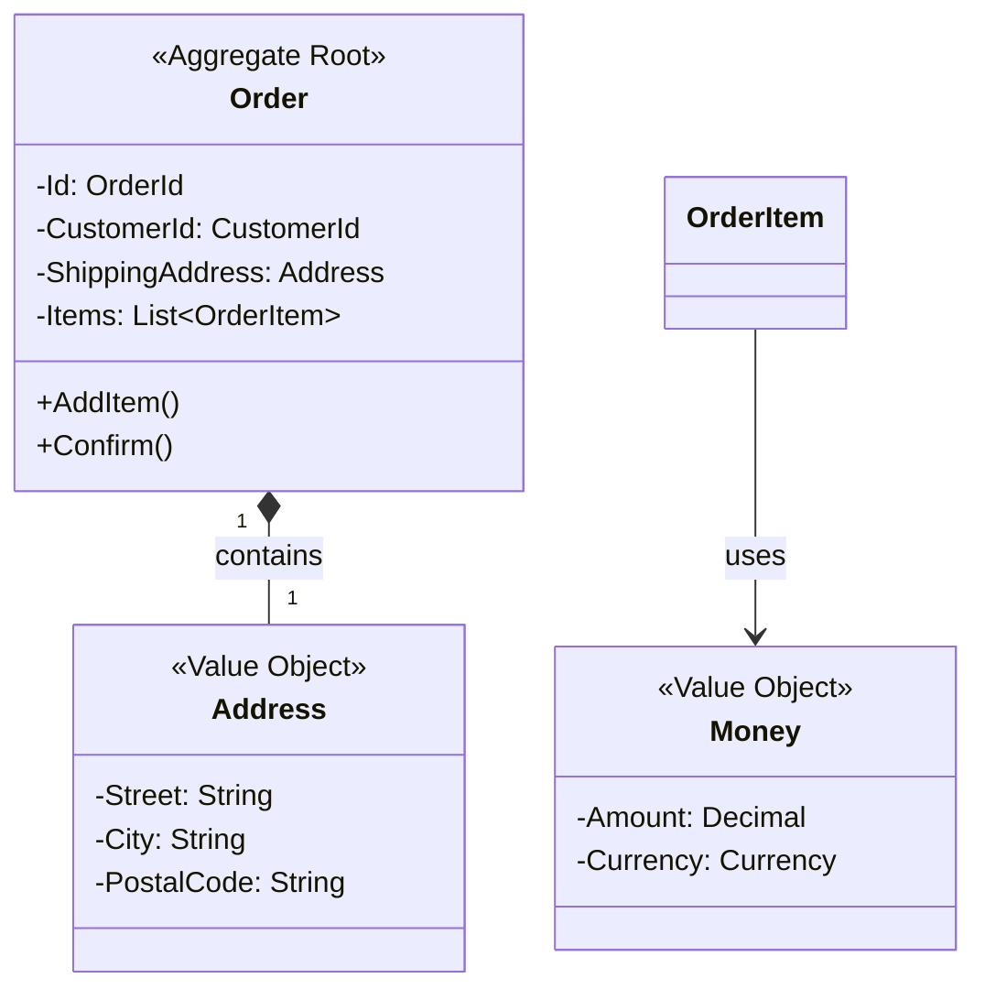

# Value Objects

## Overview

A Value Object is an immutable object that represents a descriptive aspect of the domain, defined by its attributes rather than an identity. Two Value Objects with the same values are considered identical.

**Key characteristics:**
- Immutable (never changes after creation)
- Structural equality (same values = same object)
- No identity (defined by attributes, not ID)
- Always valid (validation in constructor/factory)
- Self-validating (cannot be instantiated in invalid state)

## When to Use Value Objects

Use Value Objects when:

- **Measuring or quantifying** (Money, Quantity, Weight, Duration)
- **Describing attributes** (Address, Color, DateRange)
- **Combining related primitives** (Street + City + Zip → Address)
- **Ensuring type safety** (CustomerId vs OrderId vs ProductId)
- **Encapsulating validation rules** (EmailAddress, PhoneNumber)

## Core Rules

### 0. The Result Pattern for Creation

**Rule:** Value Object creation uses static `Create` methods that return `Result<T>` to handle validation failures without exceptions.

Operations that can fail return `Result<T>` with either `Result.Success` (containing the value) or `Result.Error` (containing a descriptive message). This enables explicit error handling without exceptions, with failures visible in type signatures and composable error handling.

**Create method structure:** Validate all rules, then return `Result.Success` with constructed instance or `Result.Error` with descriptive message.

---

### 1. Immutability

**Rule:** Once created, a Value Object must never change.



**Why immutability matters:**

- **Thread Safety:** Share across threads without locks
- **Aliasing Safety:** Shared references won't unexpectedly change
- **Caching:** Stable hash codes enable use as dictionary keys
- **Predictability:** No spooky action at a distance

**Implementation approach:**



**Do:**
- Use read-only fields/properties
- Return new instances from operations
- Validate in constructor
- Override `Equals()` and `GetHashCode()` for structural equality

**Don't:**
- Expose public setters
- Mutate internal state
- Allow invalid states to exist

### 2. Structural Equality

**Rule:** Two Value Objects with identical attribute values are equal.



**Implementation requirements:**

- Override equality operators to compare all fields
- Use language features that support structural equality (records, dataclasses)
- Ensure hash codes are based on immutable fields

**Examples across languages:**

| Language | Feature | Notes |
|----------|---------|-------|
| C# | `record` types | Built-in structural equality |
| Java | `record` (Java 16+) | Auto-generates equals/hashCode |
| Python | `@dataclass(frozen=True)` | Immutable dataclasses |
| TypeScript | No native support | Manual implementation required |

### 3. Always Valid Paradigm

**Rule:** A Value Object must never be instantiated in an invalid state. The Result pattern ensures this contract.

Validation occurs in the Create method, with `Result.Error` returned for invalid input and `Result.Success` for valid instances. This ensures invalid objects cannot exist, enables fail-fast error handling, and eliminates the need for defensive coding at call sites.

### 4. No Identity

**Rule:** Value Objects are defined by their values, not by an ID.

```mermaid
flowchart LR
    A[Customer ID: 123] --> B[Same customer\neven if name changes]
    C[Money: $100] --> D[Same money\nregardless of "which" $100]

    style B fill:#e1f5e1
    style D fill:#e1f5e1
```

**Entity vs Value Object distinction:**

| Aspect | Entity | Value Object |
|--------|--------|--------------|
| Identification | ID (identity) | Attributes (values) |
| Equality | Same ID = same entity | Same values = same object |
| Mutability | Mutable | Immutable |
| Lifecycle | Created → modified → deleted | Created and replaced |
| Example | Customer, Order | Money, Address, Email |

## Common Value Object Patterns

### Money Pattern



**Key responsibilities:**
- Encapsulates currency-specific rounding rules
- Prevents mixing incompatible currencies
- Provides domain-relevant operations
- Validates non-negative amounts (context-dependent)
- Create method returns Result with validation errors

### Address Pattern



**Key responsibilities:**
- Validates postal code format for country
- Normalizes address components
- Provides domestic/international logic
- Encapsulates country-specific validation rules

### DateRange Pattern



**Key responsibilities:**
- Validates that start ≤ end
- Provides date arithmetic and comparison
- Encapsulates temporal logic
- Enables expressive business rules (e.g., subscription periods)

### EmailAddress Pattern



**Key responsibilities:**
- Validates email format on construction
- Parses local part and domain
- Prevents primitive obsession (strong typing vs raw string)
- Enables domain-specific operations (e.g., `@IsCorporateEmail()`)

### Quantity Pattern



**Key responsibilities:**
- Prevents mixing incompatible units
- Validates non-negative values (context-dependent)
- Encapsulates unit conversion logic
- Provides type safety over raw integers

## Aggregate Integration

### Value Objects Inside Aggregates



**Key principles:**

- Value Objects are contained within Aggregates
- They don't have their own repositories
- They're persisted as part of the Aggregate Root
- They enforce invariants at the attribute level

## Anti-Patterns to Avoid

### Mutable Value Objects
**Problem:** Mutable Value Objects cause unpredictable state changes when shared across code. One change affects all references, leading to bugs.
**Solution:** Ensure Value Objects are immutable with read-only fields. Operations return new instances rather than modifying existing ones.

### Identity Leaks
**Problem:** A Value Object with an ID field is actually an Entity in disguise, violating the pattern.
**Solution:** Remove ID fields and redesign as a true Value Object, or if identity is essential, redesign as an Entity.

### Deferred Validation
**Problem:** Creating a Value Object without validating its state allows invalid objects to exist in the domain.
**Solution:** Validate all invariants in the Create method using the Result pattern, returning errors for invalid input.

## Summary Checklist

When reviewing a DOMAIN.md for Value Object compliance, ask:

- [ ] Is the Value Object immutable (read-only fields, no setters)?
- [ ] Does the Value Object have structural equality (equals/hashCode overridden)?
- [ ] Does the Value Object have no identity (no ID field)?
- [ ] Is the Create method returning `Result<T>` for validation failures?
- [ ] Are all validation rules in the Create method?
- [ ] Does the Value Object have self-contained behavior?
- [ ] Is the domain meaning of the Value Object clear?
- [ ] Does the Value Object prevent primitive obsession?
- [ ] Are error messages in the Result.Error returns descriptive?
